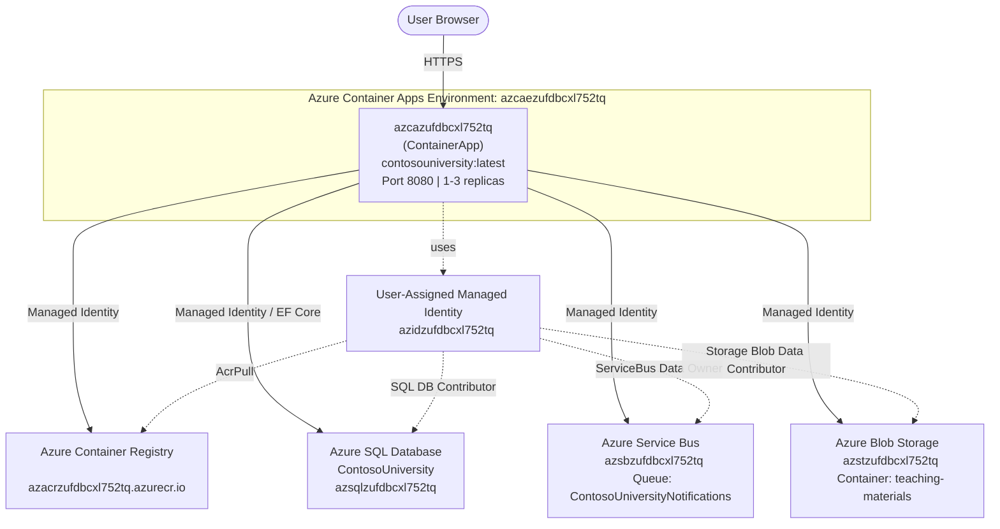

# Deployment Summary — 008-deploy-container-apps

## Status: ✅ Succeeded

**Project**: ContosoUniversity  
**Deployment Date**: 2026-06-29  
**Deployment Tool**: Azure CLI (`az acr build` + `az containerapp update`)  
**Rounds to success**: 3 (Dockerfile fixes: Windows fallback packages path, Debian user commands)

---

## Deployed Application

| Property | Value |
|----------|-------|
| **App URL** | https://azcazufdbcxl752tq.ashymushroom-e7c9520b.centralus.azurecontainerapps.io |
| **Container App** | `azcazufdbcxl752tq` |
| **Container Image** | `azacrzufdbcxl752tq.azurecr.io/contosouniversity:latest` |
| **Image Digest** | `sha256:ffefc34ec50b48072d3e669013e3fe5dc6459df57169d864865390511ca2630c` |
| **Active Revision** | `azcazufdbcxl752tq--0000003` |
| **Running State** | Running (1 replica) |
| **Hosting Environment** | Production |
| **Listening Port** | 8080 |

---

## Azure Resources Used

| Resource Type | Name | Role |
|---|---|---|
| Azure Container App | `azcazufdbcxl752tq` | Hosts the ContosoUniversity web application |
| Container Apps Environment | `azcaezufdbcxl752tq` | Consumption-tier hosting environment |
| Azure Container Registry | `azacrzufdbcxl752tq` | Stores the built Docker image |
| Azure SQL Database | `ContosoUniversity` on `azsqlzufdbcxl752tq` | School data persistence (EF Core + Managed Identity) |
| Azure Service Bus | `azsbzufdbcxl752tq` / queue `ContosoUniversityNotifications` | Notification messaging |
| Azure Blob Storage | `azstzufdbcxl752tq` / container `teaching-materials` | Teaching material file storage |
| User-Assigned Managed Identity | `azidzufdbcxl752tq` (client: `8338f244-ad28-4717-9f83-644bccbce6c9`) | Passwordless auth to all Azure services |

---

## Architecture Diagram

---

## Environment Variables Configured

| Variable | Value |
|---|---|
| `AZURE_CLIENT_ID` | `8338f244-ad28-4717-9f83-644bccbce6c9` |
| `ConnectionStrings__DefaultConnection` | `Server=tcp:azsqlzufdbcxl752tq.database.windows.net;Database=ContosoUniversity;Authentication=Active Directory Default;TrustServerCertificate=True` |
| `AzureServiceBus__FullyQualifiedNamespace` | `azsbzufdbcxl752tq.servicebus.windows.net` |
| `Storage__ServiceUri` | `https://azstzufdbcxl752tq.blob.core.windows.net` |
| `Storage__ContainerName` | `teaching-materials` |
| `ASPNETCORE_ENVIRONMENT` | `Production` |
| `ASPNETCORE_URLS` | `http://+:8080` |

---

## Files Created

| File | Description |
|---|---|
| `ContosoUniversity/Dockerfile` | Multi-stage Docker build for .NET 10 ASP.NET Core app. Build stage: `dotnet/sdk:10.0`, runtime stage: `dotnet/aspnet:10.0`. Non-root user, port 8080. |
| `ContosoUniversity/.dockerignore` | Excludes `bin/`, `obj/`, `.vs/`, `Uploads/`, dev secrets from Docker build context. |
| `008-deploy-container-apps/plan.md` | Full deployment plan with architecture, resources, and execution steps. |
| `008-deploy-container-apps/progress.md` | Real-time progress tracking for each step. |
| `008-deploy-container-apps/deployment-summary.md` | This file — deployment outcome and resource reference. |
| `008-deploy-container-apps/deploy-scripts/deploy.ps1` | PowerShell script to build, push, and deploy the application (repeatable). |

---

## Log Validation Summary

| Check | Status |
|---|---|
| Application started | ✅ `Application started. Press Ctrl+C to shut down.` |
| Listening on correct port | ✅ `Now listening on: http://[::]:8080` |
| Hosting environment | ✅ `Production` |
| EF Core SQL queries | ✅ Executed against Azure SQL Database |
| No startup errors | ✅ No Error-level log entries |
| Warnings (non-blocking) | ⚠️ `wwwroot` not found (static files via Content/Scripts paths — working), DataProtection keys ephemeral (expected) |
