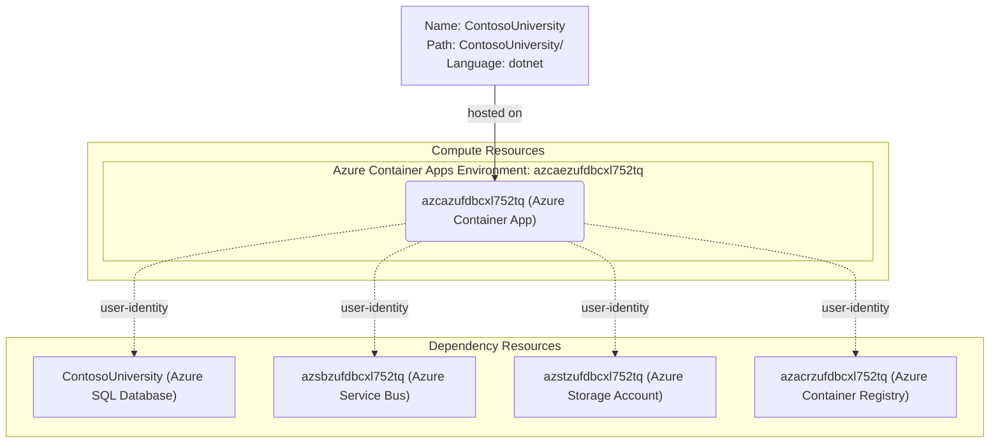

# Azure Deployment Plan for ContosoUniversity Project

## **Goal**

Deploy the ContosoUniversity ASP.NET Core .NET 10 web application to Azure Container Apps in resource group `rg-contosouniversity` (subscription `0dc80431-5546-4681-a92a-2a799ade5139`) using Azure CLI. The application will be containerized, pushed to Azure Container Registry, and deployed to the existing Container App with all required environment variables configured for Azure service connections.

---

## **Project Information**

**ContosoUniversity**
- **Stack**: ASP.NET Core .NET 10 (MVC)
- **Type**: University management web application (students, courses, departments, instructors)
- **Containerization**: No Dockerfile yet — to be generated
- **Dependencies**:
  - Azure SQL Database (`azsqlzufdbcxl752tq.database.windows.net` / `ContosoUniversity`) — EF Core with Managed Identity
  - Azure Service Bus (`azsbzufdbcxl752tq.servicebus.windows.net` / queue `ContosoUniversityNotifications`) — notification service
  - Azure Blob Storage (`https://azstzufdbcxl752tq.blob.core.windows.net` / container `teaching-materials`) — teaching material uploads
  - User-Assigned Managed Identity (`azidzufdbcxl752tq`, client ID `8338f244-ad28-4717-9f83-644bccbce6c9`) — passwordless auth to all Azure services
- **Hosting**: Azure Container Apps

---

## **Azure Resources Architecture**

> **Install the mermaid extension in IDE to view the architecture.**

---

## **Existing Azure Resources**

| Resource Type | Name | SKU / Tier | Purpose |
|---|---|---|---|
| Resource Group | `rg-contosouniversity` | N/A | Container for all resources |
| User-Assigned Managed Identity | `azidzufdbcxl752tq` | N/A | Passwordless auth to ACR, SQL, Service Bus, Storage |
| Azure Container Registry | `azacrzufdbcxl752tq` | Basic | Docker image hosting |
| Log Analytics Workspace | `azlogzufdbcxl752tq` | PerGB2018 | Container Apps log aggregation |
| Container Apps Environment | `azcaezufdbcxl752tq` | Consumption | Hosting environment for Container App |
| Azure Container App | `azcazufdbcxl752tq` | Consumption | Hosts ContosoUniversity web app |
| Azure SQL Server | `azsqlzufdbcxl752tq` | N/A | SQL Server for ContosoUniversity DB |
| Azure SQL Database | `ContosoUniversity` | Serverless | Persistent school data |
| Azure Service Bus Namespace | `azsbzufdbcxl752tq` | Standard | Cloud messaging (replaces MSMQ) |
| Azure Service Bus Queue | `ContosoUniversityNotifications` | Standard | Notification queue |
| Azure Storage Account | `azstzufdbcxl752tq` | Standard LRS | Teaching material blob storage |
| Blob Container | `teaching-materials` | Hot | Teaching material images |

**Missing resources**: None — all resources were provisioned in task 007.

---

## **Execution Steps**

> **Below are the steps for Copilot to follow; ask Copilot to update or execute this plan.**
> **CRITICAL: Do NOT run 'az login' until 'Env setup' step.**

1. **Containerization**
   - [ ] Analyze repository with `appmod-analyze-repository`
   - [ ] Generate Dockerfile with `appmod-plan-generate-dockerfile`
   - [ ] Build Docker image with `az acr build` (ACR available: `azacrzufdbcxl752tq`)
   - Output: `ContosoUniversity/Dockerfile`

2. **Env Setup for AzCLI**
   - [ ] Verify AZ CLI is installed
   - [ ] Set subscription to `0dc80431-5546-4681-a92a-2a799ade5139`
   - [ ] Install `serviceconnector-passwordless` extension

3. **Provisioning**
   - [ ] All resources already provisioned by task 007 — verify existence only

4. **Check Azure Resources Existence**
   - [ ] Container App `azcazufdbcxl752tq` — resource group `rg-contosouniversity`
   - [ ] Container Registry `azacrzufdbcxl752tq` — login server `azacrzufdbcxl752tq.azurecr.io`
   - [ ] SQL Database `ContosoUniversity` on `azsqlzufdbcxl752tq`
   - [ ] Service Bus Namespace `azsbzufdbcxl752tq`
   - [ ] Storage Account `azstzufdbcxl752tq`

5. **Deployment**
   - [ ] Generate deploy script `deploy-scripts/deploy.ps1`
     - `az acr build` — build + push image to `azacrzufdbcxl752tq.azurecr.io`
     - `az containerapp update` — deploy new image with env vars
   - [ ] Run deploy script and fix until successful
   - [ ] Validate with `appmod-get-app-logs`

6. **Summarize Result**
   - [ ] Call `appmod-summarize-result`
   - [ ] Generate `deployment-summary.md`

---

## **Progress Tracking**

See `progress.md` for real-time status updates.

---

## **Tools Checklist**

- [ ] appmod-analyze-repository
- [ ] appmod-plan-generate-dockerfile
- [ ] appmod-build-docker-image
- [ ] appmod-summarize-result
- [ ] appmod-get-app-logs
