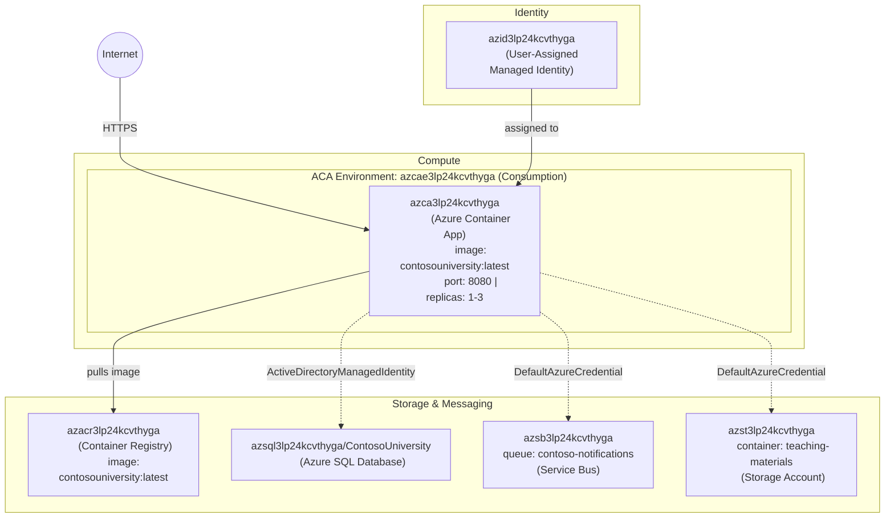

# Deployment Summary — ContosoUniversity

## Result: ✅ Successful

| Property | Value |
|----------|-------|
| **Task ID** | 008-deployment-containerapp |
| **Project** | ContosoUniversity (.NET 10 ASP.NET Core MVC) |
| **Deployment Tool** | Azure CLI (`az acr build`, `az containerapp update`) |
| **Date** | 2026-06-09 |
| **Subscription** | `0dc80431-5546-4681-a92a-2a799ade5139` |
| **Resource Group** | `rg-contosouniversity` |

## Application URL

🌐 **https://azca3lp24kcvthyga.happymeadow-4ef7e0a2.centralus.azurecontainerapps.io**

## Deployed Image

| Property | Value |
|----------|-------|
| **Registry** | `azacr3lp24kcvthyga.azurecr.io` |
| **Image** | `contosouniversity:latest` |
| **Digest** | `sha256:25aee55913b95e85cbe375c09df216b0ae80f4998fbc87f53bfaaab663a068bc` |
| **Base Image** | `mcr.microsoft.com/dotnet/aspnet:10.0` (Debian, linux/amd64) |
| **Build Strategy** | Multi-stage (SDK build → ASP.NET runtime) |
| **ACR Build Run ID** | `cj3` |

## Container App Configuration

| Property | Value |
|----------|-------|
| **Name** | `azca3lp24kcvthyga` |
| **Environment** | `azcae3lp24kcvthyga` (Consumption) |
| **Revision** | `azca3lp24kcvthyga--0000007` |
| **Status** | Running (1 replica, min: 1, max: 3) |
| **Ingress** | External — port 8080 |
| **Identity** | User-Assigned MI `azid3lp24kcvthyga` (clientId: `7e6223da-2364-41ae-ab88-59232bad4a8e`) |

## Environment Variables Configured

| Variable | Value |
|----------|-------|
| `AZURE_CLIENT_ID` | `7e6223da-2364-41ae-ab88-59232bad4a8e` |
| `ASPNETCORE_ENVIRONMENT` | `Production` |
| `ASPNETCORE_URLS` | `http://+:8080` |
| `ConnectionStrings__DefaultConnection` | `Data Source=azsql3lp24kcvthyga...,1433;...Authentication=ActiveDirectoryManagedIdentity` |
| `AzureServiceBus__FullyQualifiedNamespace` | `azsb3lp24kcvthyga.servicebus.windows.net` |
| `AzureServiceBus__QueueName` | `contoso-notifications` |
| `Storage__ServiceUri` | `https://azst3lp24kcvthyga.blob.core.windows.net/` |
| `Storage__ContainerName` | `teaching-materials` |

## Created Files

| File | Description |
|------|-------------|
| `Dockerfile` | Multi-stage Docker build for .NET 10 ASP.NET Core MVC app. Uses `sdk:10.0` to build, `aspnet:10.0` for runtime. Non-root user (`appuser:appgroup`). Exposes port 8080. |
| `.dockerignore` | Excludes build artifacts, git history, infra files, and OS files from Docker build context |
| `.github/modernize/modernization-plan/008-deployment-containerapp/plan.md` | Deployment plan with architecture diagram, Azure resource inventory, and execution checklist |
| `.github/modernize/modernization-plan/008-deployment-containerapp/progress.md` | Real-time progress tracker with completed/failed/pending steps |
| `.github/modernize/modernization-plan/008-deployment-containerapp/deploy-scripts/deploy.ps1` | PowerShell deploy script: sets subscription, runs `az acr build`, updates Container App with new image and env vars |
| `.github/modernize/modernization-plan/008-deployment-containerapp/deployment-summary.md` | This file — deployment result summary |

## Azure Resources Diagram

## Key Notes

- **Authentication fix**: The SQL connection string uses `Authentication=ActiveDirectoryManagedIdentity` (no spaces), which is the correct SqlClient keyword validated against the infrastructure-provisioned secret format.
- **Static files**: `wwwroot` is not present; static files are served from `Content/` and `Scripts/` directories via ASP.NET Core `PhysicalFileProvider` middleware — this is working by design.
- **DB Initialization**: `DbInitializer.Initialize()` runs at startup to seed the database via EF Core `EnsureCreated()`.
