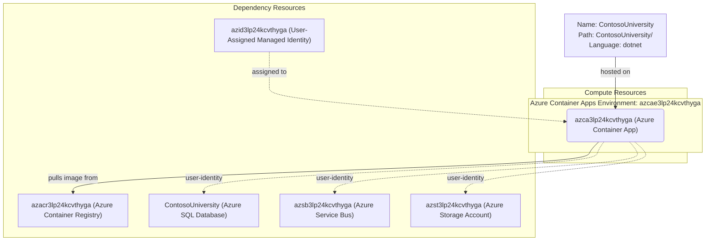

# Azure Deployment Plan for ContosoUniversity Project

## **Goal**
Deploy the ContosoUniversity .NET 10 ASP.NET Core MVC application to Azure Container App `azca3lp24kcvthyga` in resource group `rg-contosouniversity`, subscription `0dc80431-5546-4681-a92a-2a799ade5139`, using Azure CLI.

## **Project Information**

**ContosoUniversity**
- **Stack**: .NET 10 ASP.NET Core MVC
- **Type**: University course/student management web app
- **Project File**: `ContosoUniversity/ContosoUniversity.csproj`
- **Containerization**: No Dockerfile — will be generated
- **Dependencies**:
  - Azure SQL Database (EF Core / SQL Server)
  - Azure Service Bus (notifications queue)
  - Azure Blob Storage (teaching materials)
  - All use `DefaultAzureCredential` (Managed Identity)
- **Hosting**: Azure Container Apps (port 8080)

## **Azure Resources Architecture**

> **Install the mermaid extension in IDE to view the architecture.**

## **Existing Azure Resources**

| Resource Type | Name | SKU | Purpose |
|---------------|------|-----|---------|
| Azure Container App | `azca3lp24kcvthyga` | Consumption | Hosts the ContosoUniversity web app |
| Container Apps Environment | `azcae3lp24kcvthyga` | Consumption | ACA environment with Log Analytics |
| Azure Container Registry | `azacr3lp24kcvthyga` | Basic | Stores Docker images |
| Azure SQL Server | `azsql3lp24kcvthyga` | — | SQL backend |
| Azure SQL Database | `ContosoUniversity` | Serverless GP_S_Gen5 | App database |
| Azure Service Bus Namespace | `azsb3lp24kcvthyga` | Standard | Notification queue |
| Azure Service Bus Queue | `contoso-notifications` | — | App notification messages |
| Azure Storage Account | `azst3lp24kcvthyga` | — | Teaching material blobs |
| Blob Container | `teaching-materials` | — | Stores teaching materials |
| User-Assigned Managed Identity | `azid3lp24kcvthyga` | — | App identity for all Azure service auth |
| Log Analytics Workspace | `azlog3lp24kcvthyga` | Standard | Container App logs |

**Missing resources:** None — all required resources are provisioned.

## **Execution Steps**

> **Below are the steps for Copilot to follow; ask Copilot to update or execute this plan.**
> **CRITICAL: Do NOT run 'az login' until 'Env setup' step.**

1. **Containerization**
   - [ ] No Dockerfile exists — analyze repo with `appmod-analyze-repository`
   - [ ] Generate Dockerfile with `appmod-plan-generate-dockerfile`
   - [ ] Create `ContosoUniversity/Dockerfile`
   - [ ] Build and push image using `az acr build` to `azacr3lp24kcvthyga.azurecr.io`

2. **Env Setup for AzCLI**
   - [ ] Verify `az` CLI is installed
   - [ ] Set subscription: `az account set --subscription 0dc80431-5546-4681-a92a-2a799ade5139`
   - [ ] Install service connector extension: `az extension add --name serviceconnector-passwordless --upgrade`

3. **Provisioning**
   - [ ] All resources already provisioned — skip IaC generation

4. **Check Azure Resources Existence**
   - [ ] Azure Container App `azca3lp24kcvthyga` — verify with `az containerapp show`
   - [ ] Azure Container Registry `azacr3lp24kcvthyga` — verify with `az acr show`
   - [ ] Azure SQL Database `ContosoUniversity` — verify existence
   - [ ] Azure Service Bus `azsb3lp24kcvthyga` — verify existence
   - [ ] Azure Storage Account `azst3lp24kcvthyga` — verify existence

5. **Deployment**
   - [ ] Create `deploy-scripts/deploy.ps1` — ACR build + Container App update
   - [ ] Configure Container App environment variables:
     - `AZURE_SQL_CONTOSOUNIVERSITY_SQL_CONNECTIONSTRING`
     - `AzureServiceBus__FullyQualifiedNamespace`
     - `AzureServiceBus__QueueName`
     - `Storage__ServiceUri`
     - `Storage__ContainerName`
     - `AZURE_CLIENT_ID` (Managed Identity client ID)
   - [ ] Run deploy script
   - [ ] Validate with `appmod-get-app-logs`

6. **Summarize Result**
   - [ ] Call `appmod-summarize-result`
   - [ ] Generate `deployment-summary.md`

## **Tools Checklist**
- [ ] appmod-analyze-repository
- [ ] appmod-plan-generate-dockerfile
- [ ] appmod-build-docker-image
- [ ] appmod-summarize-result
- [ ] appmod-get-app-logs
