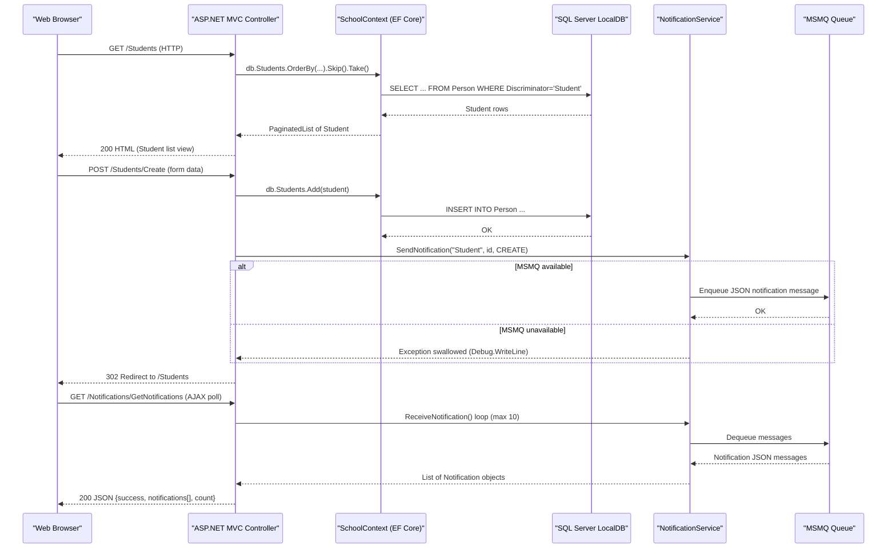

# API & Service Communication Contracts

ContosoUniversity exposes a traditional server-rendered HTML surface via ASP.NET MVC 5 with 32 action endpoints across 6 controllers, supplemented by 2 JSON endpoints for a lightweight in-browser notification widget. There is no REST API gateway, versioning scheme, or inter-service communication — the application is a single deployable monolith.

## Service Catalog

| Service | Port | Category | Purpose |
|---|---|---|---|
| ContosoUniversity | 80 (IIS) | Business | Monolithic ASP.NET MVC 5 web application serving university management UI and JSON notification endpoints |

## API Endpoints Inventory

| Controller | Method | Path | Request Type | Response Type |
|---|---|---|---|---|
| HomeController | GET | / | — | HTML (Index view) |
| HomeController | GET | /Home/About | — | HTML (About view with enrollment statistics) |
| HomeController | GET | /Home/Contact | — | HTML (Contact view) |
| HomeController | GET | /Home/Error | — | HTML (Error view) |
| HomeController | GET | /Home/Unauthorized | — | HTML (Unauthorized view) |
| StudentsController | GET | /Students | sortOrder, currentFilter, searchString, page (query) | HTML (paginated Student list) |
| StudentsController | GET | /Students/Details/{id} | id (path) | HTML (Student detail view) |
| StudentsController | GET | /Students/Create | — | HTML (Create form) |
| StudentsController | POST | /Students/Create | Student (form: LastName, FirstMidName, EnrollmentDate) | Redirect or HTML (validation errors) |
| StudentsController | GET | /Students/Edit/{id} | id (path) | HTML (Edit form) |
| StudentsController | POST | /Students/Edit/{id} | Student (form: ID, LastName, FirstMidName, EnrollmentDate) | Redirect or HTML (validation errors) |
| StudentsController | GET | /Students/Delete/{id} | id (path) | HTML (Delete confirmation) |
| StudentsController | POST | /Students/Delete/{id} | id (form) | Redirect |
| CoursesController | GET | /Courses | — | HTML (Course list) |
| CoursesController | GET | /Courses/Details/{id} | id (path) | HTML (Course detail) |
| CoursesController | GET | /Courses/Create | — | HTML (Create form) |
| CoursesController | POST | /Courses/Create | Course (form: CourseID, Title, Credits, DepartmentID, TeachingMaterialImagePath) + file upload | Redirect or HTML |
| CoursesController | GET | /Courses/Edit/{id} | id (path) | HTML (Edit form) |
| CoursesController | POST | /Courses/Edit/{id} | Course (form + file upload) | Redirect or HTML |
| CoursesController | GET | /Courses/Delete/{id} | id (path) | HTML (Delete confirmation) |
| CoursesController | POST | /Courses/Delete/{id} | id (form) | Redirect |
| DepartmentsController | GET | /Departments | — | HTML (Department list) |
| DepartmentsController | GET | /Departments/Details/{id} | id (path) | HTML (Department detail) |
| DepartmentsController | GET | /Departments/Create | — | HTML (Create form) |
| DepartmentsController | POST | /Departments/Create | Department (form: Name, Budget, StartDate, InstructorID) | Redirect or HTML |
| DepartmentsController | GET | /Departments/Edit/{id} | id (path) | HTML (Edit form) |
| DepartmentsController | POST | /Departments/Edit/{id} | Department (form + RowVersion for concurrency) | Redirect or HTML |
| DepartmentsController | GET | /Departments/Delete/{id} | id (path) | HTML (Delete confirmation) |
| DepartmentsController | POST | /Departments/Delete/{id} | id (form) | Redirect |
| InstructorsController | GET | /Instructors | id, courseID (query) | HTML (Instructor list with optional course/enrollment panel) |
| InstructorsController | GET | /Instructors/Details/{id} | id (path) | HTML (Instructor detail) |
| InstructorsController | GET | /Instructors/Create | — | HTML (Create form) |
| InstructorsController | POST | /Instructors/Create | Instructor (form: LastName, FirstMidName, HireDate, OfficeAssignment) + selectedCourses[] | Redirect or HTML |
| InstructorsController | GET | /Instructors/Edit/{id} | id (path) | HTML (Edit form) |
| InstructorsController | POST | /Instructors/Edit/{id} | id (path) + selectedCourses[] (form) | Redirect or HTML |
| InstructorsController | GET | /Instructors/Delete/{id} | id (path) | HTML (Delete confirmation) |
| InstructorsController | POST | /Instructors/Delete/{id} | id (form) | Redirect |
| NotificationsController | GET | /Notifications/GetNotifications | — | JSON `{success, notifications[], count}` |
| NotificationsController | POST | /Notifications/MarkAsRead | id (form) | JSON `{success}` |
| NotificationsController | GET | /Notifications | — | HTML (Notification dashboard) |

## Management & Observability Endpoints

| Service | Endpoint | Custom Metrics |
|---|---|---|
| ContosoUniversity | None configured | None — no health check, Swagger UI, or metrics endpoint is present |

No ASP.NET health check middleware, Swagger/OpenAPI UI, or metrics exporter is configured. The only non-HTML endpoints are the two JSON notification endpoints.

## DTOs & Contracts

The application does not use dedicated DTO or request/response model classes. Controllers bind directly to EF Core entity classes (`Student`, `Course`, `Department`, `Instructor`) using `[Bind(Include = "...")]` attribute lists. The domain models serve a dual role as both persistence entities and MVC binding targets.

- **`Student`** — form-bind target for create/edit; rendered as view model for list/detail pages
- **`Course`** — form-bind target; also accepts `HttpPostedFileBase teachingMaterialImage` for file upload
- **`Department`** — form-bind target; includes `RowVersion` byte array for optimistic concurrency
- **`Instructor`** — form-bind target; additionally accepts a `string[] selectedCourses` parameter outside the bound entity
- **`Notification`** — returned inline as a JSON-serialised list from `GetNotifications`; fields serialised with `Newtonsoft.Json`

No OpenAPI/Swagger specification, protobuf schemas, or GraphQL schema files were found. There is no separation between gateway-level DTOs and service-level entities. For full entity field lists and ORM mapping details, see `data-architecture.md`.

## Communication Patterns

**Synchronous (HTTP, in-process):** All client interactions are synchronous HTTP request/response through the MVC action pipeline. There is no REST API client, `HttpClient`, or inter-service HTTP call within the application — all data access is performed in-process via `SchoolContext`.

**Asynchronous (MSMQ):** `NotificationService` uses `System.Messaging.MessageQueue` to publish JSON-serialised `Notification` messages to a local MSMQ private queue (`.\Private$\ContosoUniversityNotifications`) on every entity create, update, or delete operation. Messages are dequeued synchronously by the `GetNotifications` action when the browser polls. There is no background consumer, retry policy, or dead-letter handling.

**Resilience patterns:** No circuit-breaker, retry, timeout, or bulkhead configuration is present. MSMQ errors are silently swallowed with `Debug.WriteLine` and do not propagate to the caller.

**Service discovery:** Not applicable — single-process monolith with no inter-service calls.

**API gateway:** None. The application serves all traffic directly.

**Security posture:** No authentication, authorisation, or TLS is configured at the application level. No `[Authorize]` attributes are applied to any controller or action. All 39 endpoints are publicly accessible with no credential or role checks. The `Microsoft.Identity.Client` package is present as a NuGet dependency but is not used anywhere in the codebase. HTTPS/TLS enforcement must be handled entirely at the IIS or reverse-proxy layer.

## Service Technology Matrix

| Service | Web Framework | Data Access | Discovery | Gateway | Health Checks | Cache | Metrics |
|---|---|---|---|---|---|---|---|
| ContosoUniversity | ASP.NET MVC 5 / Razor | EF Core 3.1 (SchoolContext) | None | None | None | None | None |

## Service Communication Sequence

