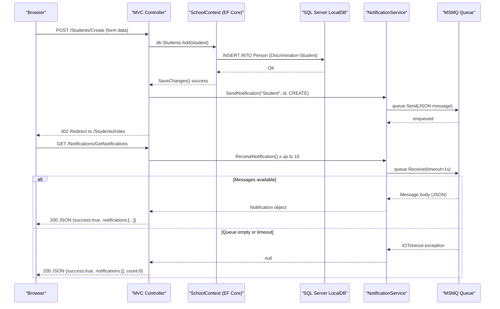

# API & Service Communication Contracts

ContosoUniversity exposes a single deployable MVC 5 web application with **29 HTTP endpoints** — a mix of server-rendered HTML actions (conventional MVC) and two lightweight JSON endpoints used by the notification subsystem. There is no API gateway, service mesh, or microservice decomposition.

## Service Catalog

| Service | Port | Category | Purpose |
|---|---|---|---|
| ContosoUniversity Web App | 80 / 443 (IIS-hosted) | Business | Single ASP.NET MVC 5 web application serving server-rendered HTML and JSON notification endpoints |

## API Endpoints Inventory

### HomeController

| Method | Path | Request Type | Response Type | Notes |
|---|---|---|---|---|
| GET | `/Home/Index` (default `/`) | — | ViewResult (HTML) | Enrollment statistics dashboard |
| GET | `/Home/About` | — | ViewResult (HTML) | Enrollment count per date |
| GET | `/Home/Contact` | — | ViewResult (HTML) | Contact page |
| GET | `/Home/Error` | — | ViewResult (HTML) | Error view |
| GET | `/Home/Unauthorized` | — | ViewResult (HTML) | Unauthorized access page |

### StudentsController

| Method | Path | Request Type | Response Type | Notes |
|---|---|---|---|---|
| GET | `/Students/Index` | Query: sortOrder, currentFilter, searchString, page | ViewResult (HTML) | Paginated + sortable student list |
| GET | `/Students/Details/{id}` | Path: int id | ViewResult (HTML) | Student detail with enrollments |
| GET | `/Students/Create` | — | ViewResult (HTML) | Empty create form |
| POST | `/Students/Create` | Body (form): Student (LastName, FirstMidName, EnrollmentDate) | RedirectToAction / ViewResult | Creates student; triggers MSMQ notification |
| GET | `/Students/Edit/{id}` | Path: int id | ViewResult (HTML) | Populated edit form |
| POST | `/Students/Edit/{id}` | Body (form): Student (ID, LastName, FirstMidName, EnrollmentDate) | RedirectToAction / ViewResult | Updates student; triggers MSMQ notification |
| GET | `/Students/Delete/{id}` | Path: int id | ViewResult (HTML) | Delete confirmation view |
| POST | `/Students/Delete/{id}` | Path: int id | RedirectToAction | Deletes student; triggers MSMQ notification |

### CoursesController

| Method | Path | Request Type | Response Type | Notes |
|---|---|---|---|---|
| GET | `/Courses/Index` | — | ViewResult (HTML) | Course list |
| GET | `/Courses/Details/{id}` | Path: int id | ViewResult (HTML) | Course detail |
| GET | `/Courses/Create` | — | ViewResult (HTML) | Empty create form |
| POST | `/Courses/Create` | Body (form): Course (CourseID, Title, Credits, DepartmentID, TeachingMaterialImagePath) + file upload | RedirectToAction / ViewResult | Creates course with optional file upload; triggers MSMQ notification |
| GET | `/Courses/Edit/{id}` | Path: int id | ViewResult (HTML) | Populated edit form |
| POST | `/Courses/Edit/{id}` | Body (form): Course + file upload | RedirectToAction / ViewResult | Updates course; triggers MSMQ notification |
| GET | `/Courses/Delete/{id}` | Path: int id | ViewResult (HTML) | Delete confirmation view |
| POST | `/Courses/Delete/{id}` | Path: int id | RedirectToAction | Deletes course; triggers MSMQ notification |

### DepartmentsController

| Method | Path | Request Type | Response Type | Notes |
|---|---|---|---|---|
| GET | `/Departments/Index` | — | ViewResult (HTML) | Department list |
| GET | `/Departments/Details/{id}` | Path: int id | ViewResult (HTML) | Department detail |
| GET | `/Departments/Create` | — | ViewResult (HTML) | Empty create form |
| POST | `/Departments/Create` | Body (form): Department (Name, Budget, StartDate, InstructorID) | RedirectToAction / ViewResult | Creates department; triggers MSMQ notification |
| GET | `/Departments/Edit/{id}` | Path: int id | ViewResult (HTML) | Populated edit form (with concurrency token) |
| POST | `/Departments/Edit/{id}` | Body (form): Department + RowVersion | RedirectToAction / ViewResult | Updates department with optimistic concurrency; triggers MSMQ notification |
| GET | `/Departments/Delete/{id}` | Path: int id | ViewResult (HTML) | Delete confirmation |
| POST | `/Departments/Delete/{id}` | Path: int id | RedirectToAction | Deletes department; triggers MSMQ notification |

### InstructorsController

| Method | Path | Request Type | Response Type | Notes |
|---|---|---|---|---|
| GET | `/Instructors/Index` | Query: id (instructor), courseID | ViewResult (HTML) | Instructor list with optional course selection |
| GET | `/Instructors/Details/{id}` | Path: int id | ViewResult (HTML) | Instructor detail |
| GET | `/Instructors/Create` | — | ViewResult (HTML) | Create form with assigned-course checkboxes |
| POST | `/Instructors/Create` | Body (form): Instructor + string[] selectedCourses | RedirectToAction / ViewResult | Creates instructor with course assignments; triggers MSMQ notification |
| GET | `/Instructors/Edit/{id}` | Path: int id | ViewResult (HTML) | Edit form with assigned-course checkboxes |
| POST | `/Instructors/Edit/{id}` | Body (form): int id + string[] selectedCourses | RedirectToAction / ViewResult | Updates instructor and course assignments; triggers MSMQ notification |
| GET | `/Instructors/Delete/{id}` | Path: int id | ViewResult (HTML) | Delete confirmation |
| POST | `/Instructors/Delete/{id}` | Path: int id | RedirectToAction | Deletes instructor; triggers MSMQ notification |

### NotificationsController

| Method | Path | Request Type | Response Type | Notes |
|---|---|---|---|---|
| GET | `/Notifications/GetNotifications` | — | JsonResult `{success, notifications[], count}` | Polls up to 10 messages from the MSMQ queue |
| POST | `/Notifications/MarkAsRead` | Query: int id | JsonResult `{success}` | Marks a notification as read (stub; no persistence) |
| GET | `/Notifications/Index` | — | ViewResult (HTML) | Notification dashboard view |

## Management & Observability Endpoints

| Service | Endpoint | Notes |
|---|---|---|
| ContosoUniversity Web App | `/Home/Error` | Custom error page; registered via `HandleErrorAttribute` global filter |
| ContosoUniversity Web App | None (no `/health`, `/swagger`, `/metrics`) | No health check, OpenAPI/Swagger, or metrics endpoints are configured |

No Spring Boot Actuator equivalent, no .NET health checks middleware, no OpenAPI spec, and no Prometheus/Application Insights integration are present.

## DTOs & Contracts

The application uses **ASP.NET MVC model binding** — no dedicated DTO layer exists. Domain entities (`Student`, `Course`, `Department`, `Instructor`) are bound directly from HTML form posts using `[Bind(Include="...")]` attribute whitelisting. View-model classes exist only for the instructor index view:

| Class | Role | Immutability | Notes |
|---|---|---|---|
| `Student` | Request body (form POST) + response (view model) | Mutable | Domain entity used directly; see `data-architecture.md` for field details |
| `Course` | Request body (form POST) + response (view model) | Mutable | Includes `HttpPostedFileBase` for file upload |
| `Department` | Request body (form POST) + response (view model) | Mutable | Includes `RowVersion` byte array for optimistic concurrency |
| `Instructor` | Request body (form POST) + response (view model) | Mutable | Combined with `string[] selectedCourses` for course assignments |
| `InstructorIndexData` | Response (view model) | Mutable | Aggregates instructors, courses, and enrollments for the index view |
| `AssignedCourseData` | Response (view model) | Mutable | Checkbox state per course for instructor edit view |
| `EnrollmentDateGroup` | Response (view model) | Mutable | Groups enrollment counts by date for the About page |
| `Notification` | JSON response (`GetNotifications`) | Mutable | Serialised from MSMQ message body via Newtonsoft.Json |

No OpenAPI/Swagger specification, no `.proto` files, and no GraphQL schema are present. JSON serialization for notification endpoints uses **Newtonsoft.Json** (via `JsonConvert.SerializeObject` in `NotificationService`).

## Communication Patterns

**Synchronous (in-process)**: All controller actions communicate directly with `SchoolContext` (EF Core) via LINQ queries. There is no inter-service HTTP call, Feign client, or HttpClient usage.

**Asynchronous (MSMQ)**: Every successful CRUD operation on a domain entity enqueues a JSON-serialised `Notification` message to a local MSMQ private queue (`.\Private$\ContosoUniversityNotifications`). The `NotificationsController.GetNotifications()` endpoint synchronously drains up to 10 messages per poll call. This is a fire-and-forget pattern with no acknowledgement, no dead-letter queue, and no retry logic.

**Resilience patterns**: None configured. No Polly circuit-breaker, retry, or timeout policies are applied to either EF Core queries or MSMQ operations. MSMQ receive operations use a 1-second hard timeout (`TimeSpan.FromSeconds(1)`) after which `IOTimeout` is silently swallowed.

**Service discovery**: Not applicable — single monolithic application with no inter-service calls.

**API Gateway**: Not present.

**Security posture**: **No authentication or authorisation is configured.** The `FilterConfig.cs` has the global `AuthorizeAttribute` commented out. All 29 endpoints — including CRUD write operations — are publicly accessible with no login required, no role checks, and no CSRF protection beyond ASP.NET MVC's built-in `AntiForgeryToken` (where applied). Transport security (HTTPS/TLS) depends entirely on the IIS hosting configuration and is not enforced at the application level. No JWT, OAuth 2.0, or Windows Authentication is wired up.

## Service Technology Matrix

| Service | Web Framework | Data Access | Discovery | Gateway | Health Check | Cache | Metrics |
|---|---|---|---|---|---|---|---|
| ContosoUniversity Web App | ASP.NET MVC 5.2.9 | EF Core 3.1.32 (SQL Server) | None | None | None | None | None |

## Service Communication Sequence

