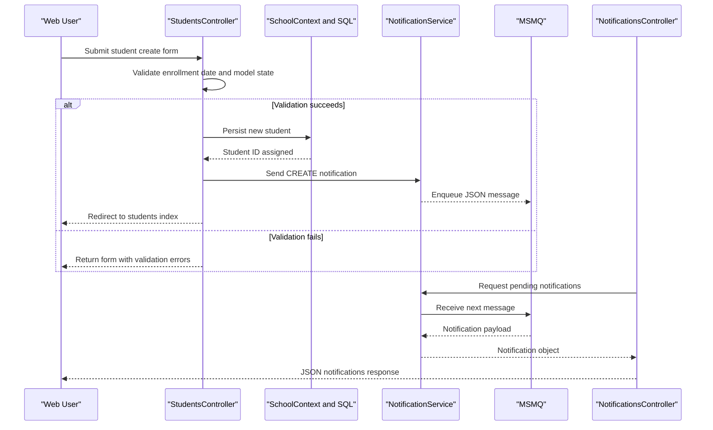

# API & Service Communication Contracts

This inventory captures the HTTP endpoints and communication patterns exposed by the ContosoUniversity web application, including synchronous MVC request processing and asynchronous notification queue interactions.

## Service Catalog

| Service | Port | Category | Purpose |
|---|---|---|---|
| ContosoUniversity Web App (`ContosoUniversity.csproj`) | 44300 (IIS Express setting) | API Layer | Hosts MVC endpoints, HTML views, and JSON notification APIs |
| Notification Queue Adapter (`NotificationService`) | MSMQ private path `./Private$/ContosoUniversityNotifications` | Infrastructure | Sends and receives asynchronous entity operation notifications |

## API Endpoints Inventory

| Service | Method | Path | Request Type | Response Type |
|---|---|---|---|---|
| ContosoUniversity Web App / StudentsController | GET | `/Students/Index` | Query params (`sortOrder`, `currentFilter`, `searchString`, `page`) | HTML view with paged `Student` list |
| ContosoUniversity Web App / StudentsController | POST | `/Students/Create` | Form body bound to `Student` | Redirect on success; validation errors in HTML view |
| ContosoUniversity Web App / StudentsController | POST | `/Students/Edit` | Form body bound to `Student` | Redirect on success; validation errors in HTML view |
| ContosoUniversity Web App / StudentsController | POST | `/Students/Delete` | Path/form `id` | Redirect with operation outcome |
| ContosoUniversity Web App / CoursesController | POST | `/Courses/Create` | Form body bound to `Course` + file upload | Redirect on success; validation errors in HTML view |
| ContosoUniversity Web App / CoursesController | POST | `/Courses/Edit` | Form body bound to `Course` + optional file upload | Redirect on success; validation errors in HTML view |
| ContosoUniversity Web App / CoursesController | POST | `/Courses/Delete` | Path/form `id` | Redirect with operation outcome |
| ContosoUniversity Web App / InstructorsController | GET/POST | `/Instructors/*` | MVC route values and form posts | HTML views and redirects |
| ContosoUniversity Web App / DepartmentsController | GET/POST | `/Departments/*` | MVC route values and form posts | HTML views and redirects |
| ContosoUniversity Web App / NotificationsController | GET | `/Notifications/GetNotifications` | No body | JSON `{ success, notifications, count }` |
| ContosoUniversity Web App / NotificationsController | POST | `/Notifications/MarkAsRead` | Form/query `id` | JSON `{ success }` or error message |

## Management & Observability Endpoints

| Service | Endpoint | Custom Metrics (if any) |
|---|---|---|
| ContosoUniversity Web App | None explicitly configured (`/health`, `/healthz`, `/swagger` not present) | None detected |

## DTOs & Contracts

The API surface primarily uses MVC model binding directly against domain classes (`Student`, `Instructor`, `Course`, `Department`, `Notification`) rather than separate immutable API DTOs. View-model classes such as `InstructorIndexData`, `AssignedCourseData`, and `EnrollmentDateGroup` support server-rendered responses. JSON serialization for notification payloads is handled with Newtonsoft.Json when messages are enqueued/dequeued. No OpenAPI/Swagger, protobuf, or GraphQL contract artifacts were detected.

## Communication Patterns

Synchronous communication follows browser-to-controller request/response over HTTPS via IIS Express and MVC routing. Within the monolith, controllers directly invoke EF Core `DbContext` operations and helper services (no separate service discovery or API gateway). Asynchronous communication exists for notifications: CRUD controllers send notification events to MSMQ and the notifications endpoint reads queued messages. No explicit circuit breaker, retry library, or timeout policy framework is configured; fallback behavior is basic exception handling with error responses. Startup API availability depends on successful database initialization at application start.

Security posture: the project enables IIS Express Windows Authentication in project settings while also noting no global authorize filter in `FilterConfig`, so endpoint-level authorization is not consistently enforced across controllers.

## Service Technology Matrix

| Service | Web | Data Access | Discovery | Gateway | Actuator | Cache | Metrics |
|---|---|---|---|---|---|---|---|
| ContosoUniversity Web App | ASP.NET MVC 5 | EF Core 3.1 + SQL Server provider | None | None | None | In-process abstractions available | None explicit |
| Notification Queue Adapter | N/A | MSMQ queue operations | None | None | None | None | None |

## Service Communication Sequence

