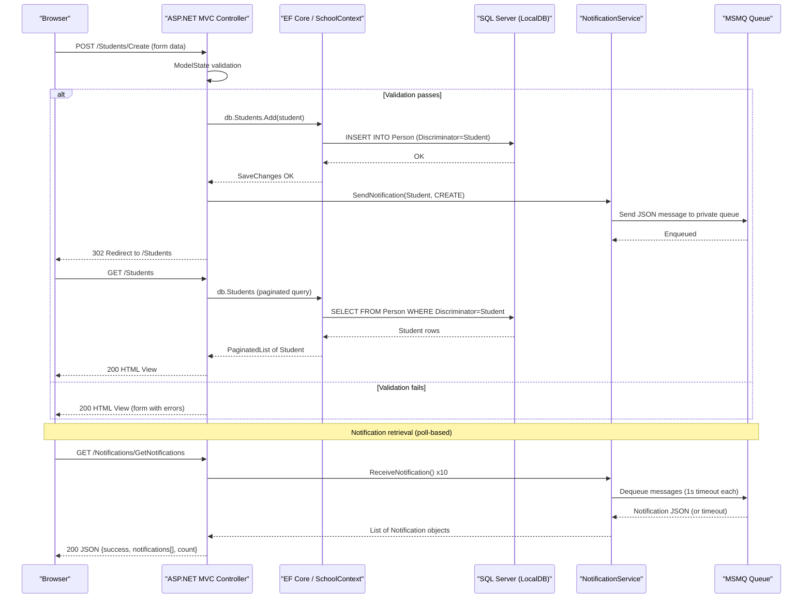

# API & Service Communication Contracts

ContosoUniversity exposes 28 MVC action endpoints across 6 controllers using a conventional `{controller}/{action}/{id}` route pattern; there is no REST API layer, API versioning, or API gateway — all endpoints return HTML views or JSON responses over HTTP.

## Service Catalog

| Service | Port | Category | Purpose |
|---------|------|----------|---------|
| ContosoUniversity Web App | 44300 (HTTPS) / 58801 (HTTP) | Business | Single deployable ASP.NET MVC 5 web application managing students, courses, instructors, departments, and notifications |

## API Endpoints Inventory

| Controller | Method | Path | Request Type | Response Type | Notes |
|-----------|--------|------|-------------|---------------|-------|
| HomeController | GET | `/` or `/Home/Index` | — | HTML View | Landing page |
| HomeController | GET | `/Home/About` | — | HTML View (EnrollmentDateGroup list) | Enrollment statistics |
| HomeController | GET | `/Home/Contact` | — | HTML View | Contact page |
| HomeController | GET | `/Home/Error` | — | HTML View | Error page |
| HomeController | GET | `/Home/Unauthorized` | — | HTML View | Access-denied page |
| StudentsController | GET | `/Students` | `sortOrder`, `currentFilter`, `searchString`, `page` (query) | HTML View (PaginatedList of Student) | Paginated, sortable, searchable list |
| StudentsController | GET | `/Students/Details/{id}` | `id` (path) | HTML View (Student) | 400 if id null, 404 if not found |
| StudentsController | GET | `/Students/Create` | — | HTML View | Empty create form |
| StudentsController | POST | `/Students/Create` | Student (form-encoded) | Redirect / HTML View | 302 on success; re-renders form on error |
| StudentsController | GET | `/Students/Edit/{id}` | `id` (path) | HTML View (Student) | 400 if id null, 404 if not found |
| StudentsController | POST | `/Students/Edit/{id}` | Student (form-encoded) | Redirect / HTML View | 302 on success |
| StudentsController | GET | `/Students/Delete/{id}` | `id` (path) | HTML View (Student) | Confirmation page |
| StudentsController | POST | `/Students/Delete/{id}` | `id` (form) | Redirect | AntiForgery-protected |
| CoursesController | GET | `/Courses` | — | HTML View (Course list) | Includes Department |
| CoursesController | GET | `/Courses/Details/{id}` | `id` (path) | HTML View (Course) | |
| CoursesController | GET | `/Courses/Create` | — | HTML View | Populates department dropdown |
| CoursesController | POST | `/Courses/Create` | Course + optional image file (multipart/form-data) | Redirect / HTML View | Accepts image upload; validates type and size (max 5 MB) |
| CoursesController | GET | `/Courses/Edit/{id}` | `id` (path) | HTML View (Course) | |
| CoursesController | POST | `/Courses/Edit/{id}` | Course + optional image file (multipart/form-data) | Redirect / HTML View | Replaces existing image on server |
| CoursesController | GET | `/Courses/Delete/{id}` | `id` (path) | HTML View (Course) | |
| CoursesController | POST | `/Courses/Delete/{id}` | `id` (form) | Redirect | Deletes associated image file |
| InstructorsController | GET | `/Instructors` | `id` (instructor, query), `courseID` (query) | HTML View (InstructorIndexData) | Master-detail: selecting instructor shows courses; selecting course shows enrollments |
| InstructorsController | GET | `/Instructors/Details/{id}` | `id` (path) | HTML View (Instructor) | |
| InstructorsController | GET | `/Instructors/Create` | — | HTML View | Populates assigned-course checkboxes |
| InstructorsController | POST | `/Instructors/Create` | Instructor + `selectedCourses[]` (form) | Redirect / HTML View | |
| InstructorsController | GET | `/Instructors/Edit/{id}` | `id` (path) | HTML View (Instructor) | |
| InstructorsController | POST | `/Instructors/Edit/{id}` | `id` + `selectedCourses[]` (form) | Redirect / HTML View | Uses `TryUpdateModel` |
| InstructorsController | GET | `/Instructors/Delete/{id}` | `id` (path) | HTML View (Instructor) | |
| InstructorsController | POST | `/Instructors/Delete/{id}` | `id` (form) | Redirect | Clears administrator FK in Departments |
| DepartmentsController | GET | `/Departments` | — | HTML View (Department list) | |
| DepartmentsController | GET | `/Departments/Details/{id}` | `id` (path) | HTML View (Department) | |
| DepartmentsController | GET | `/Departments/Create` | — | HTML View | |
| DepartmentsController | POST | `/Departments/Create` | Department (form-encoded) | Redirect / HTML View | |
| DepartmentsController | GET | `/Departments/Edit/{id}` | `id` (path) | HTML View (Department) | Optimistic concurrency with RowVersion |
| DepartmentsController | POST | `/Departments/Edit/{id}` | Department incl. RowVersion (form-encoded) | Redirect / HTML View | Returns `DbUpdateConcurrencyException` details on conflict |
| DepartmentsController | GET | `/Departments/Delete/{id}` | `id` (path) | HTML View (Department) | |
| DepartmentsController | POST | `/Departments/Delete/{id}` | `id` (form) | Redirect | |
| NotificationsController | GET | `/Notifications` | — | HTML View | Admin notification dashboard |
| NotificationsController | GET | `/Notifications/GetNotifications` | — | JSON (`{success, notifications[], count}`) | Reads up to 10 messages from MSMQ queue |
| NotificationsController | POST | `/Notifications/MarkAsRead` | `id` (form) | JSON (`{success}`) | No-op in current implementation |

## Management & Observability Endpoints

| Endpoint | Description |
|----------|-------------|
| No health-check endpoints | No `/health`, `/healthz`, or Actuator-style endpoints are configured |
| No Swagger / OpenAPI UI | No API documentation endpoints present |
| No metrics endpoints | No Prometheus, Application Insights, or custom metrics endpoints exposed |

> Note: Observability is limited to `System.Diagnostics.Trace` and `Debug.WriteLine` calls in source code. There are no structured logging, health-check, or metrics endpoints.

## DTOs & Contracts

The application uses domain entity classes directly as controller action parameters and view models, with no dedicated DTO or API contract layer. All model binding uses `[Bind(Include="...")]` attribute constraints directly on entity parameters.

**View Models (presentation-layer aggregates)**:
- `InstructorIndexData` — aggregates `Instructors`, `Courses`, and `Enrollments` collections for the master-detail Instructors index view; this is the closest thing to a gateway-level aggregation DTO.
- `AssignedCourseData` — checkbox state DTO pairing a `CourseID`, `Title`, and `Assigned` flag for instructor course-assignment views.
- `EnrollmentDateGroup` — projection DTO grouping students by enrollment date for the Home/About statistics view.

**Domain entities used directly as request/response models**: `Student`, `Instructor`, `Course`, `Department`, `Enrollment`, `Notification`, `OfficeAssignment`, `CourseAssignment`. See `data-architecture.md` for full field definitions and ORM mapping details.

**JSON responses**: `NotificationsController.GetNotifications` returns an anonymous JSON object `{success, notifications[], count}` — not a typed contract class. Serialization uses ASP.NET MVC's built-in `JsonResult` (Newtonsoft.Json under the hood via the default JSON serializer).

**No OpenAPI/Swagger**, no protobuf schemas, and no GraphQL schemas are present.

## Communication Patterns

**Synchronous (HTTP)**: All client-to-server communication is synchronous HTML form submissions over HTTP/HTTPS. The application is a monolith — there is no inter-service HTTP communication. Controllers call `SchoolContext` (EF Core) directly for data access.

**Asynchronous (MSMQ)**: Entity mutation operations (create/update/delete across all resource controllers) publish a JSON-serialized `Notification` object to a local Windows MSMQ private queue (`.\Private$\ContosoUniversityNotifications`) via `NotificationService`. The `NotificationsController.GetNotifications` endpoint dequeues up to 10 messages synchronously on demand (poll-based, not push). There is no background consumer or event-driven subscriber.

**Resilience**: No circuit-breaker, retry policy, timeout configuration, or bulkhead pattern is implemented. MSMQ errors are silently swallowed (`Debug.WriteLine` only) to avoid breaking the primary operation. EF Core operations have no retry or transaction policies.

**Service Discovery**: Not applicable — single-process monolith, no external service calls.

**API Gateway**: None.

**Security posture**: **No authentication or authorization is configured.** There is no login page, no ASP.NET Identity, no JWT/OAuth2 middleware, and no `[Authorize]` attributes anywhere in the codebase. All 40 endpoints are publicly accessible without any credentials. HTTPS is configured for the development IIS Express profile (port 44300) but no enforcement or redirect from HTTP is in place. CSRF protection is applied to all POST endpoints via `[ValidateAntiForgeryToken]`.

## Service Technology Matrix

| Capability | ContosoUniversity Web App |
|------------|--------------------------|
| Web Framework | ASP.NET MVC 5.2.9 (Razor views) |
| Data Access | Entity Framework Core 3.1.32 (SchoolContext) |
| Service Discovery | None |
| API Gateway | None |
| Health Checks | None |
| Caching | None |
| Metrics / Observability | None |
| Authentication | None |
| File Storage | Local filesystem (`~/Uploads/TeachingMaterials/`) |
| Messaging | MSMQ (System.Messaging, Windows-only) |

## Service Communication Sequence

