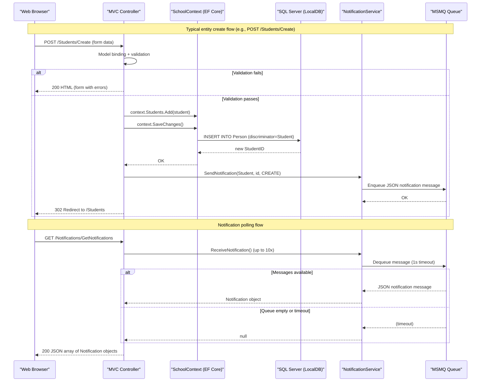

# API & Service Communication Contracts

ContosoUniversity exposes a single monolithic ASP.NET MVC 5 application with approximately 35 HTTP endpoints covering full CRUD operations across 5 controllers, plus one JSON-returning notification endpoint; all communication is synchronous HTTP with no external service-to-service calls or API gateway.

## Service Catalog

| Service | Port | Category | Purpose |
|---------|------|----------|---------|
| ContosoUniversity (IIS Express) | 44300 (HTTPS) / 4200 (HTTP) | Business | Monolithic ASP.NET MVC 5 web application managing students, courses, instructors, departments, and notifications |

## API Endpoints Inventory

| Service | Method | Path | Request Type | Response Type |
|---------|--------|------|-------------|---------------|
| HomeController | GET | / | — | HTML (Index view) |
| HomeController | GET | /Home/About | — | HTML (About view, enrollment statistics) |
| HomeController | GET | /Home/Contact | — | HTML (Contact view) |
| HomeController | GET | /Home/Error | — | HTML (Error view) |
| HomeController | GET | /Home/Unauthorized | — | HTML (Unauthorized view) |
| StudentsController | GET | /Students | sortOrder, currentFilter, searchString, page (query) | HTML (paginated student list) |
| StudentsController | GET | /Students/Details/{id} | id (path) | HTML (student details + enrollments) |
| StudentsController | GET | /Students/Create | — | HTML (create form) |
| StudentsController | POST | /Students/Create | Student (form body) | Redirect / HTML (validation errors) |
| StudentsController | GET | /Students/Edit/{id} | id (path) | HTML (edit form) |
| StudentsController | POST | /Students/Edit | Student (form body) | Redirect / HTML (validation errors) |
| StudentsController | GET | /Students/Delete/{id} | id (path) | HTML (delete confirmation) |
| StudentsController | POST | /Students/Delete/{id} | id (path) | Redirect |
| CoursesController | GET | /Courses | — | HTML (course list with departments) |
| CoursesController | GET | /Courses/Details/{id} | id (path) | HTML (course details) |
| CoursesController | GET | /Courses/Create | — | HTML (create form) |
| CoursesController | POST | /Courses/Create | Course + teachingMaterialImage (multipart form) | Redirect / HTML (validation errors) |
| CoursesController | GET | /Courses/Edit/{id} | id (path) | HTML (edit form) |
| CoursesController | POST | /Courses/Edit | Course + teachingMaterialImage (multipart form) | Redirect / HTML (validation errors) |
| CoursesController | GET | /Courses/Delete/{id} | id (path) | HTML (delete confirmation) |
| CoursesController | POST | /Courses/Delete/{id} | id (path) | Redirect |
| InstructorsController | GET | /Instructors | id, courseID (query) | HTML (instructor list with courses and enrollments) |
| InstructorsController | GET | /Instructors/Details/{id} | id (path) | HTML (instructor details) |
| InstructorsController | GET | /Instructors/Create | — | HTML (create form with course assignments) |
| InstructorsController | POST | /Instructors/Create | Instructor + selectedCourses[] (form body) | Redirect / HTML (validation errors) |
| InstructorsController | GET | /Instructors/Edit/{id} | id (path) | HTML (edit form with course assignments) |
| InstructorsController | POST | /Instructors/Edit/{id} | Instructor + selectedCourses[] (form body) | Redirect / HTML (validation errors) |
| InstructorsController | GET | /Instructors/Delete/{id} | id (path) | HTML (delete confirmation) |
| InstructorsController | POST | /Instructors/Delete/{id} | id (path) | Redirect |
| DepartmentsController | GET | /Departments | — | HTML (department list with administrators) |
| DepartmentsController | GET | /Departments/Details/{id} | id (path) | HTML (department details) |
| DepartmentsController | GET | /Departments/Create | — | HTML (create form) |
| DepartmentsController | POST | /Departments/Create | Department (form body) | Redirect / HTML (validation errors) |
| DepartmentsController | GET | /Departments/Edit/{id} | id (path) | HTML (edit form) |
| DepartmentsController | POST | /Departments/Edit | Department + RowVersion (form body) | Redirect / HTML (concurrency error) |
| DepartmentsController | GET | /Departments/Delete/{id} | id (path) | HTML (delete confirmation) |
| DepartmentsController | POST | /Departments/Delete/{id} | id (path) | Redirect / HTML (concurrency error) |
| NotificationsController | GET | /Notifications | — | HTML (notification dashboard) |
| NotificationsController | GET | /Notifications/GetNotifications | — | JSON (array of up to 10 Notification objects) |
| NotificationsController | POST | /Notifications/MarkAsRead/{id} | id (path) | JSON (placeholder, always succeeds) |

## Management & Observability Endpoints

| Service | Endpoint | Custom Metrics |
|---------|----------|---------------|
| ContosoUniversity | None configured | None |

No health check endpoints (`/health`, `/healthz`), Swagger UI (`/swagger`), or metrics endpoints are configured. There is no integration with Application Insights, Prometheus, or any other observability platform.

## DTOs & Contracts

The application uses domain entity classes directly as MVC model binding targets rather than dedicated DTO or request/response classes. All entity types are service-level domain models with no gateway-level aggregation DTOs.

**Entity/Model classes used as API contracts:**

| Class | API Role | Immutability |
|-------|----------|-------------|
| `Student` | POST/PUT request body (Create/Edit forms); read model for Details/Index views | Mutable (properties with setters) |
| `Instructor` | POST/PUT request body; read model for Details/Index views | Mutable |
| `Course` | POST/PUT request body (includes file upload); read model | Mutable |
| `Department` | POST/PUT request body (includes RowVersion); read model | Mutable |
| `Notification` | JSON response object from `GetNotifications` endpoint | Mutable |
| `InstructorIndexData` | View model aggregating instructor list, selected courses, and enrollments | Mutable |
| `AssignedCourseData` | View model for course-assignment checkbox list in instructor forms | Mutable |
| `EnrollmentDateGroup` | View model for enrollment statistics on About page | Mutable |
| `ErrorViewModel` | View model for error display | Mutable |

No OpenAPI/Swagger specifications, `.proto` protobuf schemas, or GraphQL schemas are present. JSON serialization for the notification endpoint uses `Newtonsoft.Json` (13.0.3) with default settings. MVC model binding uses standard ASP.NET MVC 5 form-encoded and multipart binding; no custom serializers are configured.

For full field definitions and ORM annotations, see `data-architecture.md`.

## Communication Patterns

**Synchronous (HTTP/MVC):** All user-facing interactions are synchronous HTTP request/response cycles handled within a single process. Controllers query `SchoolContext` (EF Core) directly via synchronous LINQ queries; there is no async/await in controller actions or service methods.

**Asynchronous (MSMQ):** Entity create, update, and delete operations in controllers call `NotificationService.SendNotification()`, which enqueues a JSON-serialized `Notification` message to a local MSMQ private queue (`.\Private$\ContosoUniversityNotifications`). The `NotificationsController.GetNotifications()` endpoint dequeues up to 10 messages synchronously from the same queue with a 1-second receive timeout. There is no durable storage for notifications — if the queue is unavailable or the application restarts, unread messages may be lost.

**Resilience policies:** No circuit breaker, retry policies, timeout configuration (beyond the default 1-second MSMQ receive timeout), or bulkhead patterns are implemented.

**Service discovery:** Not applicable — the application is a single-process monolith with no inter-service calls.

**API gateway:** None.

**Security posture:** No authentication or TLS is configured at the application level. The `[Authorize]` global filter is explicitly commented out in `FilterConfig.cs`. `Microsoft.Identity.Client` (MSAL) is declared as a dependency but is not wired up. All 40 endpoints are publicly accessible with no authorization checks. Input from file uploads is validated for type (image extensions) and size (max 5 MB), but there is no CSRF token protection explicitly verified in the code, and no HTTPS enforcement redirect is configured.

## Service Technology Matrix

| Service | Web Framework | Data Access | Discovery | Gateway | Health Checks | Cache | Metrics |
|---------|--------------|-------------|-----------|---------|--------------|-------|---------|
| ContosoUniversity | ASP.NET MVC 5.2.9 | EF Core 3.1 (SQL Server) | None | None | None | None | None |

## Service Communication Sequence

