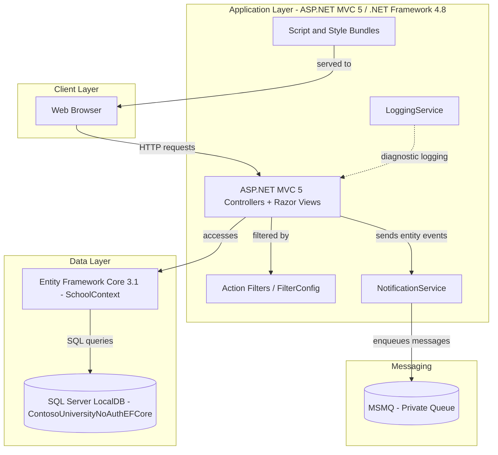
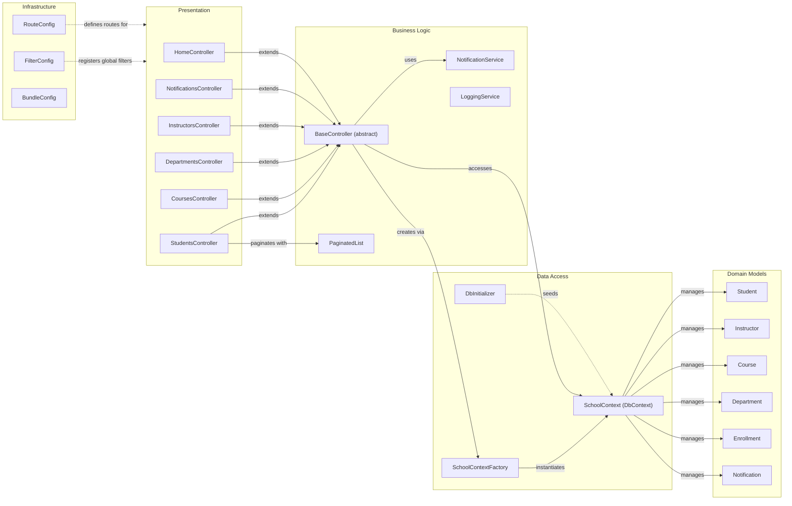

# Architecture Diagram

ContosoUniversity is an ASP.NET MVC 5 web application targeting .NET Framework 4.8, demonstrating a classic university management system with Entity Framework Core 3.1 for data access and MSMQ-based notifications.

## Application Architecture

### Technology Stack Summary

| Layer | Technology | Version | Purpose |
|---|---|---|---|
| Presentation | ASP.NET MVC 5 (Razor Views) | 5.2.9 | Server-side rendered HTML pages |
| Presentation | Bootstrap | 5.3.3 | Front-end UI styling |
| Presentation | jQuery | 3.7.1 | Client-side scripting and validation |
| Business Logic | ASP.NET MVC 5 Controllers | 5.2.9 | Request handling and orchestration |
| Business Logic | NotificationService | Custom | MSMQ-based entity change notifications |
| Business Logic | LoggingService | Custom | Diagnostic and audit logging |
| Data Access | Entity Framework Core | 3.1.32 | ORM for data access |
| Data Access | Microsoft.Data.SqlClient | 2.1.4 | SQL Server connectivity |
| Data Storage | SQL Server LocalDB | LocalDB | Relational database for all domain data |
| Messaging | MSMQ (System.Messaging) | Built-in | Asynchronous notification queue |
| Runtime | .NET Framework | 4.8 | Application runtime |

### Data Storage & External Services

The application uses a single SQL Server LocalDB database (`ContosoUniversityNoAuthEFCore`) accessed via Entity Framework Core 3.1 with the `SchoolContext` DbContext. All domain entities (Students, Instructors, Courses, Departments, Enrollments, etc.) are stored relationally with Table-per-Hierarchy (TPH) inheritance for the Person entity. MSMQ (Microsoft Message Queuing) is used as an internal messaging bus: the `NotificationService` enqueues JSON-serialised notification messages to a private local queue (`.\Private$\ContosoUniversityNotifications`) whenever CRUD operations are performed on domain entities. There are no external third-party API integrations or cloud services.

### Key Architectural Decisions

- **Direct DbContext access in controllers**: Controllers inherit from `BaseController`, which instantiates `SchoolContext` directly via `SchoolContextFactory` without a repository abstraction layer.
- **MSMQ for notifications**: Entity change events are published to a local MSMQ queue through `NotificationService`, providing loose coupling between the data mutation operations and notification processing.
- **Table-per-Hierarchy (TPH) inheritance**: `Student` and `Instructor` both map to a single `Person` table with a discriminator column, simplifying the schema while supporting polymorphic queries.

## Component Relationships

### Component Inventory

| Component | Layer | Type | Responsibility |
|---|---|---|---|
| HomeController | Presentation | MVC Controller | Dashboard and statistics display |
| StudentsController | Presentation | MVC Controller | Student CRUD and search with pagination |
| CoursesController | Presentation | MVC Controller | Course CRUD operations |
| DepartmentsController | Presentation | MVC Controller | Department management with concurrency handling |
| InstructorsController | Presentation | MVC Controller | Instructor management and office assignments |
| NotificationsController | Presentation | MVC Controller | Notification listing and read status |
| BaseController | Business Logic | Abstract Controller | Shared DbContext, NotificationService, and disposal logic |
| NotificationService | Business Logic | Service | MSMQ message enqueue/dequeue for entity change events |
| LoggingService | Business Logic | Service | Diagnostic and audit logging |
| PaginatedList | Business Logic | Utility | Generic in-memory pagination helper |
| SchoolContext | Data Access | EF Core DbContext | ORM unit-of-work managing all domain entity sets |
| SchoolContextFactory | Data Access | Factory | Creates configured SchoolContext from Web.config connection string |
| DbInitializer | Data Access | Seeder | Populates the database with seed data on startup |
| FilterConfig | Infrastructure | Configuration | Registers global MVC action filters |
| RouteConfig | Infrastructure | Configuration | Defines URL routing conventions |
| BundleConfig | Infrastructure | Configuration | Configures CSS and JS bundling/minification |
