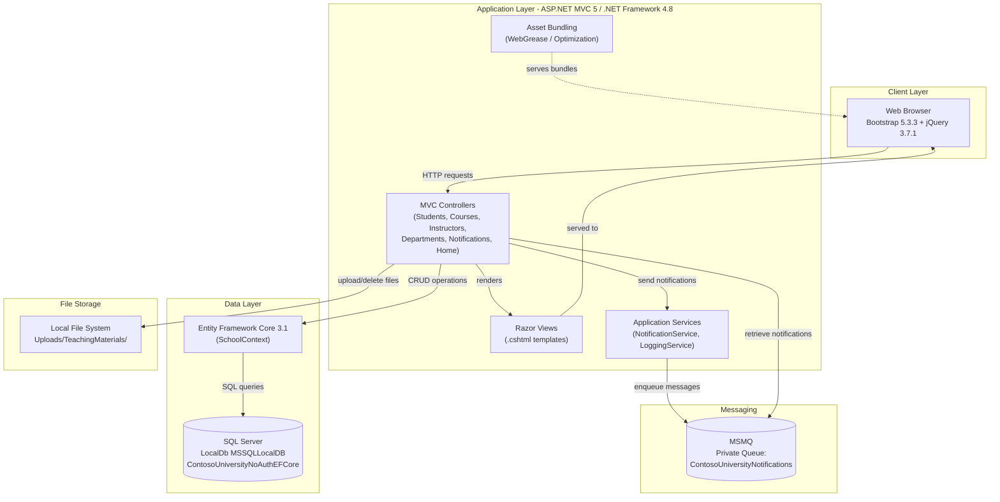
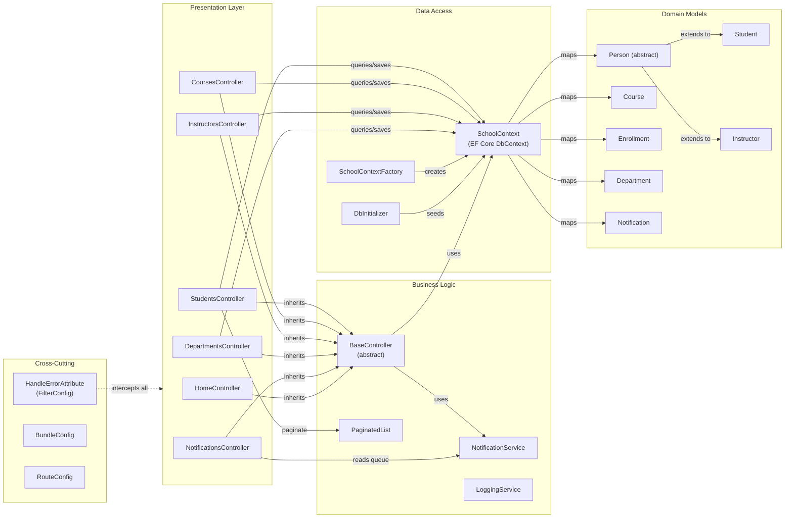

# Architecture Diagram

ContosoUniversity is an ASP.NET MVC 5 web application running on .NET Framework 4.8 that manages university data including students, instructors, courses, and departments, with MSMQ-based notifications and SQL Server data persistence.

## Application Architecture

### Technology Stack Summary

| Layer | Technology | Version | Purpose |
|-------|-----------|---------|---------|
| Presentation | ASP.NET MVC | 5.2.9 | Server-side MVC web framework |
| Presentation | Razor View Engine | 3.2.9 | Templating and HTML rendering |
| Presentation | Bootstrap | 5.3.3 | Responsive CSS UI framework |
| Presentation | jQuery | 3.7.1 | DOM manipulation and AJAX |
| Presentation | jQuery Validation | 1.21.0 | Client-side form validation |
| Business Logic | .NET Framework | 4.8 | Application runtime |
| Business Logic | MSMQ | Windows | Asynchronous notification messaging |
| Data Access | Entity Framework Core | 3.1.32 | ORM for database operations |
| Data Access | Microsoft.Data.SqlClient | 2.1.4 | SQL Server ADO.NET driver |
| Data Storage | SQL Server LocalDB | MSSQLLocalDB | Relational database |
| Data Storage | Local File System | — | Teaching material image uploads |
| Serialization | Newtonsoft.Json | 13.0.3 | JSON serialization for notifications |
| Asset Optimization | WebGrease / System.Web.Optimization | 1.5.2 / 1.1.3 | Script and CSS bundling |

### Data Storage & External Services

The application uses a single SQL Server LocalDB instance (`ContosoUniversityNoAuthEFCore`) as its primary data store, accessed through Entity Framework Core 3.1 with Table-per-Hierarchy (TPH) inheritance for the `Person` → `Student`/`Instructor` hierarchy. Asynchronous notifications are delivered via MSMQ using a private local queue (`.\Private$\ContosoUniversityNotifications`), with messages serialized as JSON. Teaching material images uploaded through course management are persisted to a local file system directory (`Uploads/TeachingMaterials/`) with a 5 MB size limit and type validation.

### Key Architectural Decisions

- **Entity Framework Core with TPH inheritance**: `Student` and `Instructor` both extend the abstract `Person` class and are stored in a single `Person` table differentiated by a `Discriminator` column, simplifying polymorphic queries.
- **MSMQ for decoupled notifications**: Entity create/update/delete operations publish messages to an MSMQ queue rather than calling notification logic inline, decoupling audit/notification concerns from controller logic.
- **Row-version optimistic concurrency on Departments**: The `Department` entity uses a `RowVersion` timestamp column to detect concurrent edit conflicts, handled explicitly in `DepartmentsController`.

## Component Relationships

### Component Inventory

| Component | Layer | Type | Responsibility |
|-----------|-------|------|----------------|
| HomeController | Presentation | MVC Controller | Home page, statistics (enrollment date groups), contact page |
| StudentsController | Presentation | MVC Controller | Student CRUD with sorting, filtering, and pagination |
| CoursesController | Presentation | MVC Controller | Course CRUD with teaching material image upload |
| InstructorsController | Presentation | MVC Controller | Instructor CRUD with multi-course assignment management |
| DepartmentsController | Presentation | MVC Controller | Department CRUD with optimistic concurrency handling |
| NotificationsController | Presentation | MVC Controller | JSON API to retrieve MSMQ notifications; notification dashboard |
| BaseController | Business Logic | Abstract Controller | Shared SchoolContext + NotificationService initialization; entity notification helper |
| NotificationService | Business Logic | Service | MSMQ queue management; serialize/deserialize notification messages |
| LoggingService | Business Logic | Service | Logging abstraction (placeholder) |
| PaginatedList | Business Logic | Helper | Generic paginated list with page metadata |
| SchoolContext | Data Access | EF Core DbContext | ORM mappings, TPH inheritance config, relationship configuration |
| SchoolContextFactory | Data Access | Factory | Creates SchoolContext with SQL Server connection string from Web.config |
| DbInitializer | Data Access | Seeder | Seeds initial students, instructors, departments, and courses |
| Person | Domain Model | Abstract Entity | Base class for Student and Instructor (ID, name) |
| Student | Domain Model | Entity | Student with enrollment date and course enrollments |
| Instructor | Domain Model | Entity | Instructor with hire date, office assignment, and course assignments |
| Course | Domain Model | Entity | Course with credits, department, teaching material image path |
| Enrollment | Domain Model | Entity | Junction between Student and Course with grade |
| Department | Domain Model | Entity | Department with budget, start date, administrator, concurrency token |
| CourseAssignment | Domain Model | Junction Entity | Many-to-many between Instructor and Course |
| OfficeAssignment | Domain Model | Entity | Optional one-to-one office location for an Instructor |
| Notification | Domain Model | Entity | Audit notification record for entity CRUD operations |
| FilterConfig | Cross-Cutting | Filter Configuration | Registers global HandleErrorAttribute for unhandled exceptions |
| BundleConfig | Cross-Cutting | Bundle Configuration | Defines jQuery, Bootstrap, and CSS script/style bundles |
| RouteConfig | Cross-Cutting | Route Configuration | Defines default MVC route `{controller}/{action}/{id}` |
