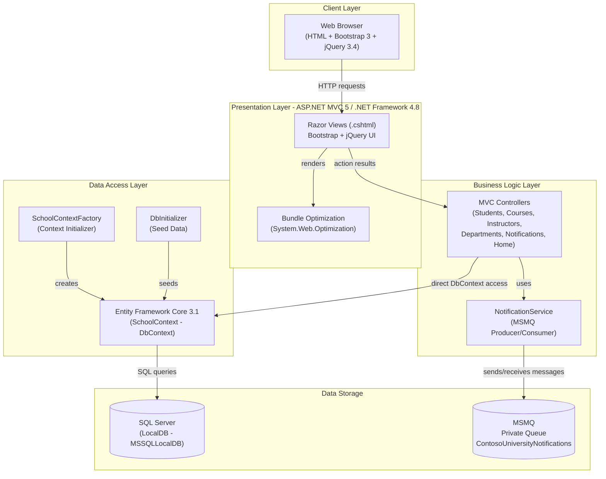
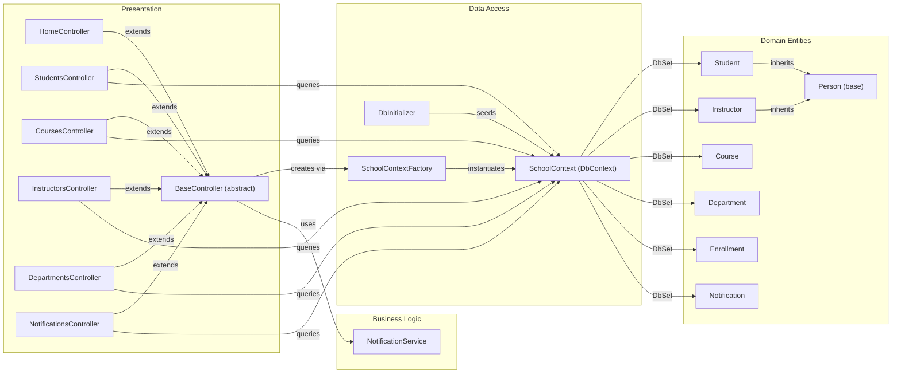

# Architecture Diagram

ContosoUniversity is an ASP.NET MVC 5 web application targeting .NET Framework 4.8, built around a university management system that tracks students, courses, instructors, departments, and enrollments. It uses Entity Framework Core for data access against SQL Server and MSMQ for asynchronous notifications.

## Application Architecture

### Technology Stack Summary

| Layer | Technology | Version | Purpose |
|-------|-----------|---------|---------|
| Presentation | ASP.NET MVC | 5.2.9 | Server-side web framework with Razor view engine |
| Presentation | Bootstrap | 3.x | Responsive CSS framework |
| Presentation | jQuery | 3.4.1 | Client-side scripting and validation |
| Presentation | jQuery Validation | Latest | Client-side form validation |
| Business Logic | System.Messaging (MSMQ) | .NET 4.8 built-in | Asynchronous notification queue |
| Business Logic | Newtonsoft.Json | 13.0.3 | JSON serialization for queue messages |
| Data Access | Entity Framework Core | 3.1.32 | ORM for database operations |
| Data Access | Microsoft.Data.SqlClient | 2.1.4 | SQL Server connectivity |
| Runtime | .NET Framework | 4.8 | Application host runtime |
| Runtime | IIS / IIS Express | - | Web server host |

### Data Storage & External Services

The application uses SQL Server LocalDB (`MSSQLLocalDB`) as its primary data store, accessed through Entity Framework Core 3.1 with code-first schema managed by `SchoolContext`. The database stores all domain entities: students, instructors, courses, departments, enrollments, office assignments, and notifications. Table-per-Hierarchy (TPH) inheritance maps `Student` and `Instructor` into a single `Person` table with a discriminator column. For asynchronous messaging, the application uses MSMQ (Microsoft Message Queuing) via a private local queue (`.\Private$\ContosoUniversityNotifications`) to broadcast entity lifecycle events (create/update/delete) that can be consumed by `NotificationsController`.

### Key Architectural Decisions

- **Direct DbContext access in controllers**: All MVC controllers extend `BaseController`, which directly instantiates `SchoolContext` via `SchoolContextFactory`, bypassing a repository abstraction layer.
- **MSMQ for async notifications**: Entity mutation operations (students, courses, etc.) publish messages to a local MSMQ queue, decoupling notification delivery from the main request pipeline.
- **Table-per-Hierarchy (TPH) inheritance**: `Student` and `Instructor` both derive from `Person` and share a single `Person` table, using a `Discriminator` column.

## Component Relationships

### Component Inventory

| Component | Layer | Type | Responsibility |
|-----------|-------|------|---------------|
| BaseController | Presentation | Abstract MVC Controller | Provides shared `SchoolContext` and `NotificationService` to all controllers; handles disposal |
| HomeController | Presentation | MVC Controller | Displays enrollment statistics grouped by date |
| StudentsController | Presentation | MVC Controller | Full CRUD for student records with pagination and search |
| CoursesController | Presentation | MVC Controller | Full CRUD for courses; manages department assignment |
| InstructorsController | Presentation | MVC Controller | Full CRUD for instructors; manages office and course assignments |
| DepartmentsController | Presentation | MVC Controller | Full CRUD for departments; manages budget and administrator |
| NotificationsController | Presentation | MVC Controller | Lists notifications received via MSMQ queue |
| NotificationService | Business Logic | Service | Sends and receives entity lifecycle notifications via MSMQ |
| SchoolContext | Data Access | EF Core DbContext | Unit of work and DbSet provider for all domain entities |
| SchoolContextFactory | Data Access | Factory | Creates and configures `SchoolContext` with SQL Server connection |
| DbInitializer | Data Access | Initializer | Seeds the database with initial test data |
| Person | Domain | Entity (base) | Abstract base class for Student and Instructor (TPH) |
| Student | Domain | Entity | University student; inherits Person; has enrollments |
| Instructor | Domain | Entity | Faculty instructor; inherits Person; has course assignments and office |
| Course | Domain | Entity | Academic course; belongs to a department; has enrollments and instructors |
| Department | Domain | Entity | Academic department; has budget, start date, and administrator |
| Enrollment | Domain | Entity | Join entity linking Student to Course with a grade |
| CourseAssignment | Domain | Entity | Join entity linking Instructor to Course (many-to-many) |
| OfficeAssignment | Domain | Entity | One-to-one entity linking Instructor to an office location |
| Notification | Domain | Entity | Persisted record of an entity lifecycle event |
