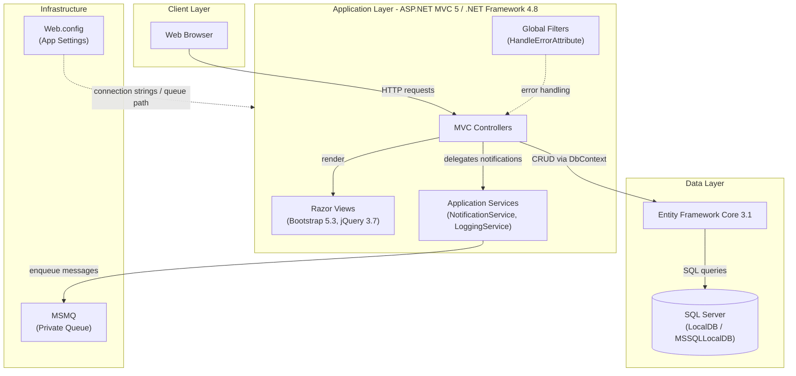
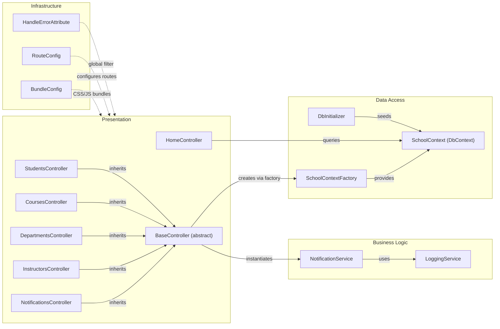

# Architecture Diagram

ContosoUniversity is a legacy ASP.NET MVC 5 web application targeting .NET Framework 4.8, using Entity Framework Core 3.1 for data access and MSMQ for asynchronous notifications.

## Application Architecture

### Technology Stack Summary

| Layer | Technology | Version | Purpose |
|---|---|---|---|
| Presentation | ASP.NET MVC | 5.2.9 | Server-side MVC web framework |
| Presentation | Razor Views | 3.2.9 | HTML templating engine |
| Presentation | Bootstrap | 5.3.3 | Responsive CSS framework |
| Presentation | jQuery | 3.7.1 | Client-side scripting |
| Runtime | .NET Framework | 4.8 | Application runtime platform |
| Data Access | Entity Framework Core | 3.1.32 | ORM for SQL Server |
| Data Access | Microsoft.Data.SqlClient | 2.1.4 | SQL Server connectivity |
| Messaging | System.Messaging (MSMQ) | Built-in (.NET Fx) | Async notification queue |
| Serialization | Newtonsoft.Json | 13.0.3 | JSON serialization |

### Data Storage & External Services

The application relies on **SQL Server** (configured as LocalDB for development via `DefaultConnection` in `Web.config`) accessed through Entity Framework Core 3.1. All domain entities — Students, Instructors, Courses, Departments, Enrollments, and Notifications — are persisted in this single relational database. For asynchronous communication, the application uses **MSMQ** (Microsoft Message Queuing) via a private queue (`.\Private$\ContosoUniversityNotifications`) to dispatch and receive notification events whenever entities are created, updated, or deleted.

### Key Architectural Decisions

- **Hybrid framework**: The project uses the legacy ASP.NET MVC 5 (System.Web) presentation layer with the modern Entity Framework Core 3.1 ORM — an unusual combination that complicates migration to .NET 6+.
- **Table-Per-Hierarchy (TPH) inheritance**: `Student` and `Instructor` both derive from a single `Person` table using a `Discriminator` column, managed via EF Core's `HasDiscriminator` configuration.
- **MSMQ for notifications**: A `NotificationService` wraps `System.Messaging.MessageQueue` to send structured JSON notifications on every CRUD operation, tying the application to Windows-only infrastructure.

## Component Relationships

### Component Inventory

| Component | Layer | Type | Responsibility |
|---|---|---|---|
| HomeController | Presentation | MVC Controller | Dashboard and enrollment statistics |
| StudentsController | Presentation | MVC Controller | Student CRUD with search/sort/paging |
| CoursesController | Presentation | MVC Controller | Course management and credit assignments |
| DepartmentsController | Presentation | MVC Controller | Department and budget management |
| InstructorsController | Presentation | MVC Controller | Instructor management with office assignments |
| NotificationsController | Presentation | MVC Controller | Notification list and read-status management |
| BaseController | Presentation | Abstract Controller | Shared DbContext access and notification dispatch |
| NotificationService | Business Logic | Service | Sends/receives MSMQ notification messages |
| LoggingService | Business Logic | Service | Application-level logging helpers |
| SchoolContext | Data Access | EF Core DbContext | DbSets for all domain entities, model configuration |
| SchoolContextFactory | Data Access | Factory | Creates SchoolContext from Web.config connection string |
| DbInitializer | Data Access | Utility | Seeds database with initial data on startup |
| HandleErrorAttribute | Infrastructure | MVC Filter | Global error handling |
| RouteConfig | Infrastructure | Configuration | URL routing rules |
| BundleConfig | Infrastructure | Configuration | CSS/JS bundle definitions |
