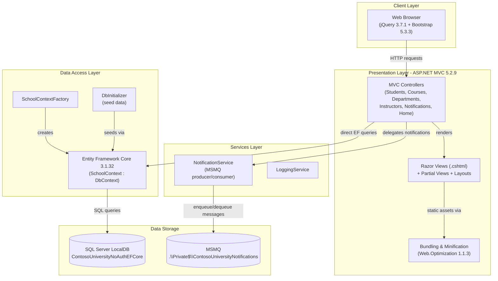
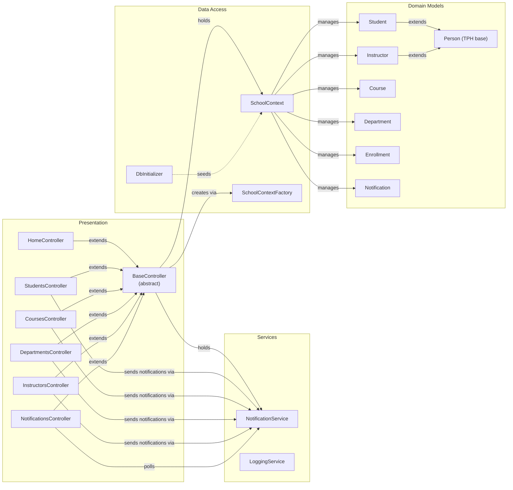

# Architecture Diagram

ContosoUniversity is a classic ASP.NET MVC 5 web application targeting .NET Framework 4.8. It manages university students, courses, departments, and instructors, with a lightweight MSMQ-based notification subsystem.

## Application Architecture

### Technology Stack Summary

| Layer | Technology | Version | Purpose |
|---|---|---|---|
| Presentation | ASP.NET MVC | 5.2.9 | Server-side web framework (controllers + Razor views) |
| Presentation | ASP.NET Razor | 3.2.9 | View templating engine |
| Client | jQuery | 3.7.1 | DOM manipulation and AJAX |
| Client | Bootstrap | 5.3.3 | Responsive UI framework |
| Client | jQuery Validation | 1.21.0 | Client-side form validation |
| Data Access | Entity Framework Core | 3.1.32 | ORM for SQL Server |
| Data Access | Microsoft.Data.SqlClient | 2.1.4 | SQL Server connectivity |
| Services | System.Messaging (MSMQ) | .NET 4.8 built-in | Async notification queuing |
| Serialization | Newtonsoft.Json | 13.0.3 | JSON serialization for MSMQ messages |
| Runtime | .NET Framework | 4.8 | Application runtime |

### Data Storage & External Services

The application uses a single **SQL Server LocalDB** database (`ContosoUniversityNoAuthEFCore`) accessed via Entity Framework Core 3.1, with Integrated Security (Windows auth). All domain entities — students, instructors, courses, departments, enrollments, and office assignments — are persisted here using a Table-per-Hierarchy strategy for the `Person` base class. A **Microsoft Message Queuing (MSMQ)** private queue (`.\Private$\ContosoUniversityNotifications`) is used as a lightweight notification bus: each CRUD operation on domain entities enqueues a JSON-serialised `Notification` message, which the `NotificationsController` polls and returns to the browser on demand.

### Key Architectural Decisions

- **Direct DbContext usage in controllers**: `BaseController` instantiates `SchoolContext` directly via `SchoolContextFactory` rather than using a repository or unit-of-work abstraction, following the classic MVC 5 tutorial pattern.
- **MSMQ as an in-process notification bus**: Instead of a REST webhook or in-memory event, the application uses MSMQ so notifications survive process restarts; the `NotificationsController` exposes a JSON polling endpoint consumed by client-side JavaScript.
- **Table-per-Hierarchy (TPH) inheritance**: `Student` and `Instructor` share a single `Person` table with a `Discriminator` column, reducing join complexity at the cost of nullable columns.

## Component Relationships

### Component Inventory

| Component | Layer | Type | Responsibility |
|---|---|---|---|
| BaseController | Presentation | Abstract MVC Controller | Provides shared `SchoolContext` and `NotificationService` to all controllers |
| HomeController | Presentation | MVC Controller | Displays enrollment statistics dashboard |
| StudentsController | Presentation | MVC Controller | CRUD operations for student records with search/sort/paging |
| CoursesController | Presentation | MVC Controller | CRUD operations for courses; manages department associations |
| DepartmentsController | Presentation | MVC Controller | CRUD operations for academic departments |
| InstructorsController | Presentation | MVC Controller | CRUD operations for instructors with office and course assignment management |
| NotificationsController | Presentation | MVC Controller | JSON polling endpoint that drains the MSMQ notification queue |
| NotificationService | Services | Service | Enqueues and dequeues JSON-serialised `Notification` messages via MSMQ |
| LoggingService | Services | Service | Application-level diagnostic logging |
| SchoolContext | Data Access | EF Core DbContext | ORM context exposing all domain entity DbSets; configures TPH, composite keys and relationships |
| SchoolContextFactory | Data Access | Factory | Creates configured `SchoolContext` instances using `Web.config` connection string |
| DbInitializer | Data Access | Seeder | Applies pending migrations and seeds initial data at startup |
| Person | Domain Models | Base Entity | Shared base class for Student and Instructor (TPH inheritance) |
| Student | Domain Models | Entity | Represents a university student with enrollment date and enrollments |
| Instructor | Domain Models | Entity | Represents an instructor with hire date, office assignment and course assignments |
| Course | Domain Models | Entity | Represents a course with credits and department association |
| Department | Domain Models | Entity | Represents an academic department with budget and instructor association |
| Enrollment | Domain Models | Entity | Join entity linking students to courses with an optional grade |
| Notification | Domain Models | Entity | Represents a queued notification event for entity CRUD operations |
