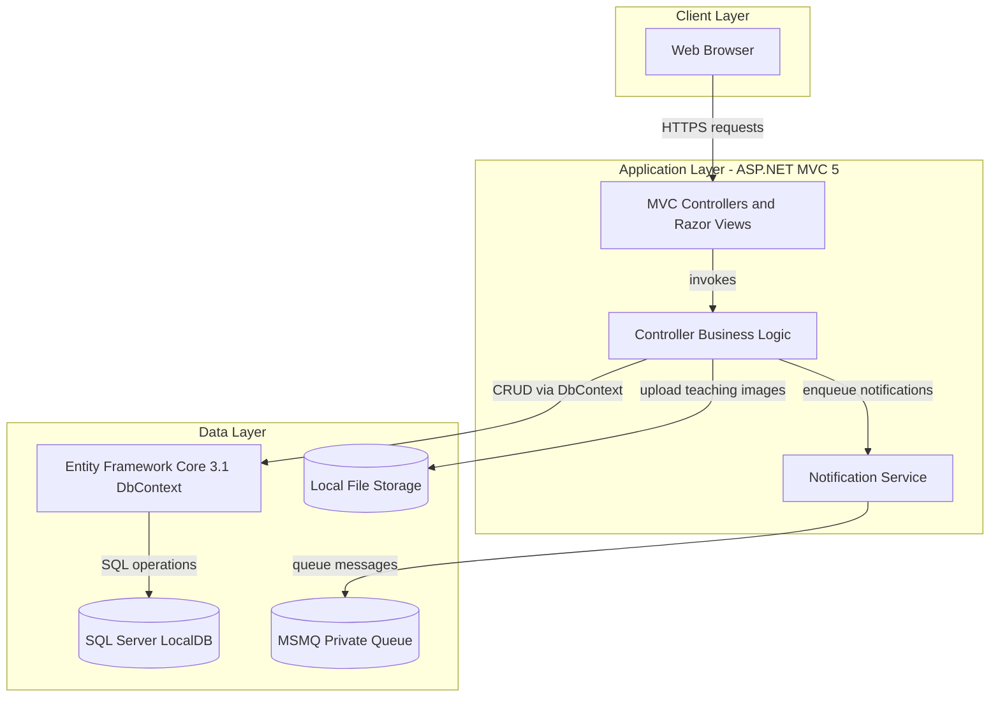
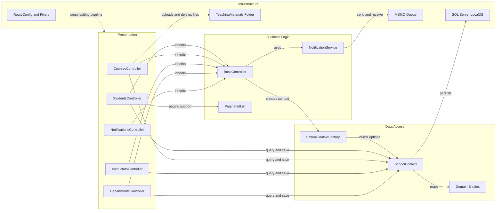

# Architecture Diagram

This document summarizes the ContosoUniversity application structure and key component interactions for the current single-project deployment.

## Application Architecture

### Technology Stack Summary

| Layer | Technology | Version | Purpose |
|---|---|---|---|
| Presentation | ASP.NET MVC + Razor | MVC 5.2.9 / WebPages 3.2.9 | Server-rendered UI and request handling |
| Application | .NET Framework | 4.8 | Business processing in controllers and services |
| Data Access | Entity Framework Core | 3.1.32 | Relational persistence via `SchoolContext` |
| Messaging | System.Messaging (MSMQ) | .NET Framework built-in | Async notification queueing |
| Storage | SQL Server LocalDB | Configured in Web.config | Primary relational data store |

### Data Storage & External Services

The application persists core academic data in SQL Server LocalDB through EF Core. It additionally uses MSMQ as an internal asynchronous channel for notification messages and stores uploaded teaching material images on local disk under the application `Uploads/TeachingMaterials` path.

### Key Architectural Decisions

- Uses a monolithic ASP.NET MVC architecture with a single deployable web application.
- Centralizes persistence in one `DbContext` with Table-per-Hierarchy inheritance for `Person` (`Student` and `Instructor`).
- Adds asynchronous side effects for CRUD events by enqueueing notification messages to MSMQ.

## Component Relationships

### Component Inventory

| Component | Layer | Type | Responsibility |
|---|---|---|---|
| StudentsController | Presentation | MVC Controller | Student list/search/paging and CRUD lifecycle |
| CoursesController | Presentation | MVC Controller | Course CRUD and teaching material upload management |
| InstructorsController | Presentation | MVC Controller | Instructor assignment and course relationships |
| DepartmentsController | Presentation | MVC Controller | Department CRUD with optimistic concurrency handling |
| NotificationsController | Presentation | MVC Controller | Notification queue polling and mark-read endpoint |
| BaseController | Business Logic | Abstract Controller Base | Shared `SchoolContext` and notification dispatch helpers |
| NotificationService | Business Logic | Service | MSMQ send/receive wrapper for entity operation messages |
| SchoolContextFactory | Data Access | Factory | Builds EF Core `DbContextOptions` from web configuration |
| SchoolContext | Data Access | EF Core DbContext | Entity mapping, relationship configuration, and data persistence |
| RouteConfig / FilterConfig | Infrastructure | Configuration | MVC routing and global filter setup |
