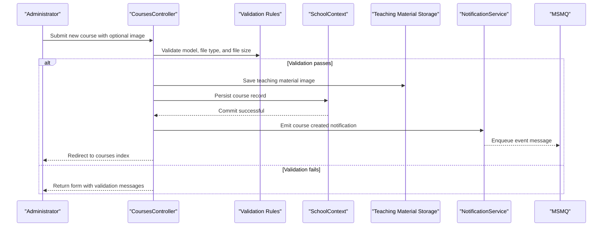

# Core Business Workflows

This application supports university administration workflows for students, courses, instructors, and departments, with additional operational notifications for CRUD events.

## Domain Entities

| Entity | Service / Bounded Context | Description | Key Relationships |
|---|---|---|---|
| Student | Academic Records | Represents enrolled learners and their enrollment timeline | Linked to many `Enrollment` records |
| Instructor | Faculty Management | Represents faculty members and teaching assignments | Linked to `CourseAssignment`, optional `OfficeAssignment`, and department administration |
| Course | Curriculum Management | Represents offered classes and teaching materials | Belongs to one `Department`; linked to `Enrollment` and `CourseAssignment` |
| Department | Academic Organization | Represents academic units with budget and administrator | Owns many `Course` records; optional administrator (`Instructor`) |
| Enrollment | Academic Records | Captures student-course participation and grade outcomes | Bridges `Student` and `Course` |
| Notification | Operations | Stores message payload describing entity lifecycle events | Produced by CRUD workflows and read by notification dashboard |

## Service-to-Domain Mapping

| Service | Domain Context | Owned Entities | External Dependencies |
|---|---|---|---|
| ContosoUniversity MVC App | Student lifecycle management | Student, Enrollment | SQL Server LocalDB via EF Core |
| ContosoUniversity MVC App | Course and curriculum operations | Course, Department, CourseAssignment | SQL Server LocalDB; local file storage for teaching material |
| ContosoUniversity MVC App | Faculty administration | Instructor, OfficeAssignment | SQL Server LocalDB |
| NotificationService | Operational messaging | Notification message contract | MSMQ private queue |

## Primary Workflows

### Workflow 1: Student Enrollment Record Management

Entry points include `GET /Students/Index`, `POST /Students/Create`, `POST /Students/Edit`, and `POST /Students/Delete`. The flow validates enrollment dates, applies model-state checks, persists changes through EF Core, and triggers notification side effects for create, update, and delete operations.

### Workflow 2: Course Content and Teaching Material Management

Entry points include `POST /Courses/Create` and `POST /Courses/Edit`. The flow validates file extension and upload size, persists course metadata, stores or replaces teaching material image files, and then emits corresponding CRUD notification messages.

### Workflow 3: Instructor and Department Administration

Instructor and department controllers coordinate assignment and update flows (including department concurrency checks) through EF Core and issue notifications after successful changes.

## Cross-Service Data Flows

The solution is a single deployable service, so cross-service composition is minimal. A notable cross-boundary flow exists between MVC CRUD controllers and the notification subsystem: controllers produce entity operation events, `NotificationService` places events into MSMQ, and `NotificationsController` consumes queued messages for dashboard display. If queue retrieval fails or times out, the notification endpoint returns success with fewer/no items rather than blocking core academic workflows.

## Business Workflow Sequence

## Business Rules & Decision Logic

- **Validation rules**: Student enrollment date must be a valid SQL-compatible range; course image uploads must use allowed extensions and stay within 5MB.
- **Decision logic**: Course workflows branch on file upload presence and validity; delete/edit flows branch on existing file presence before replacement/removal.
- **State transitions**: Core entities transition through create, update, and delete lifecycle operations with corresponding operational notifications.
- **Data integrity rules**: Department updates use concurrency (`RowVersion`) conflict handling; many-to-many instructor-course assignments are maintained through `CourseAssignment`.
- **Cross-cutting concerns**: Error handling favors user-visible recoverable messages while writing diagnostic traces; authorization is not globally enforced, so access control depends on controller implementation and hosting configuration.
