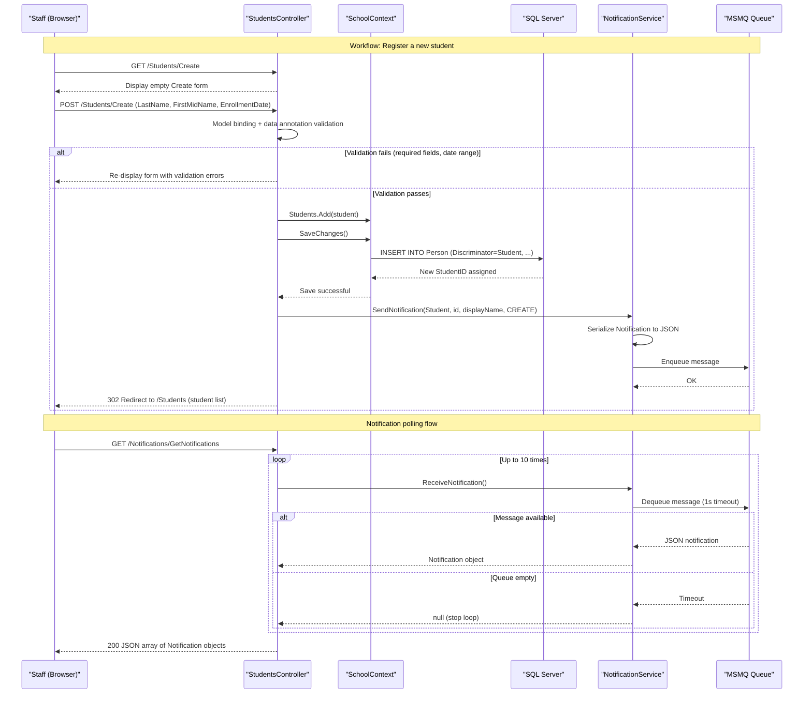

# Core Business Workflows

ContosoUniversity is a university administrative system that allows staff to manage students, instructors, courses, and departments — handling enrollment tracking, teaching assignments, and academic record maintenance with real-time notifications on entity changes.

## Domain Entities

| Entity | Service / Bounded Context | Description | Key Relationships |
|--------|--------------------------|-------------|-------------------|
| Student | Academic Records | A person enrolled at the university; tracks enrollment date and course grades | Enrolled in many Courses (via Enrollment); extends Person |
| Instructor | Staff Management | A teaching staff member; tracks hire date, office location, and course assignments | Assigned to many Courses (via CourseAssignment); may administer a Department; extends Person; optionally has one OfficeAssignment |
| Course | Curriculum Management | An academic course with a fixed course number, title, credit value, and optional teaching material | Belongs to one Department; taught by many Instructors; enrolled by many Students |
| Department | Organizational Structure | An academic department with a budget, start date, and an optional administrator (Instructor) | Offers many Courses; administered by one Instructor |
| Enrollment | Academic Records | Records a Student's participation in a Course and their grade | Links Student to Course; carries an optional Grade (A–F) |
| CourseAssignment | Curriculum Management | Records which Instructors are assigned to teach which Courses | Many-to-many junction between Instructor and Course |
| OfficeAssignment | Staff Management | Records the physical office location of an Instructor | One-to-one with Instructor (optional) |
| Notification | Operations / Audit | Records a system event (Create/Update/Delete) on any entity, used for operational awareness | Created by all entity controllers on state changes; stored in MSMQ queue and SQL table |

## Service-to-Domain Mapping

ContosoUniversity is a monolith; all domain contexts are handled within the single application.

| Service | Domain Context | Owned Entities | External Dependencies |
|---------|---------------|----------------|----------------------|
| StudentsController | Academic Records — Student Management | Student, Enrollment | SchoolContext (EF Core), NotificationService (MSMQ) |
| CoursesController | Curriculum Management — Course Management | Course, Enrollment (read), CourseAssignment (read) | SchoolContext (EF Core), Local file system (teaching material images), NotificationService (MSMQ) |
| InstructorsController | Staff Management — Instructor Management | Instructor, CourseAssignment, OfficeAssignment | SchoolContext (EF Core) |
| DepartmentsController | Organizational Structure — Department Management | Department | SchoolContext (EF Core), NotificationService (MSMQ) |
| NotificationsController | Operations / Audit | Notification | NotificationService (MSMQ) |
| HomeController | Reporting | Read-only aggregate of Student/EnrollmentDateGroup | SchoolContext (EF Core) |

## Primary Workflows

### Workflow 1: Student Enrollment Registration

A staff member registers a new student, selecting their enrollment date. The system validates inputs, persists the new student record, and dispatches a CREATE notification.

**Steps:**
1. Staff navigates to `/Students/Create` (GET).
2. System displays the student creation form.
3. Staff submits the form with LastName, FirstMidName, and EnrollmentDate (POST).
4. ASP.NET MVC model binding maps form fields to a `Student` object and runs data annotation validators.
5. If validation fails, the form is re-displayed with error messages.
6. If validation passes, `SchoolContext.Students.Add(student)` is called and `SaveChanges()` persists to the `Person` table (with `Discriminator = "Student"`).
7. `BaseController.SendEntityNotification()` calls `NotificationService.SendNotification()`, which enqueues a JSON notification message to the MSMQ queue.
8. Staff is redirected to the student list page.

### Workflow 2: Student List Browsing with Search, Sort, and Pagination

Staff searches and browses students by name with column sorting and page navigation.

**Steps:**
1. Staff navigates to `/Students` with optional query parameters: `sortOrder`, `searchString`, `currentFilter`, `page`.
2. Controller builds an EF Core LINQ query against `SchoolContext.Students`.
3. If `searchString` is provided, filters to students where `LastName.Contains(searchString)`.
4. Applies ORDER BY based on `sortOrder` (LastName asc/desc, EnrollmentDate asc/desc).
5. Wraps results in `PaginatedList<Student>` with page size 10.
6. Passes paginated results and sort/filter state to the Index view.

### Workflow 3: Course Management with Teaching Material Upload

Staff creates or edits a course, optionally attaching a teaching material image file.

**Steps:**
1. Staff submits the course form with Title, Credits, DepartmentID, and optionally a file (`HttpPostedFileBase teachingMaterialImage`).
2. If a file is provided:
   - Validates file extension is an image type (`.jpg`, `.jpeg`, `.png`, `.gif`, `.bmp`).
   - Validates file size ≤ 5 MB.
   - If validation fails, returns the form with an error message.
   - If valid, saves the file to `~/Uploads/TeachingMaterials/{uniqueFileName}` on the local file system.
   - Stores the server-relative path in `Course.TeachingMaterialImagePath`.
3. On edit, if a new file is uploaded, the old file is deleted from the file system before saving the new path.
4. `SaveChanges()` persists the Course record.
5. `SendEntityNotification()` is NOT called for courses (only Students and Departments dispatch notifications in the current implementation).

### Workflow 4: Instructor Assignment to Courses

Staff creates or edits an instructor and selects which courses they teach. The system manages the many-to-many `CourseAssignment` join table.

**Steps:**
1. GET: Controller calls `PopulateAssignedCourseData(instructor)` — loads all courses and marks which ones the instructor is already assigned to, building a checkbox list for the form.
2. Staff submits the form with instructor details and a `string[] selectedCourses` array of checked CourseIDs.
3. POST: Controller calls `UpdateInstructorCourses(selectedCourses, instructor)`:
   - Loads current assignments from the database.
   - Computes courses to add (in `selectedCourses` but not in DB) and courses to remove (in DB but not in `selectedCourses`).
   - Adds/removes `CourseAssignment` records accordingly.
4. `SaveChanges()` persists all assignment changes in a single transaction.

### Workflow 5: Department Edit with Optimistic Concurrency

Staff edits a department record. The system detects if another user modified the same record concurrently and prevents silent data loss.

**Steps:**
1. Staff loads the edit form — the current `RowVersion` timestamp is embedded in a hidden form field.
2. Staff submits changes (POST).
3. Controller sets `context.Entry(department).Property("RowVersion").OriginalValue` to the submitted `RowVersion`.
4. `SaveChanges()` sends an UPDATE with a `WHERE RowVersion = @original` clause.
5. If another user modified the record between GET and POST, SQL Server returns 0 rows affected — EF Core throws `DbUpdateConcurrencyException`.
6. Controller catches the exception, reloads the database values, displays a conflict message, and asks the staff member to review the differences before resubmitting.

### Workflow 6: Notification Polling and Dashboard

The notification dashboard polls the MSMQ queue to surface recent entity-change events to operations staff.

**Steps:**
1. Notification dashboard page (`/Notifications`) is loaded; client-side JavaScript polls `/Notifications/GetNotifications` periodically (or on page load).
2. `NotificationsController.GetNotifications()` calls `NotificationService.ReceiveNotification()` up to 10 times in a loop.
3. Each call attempts to dequeue one message from the MSMQ queue with a 1-second timeout.
4. Dequeued JSON messages are deserialized into `Notification` objects.
5. The JSON array of up to 10 notifications is returned to the client.
6. `MarkAsRead(id)` POST endpoint marks a notification as read (currently a placeholder — does not update the database).

## Cross-Service Data Flows

ContosoUniversity is a single-process monolith with no inter-service HTTP calls or message-based cross-service data flows. All domain data is read from and written to a single `SchoolContext` (SQL Server). The only cross-boundary data flow is the MSMQ notification channel:

- **Producers** (StudentsController, DepartmentsController via BaseController → NotificationService): Write JSON-serialized `Notification` messages to the MSMQ private queue on entity Create/Update/Delete.
- **Consumer** (NotificationsController → NotificationService): Reads and deserializes messages from the same MSMQ queue on demand.

There is no circuit breaker or fallback for the MSMQ channel. If the queue is unavailable, `SendNotification()` will throw an exception that propagates to the controller. The `MarkAsRead` operation is a stub with no durable effect.

## Business Workflow Sequence

## Business Rules & Decision Logic

### Validation Rules

| Entity / Workflow | Rule | Enforcement Point |
|------------------|------|------------------|
| Student | LastName, FirstMidName are required | Data annotation `[Required]` on Person base class |
| Student | EnrollmentDate must be between 1753-01-01 and 9999-12-31 | `[Range(typeof(DateTime), "1/1/1753", "12/31/9999")]` |
| Course | Title must be 3–50 characters | `[StringLength(50, MinimumLength = 3)]` |
| Course | Credits must be between 0 and 5 | `[Range(0, 5)]` |
| Course | TeachingMaterialImagePath max 255 characters | `[StringLength(255)]` |
| Course (file upload) | Uploaded file must be an image extension (.jpg, .jpeg, .png, .gif, .bmp) | Custom check in CoursesController.Create/Edit |
| Course (file upload) | Uploaded file must be ≤ 5 MB | Custom check in CoursesController.Create/Edit |
| Department | Name must be 3–50 characters | `[StringLength(50, MinimumLength = 3)]` |
| Instructor | HireDate must be between 1753-01-01 and 9999-12/31 | `[Range(typeof(DateTime), ...)]` |

### Decision Logic

- **Instructor course assignment diff**: On instructor edit, the controller computes the delta between currently assigned courses (from DB) and submitted selection, adding and removing `CourseAssignment` records only as needed — the full list is not replaced wholesale.
- **Department admin cascade on instructor delete**: When an Instructor is deleted, any Department that references them as administrator (`Department.InstructorID`) is updated to `null` before the delete, preserving referential integrity.
- **Optimistic concurrency conflict resolution**: On Department edit, if `DbUpdateConcurrencyException` is caught, the controller presents the conflicting DB values side-by-side to the user rather than silently overwriting or silently failing.

### State Transitions

| Entity | Lifecycle / State | Notes |
|--------|-------------------|-------|
| Notification | Created → Enqueued (MSMQ) → Dequeued (read) → Marked as Read | "Marked as Read" is currently a stub; no persistent read-status update is implemented |
| Course (file) | No file → File uploaded (path stored) → File replaced (old deleted, new saved) → Course deleted (file deleted) | File lifecycle is managed in CoursesController |

### Cross-Cutting Concerns

- **Transactions**: All `SaveChanges()` calls in a single controller action are implicitly wrapped in a single EF Core transaction. There is no explicit `TransactionScope` or distributed transaction. The instructor course-assignment update and instructor record save are committed together.
- **Error handling**: `HandleErrorAttribute` is registered globally and catches unhandled exceptions, rendering the `Error.cshtml` view. No business-specific exception types or compensating actions are defined.
- **Audit / notifications**: Every entity Create, Update, and Delete in StudentsController and DepartmentsController dispatches a notification message via MSMQ. InstructorsController and CoursesController do NOT dispatch notifications in the current implementation.
- **Authorization**: No authentication or authorization is enforced. All workflows are publicly accessible without login. The `[Authorize]` global filter is commented out in `FilterConfig.cs`.
