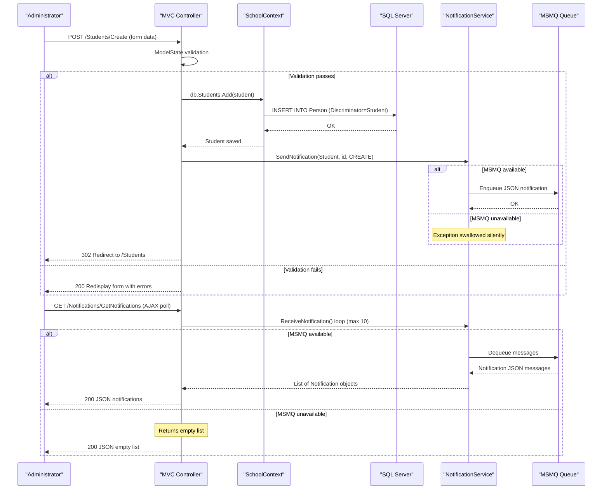

# Core Business Workflows

ContosoUniversity is a university management system that enables administrators to maintain academic records — managing students, instructors, courses, departments, and enrolments — with automatic notifications generated for every entity change.

## Domain Entities

| Entity | Service / Bounded Context | Description | Key Relationships |
|---|---|---|---|
| Student | Academic Records | A person enrolled at the university; tracks enrolment date and academic grades | Inherits from Person; has many Enrolments |
| Instructor | Academic Staff | A faculty member who teaches courses and may have an office assignment | Inherits from Person; teaches many Courses via CourseAssignment; optionally has one OfficeAssignment |
| Course | Curriculum Management | A taught subject with a credit value, belonging to one Department; may have a teaching material image | Belongs to one Department; has many Enrolments; assigned to many Instructors |
| Department | Organisational Management | An academic department with a budget, start date, and an administering Instructor | Administered by one Instructor; has many Courses |
| Enrollment | Academic Records | Records a Student's participation in a Course and their grade (A–F, or ungraded) | Links one Student to one Course; holds nullable Grade |
| CourseAssignment | Curriculum Management | Junction entity recording that an Instructor teaches a Course | Links one Instructor to one Course (composite PK) |
| OfficeAssignment | Academic Staff | Records the physical office location of an Instructor | One-to-one with Instructor (shared PK) |
| Notification | Notification Management | An audit/event message created whenever a domain entity is created, updated, or deleted; consumed via MSMQ | Standalone; not related to other domain entities by FK |

## Service-to-Domain Mapping

| Service | Domain Context | Owned Entities | External Dependencies |
|---|---|---|---|
| ContosoUniversity (monolith) | All bounded contexts | Student, Instructor, Course, Department, Enrollment, CourseAssignment, OfficeAssignment, Notification | SQL Server LocalDB (data store); MSMQ local queue (notification bus) |

The application is a single-module monolith. All domain contexts are co-located in one deployable unit with a shared database. There are no inter-service REST calls or event consumers.

## Primary Workflows

### Workflow 1: Student Enrolment Lifecycle

An administrator creates a new student record, which is saved with an enrolment date and triggers a creation notification. Students can subsequently be searched, sorted by name or enrolment date, paginated, edited, or deleted. Deletion removes the student record and all associated enrolments via EF Core cascade; a deletion notification is enqueued to MSMQ.

Steps:
1. Administrator opens the Create Student form (`GET /Students/Create`)
2. Submits the form with last name, first name, and enrolment date (`POST /Students/Create`)
3. ASP.NET MVC model binding validates the form fields via `ModelState`
4. If valid: EF Core inserts the new `Person` row (discriminator = "Student"); `NotificationService.SendNotification("Student", id, CREATE)` enqueues a JSON message to MSMQ; redirect to Student list
5. If invalid: form is redisplayed with validation error messages

### Workflow 2: Course Creation with Teaching Material Upload

A course is created with a manually assigned course number (no auto-generated PK), associated department, and an optional teaching material image upload.

Steps:
1. Administrator opens Create Course form (`GET /Courses/Create`)
2. Submits course data and optionally attaches an image file (`POST /Courses/Create`)
3. If a file is attached:
   - File extension must be one of: `.jpg`, `.jpeg`, `.png`, `.gif`, `.bmp`
   - File size must be less than 5 MB
   - A unique filename `course_{CourseID}_{GUID}{ext}` is generated
   - File is saved to `~/Uploads/TeachingMaterials/` on the server
   - The relative path is stored in `Course.TeachingMaterialImagePath`
4. EF Core inserts the Course row; a CREATE notification is enqueued; redirect to Course list
5. If file validation fails: error message added to `ModelState`; form redisplayed

### Workflow 3: Instructor Management with Course Assignments

Editing an instructor simultaneously updates personal details, the office assignment, and the set of courses the instructor teaches.

Steps:
1. Administrator opens Edit Instructor form (`GET /Instructors/Edit/{id}`)
2. EF Core loads the Instructor with eager-loaded `OfficeAssignment` and `CourseAssignments.Course`
3. The view renders all courses with checkboxes pre-checked for currently assigned courses
4. Administrator submits the form with updated fields and the new checkbox selection (`POST /Instructors/Edit/{id}`)
5. `TryUpdateModel` updates personal fields and `OfficeAssignment`
6. If `OfficeAssignment.Location` is empty or whitespace, the assignment is set to `null` (deleted from DB)
7. `UpdateInstructorCourses(selectedCourses, instructor)` reconciles the current `CourseAssignments` collection:
   - Courses in the new selection but not in the current set → new `CourseAssignment` added
   - Courses in the current set but not in the new selection → `CourseAssignment` removed
8. `SaveChanges()` persists all changes in a single transaction; UPDATE notification enqueued; redirect

### Workflow 4: Department Edit with Optimistic Concurrency

Department edits use a `RowVersion` timestamp token to detect concurrent modifications.

Steps:
1. Administrator opens Edit Department form (`GET /Departments/Edit/{id}`) — `RowVersion` is embedded as a hidden field
2. Submits updated department data including the original `RowVersion` (`POST /Departments/Edit/{id}`)
3. EF Core marks the entity as `Modified` and issues an `UPDATE` statement with a `WHERE RowVersion = @original` clause
4. **If no concurrent modification**: update succeeds; UPDATE notification enqueued; redirect to list
5. **If concurrent modification detected** (`DbUpdateConcurrencyException`):
   - EF Core compares client values against current database values field by field (Name, Budget, StartDate, InstructorID)
   - A field-level error message showing the current database value is added to `ModelState` for each differing field
   - `RowVersion` is refreshed from the database to allow re-submission
   - Form is redisplayed with conflict warnings

### Workflow 5: Notification Polling and Display

Entity change events are published to MSMQ by any create/update/delete controller action and consumed on demand by the browser.

Steps:
1. Browser polls `GET /Notifications/GetNotifications` (typically via periodic AJAX request)
2. Controller calls `NotificationService.ReceiveNotification()` in a loop, dequeuing up to 10 messages
3. Each dequeued message is deserialised from JSON to a `Notification` object
4. Controller returns a JSON response `{success, notifications[], count}`
5. Browser renders the notification list; administrators can mark items as read via `POST /Notifications/MarkAsRead`
6. If the MSMQ queue is unavailable, the exception is caught silently and an empty list is returned

## Cross-Service Data Flows

The application is a monolith with no inter-service communication. All data access is handled in-process through `SchoolContext`. The only cross-boundary data flow is the MSMQ notification channel:

- **Write path**: any controller action that mutates a domain entity calls `BaseController.SendEntityNotification()` → `NotificationService.SendNotification()` → MSMQ enqueue
- **Read path**: `NotificationsController.GetNotifications()` → `NotificationService.ReceiveNotification()` → MSMQ dequeue

There is no fallback circuit-breaker; MSMQ errors are swallowed silently so that the main entity operation is not interrupted.

## Business Workflow Sequence

## Business Rules & Decision Logic

### Validation Rules

| Entity | Rule | Enforcement |
|---|---|---|
| Student / Person | LastName: required, max 50 chars | Data annotation + ModelState |
| Student / Person | FirstMidName: required, max 50 chars | Data annotation + ModelState |
| Student | EnrollmentDate: required, must be between 1/1/1753 and 12/31/9999 | Data annotation + ModelState |
| Instructor | HireDate: required, same date range constraint | Data annotation + ModelState |
| Department | Name: required, 3–50 chars | Data annotation + ModelState |
| Department | Budget: typed as `money` (decimal) | Column type annotation |
| Course | Title: 3–50 chars | Data annotation |
| Course | Credits: 0–5 | Range annotation |
| Course | TeachingMaterialImagePath: max 255 chars | StringLength annotation |
| Course | Teaching material image file: extension must be jpg/jpeg/png/gif/bmp; size must be under 5 MB | Inline controller validation |
| All POST forms | Anti-forgery token required | `[ValidateAntiForgeryToken]` on all POST actions |

### Decision Logic

- **Instructor office assignment deletion**: if `OfficeAssignment.Location` is blank on save, the `OfficeAssignment` record is deleted (set to `null`), not merely cleared
- **Instructor course reconciliation**: on instructor edit, the system computes the symmetric difference between existing and submitted course assignments to determine which `CourseAssignment` rows to add and which to remove
- **Department concurrency conflict resolution**: field-by-field comparison is performed on conflict — the administrator is shown current database values for each changed field and must re-submit with awareness of the conflict
- **Notification send failure**: errors from `NotificationService` are always swallowed so that the main CRUD operation is not rolled back

### State Transitions

- **Enrollment grade**: nullable by default ("no grade"); transitions to one of A, B, C, D, F via edit
- **Notification.IsRead**: defaults to `false`; transitions to `true` via `MarkAsRead`; `ReadAt` is set when read (though the current implementation does not persist to DB)

### Transactions

All entity mutations use EF Core `SaveChanges()` as a single unit of work. No explicit `TransactionScope` or `BeginTransaction` calls are present. Notification enqueue happens after `SaveChanges()` — if the enqueue fails, the entity change is already committed (no saga or compensating transaction).

### Authorization

No application-level authorization is enforced. All actions are accessible to any unauthenticated user. The commented-out global `AuthorizeAttribute` in `FilterConfig.cs` indicates authorization was planned but not implemented.

### Audit / Logging

MSMQ-based notifications serve as a lightweight audit trail for entity mutations. Each create, update, and delete operation generates a `Notification` message containing the entity type, ID, operation type, and a human-readable message. No structured logging framework is configured; diagnostic output is limited to `System.Diagnostics.Debug.WriteLine`.
