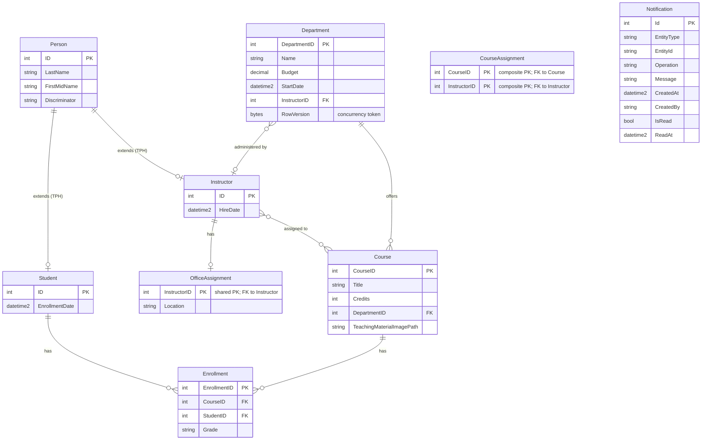

# Data Architecture & Persistence Layer

ContosoUniversity uses a single SQL Server LocalDB database accessed through Entity Framework Core 3.1 with a Table-per-Hierarchy inheritance model, hosting 9 mapped entities across the academic domain (students, instructors, courses, departments, enrollments, and notifications).

## Database Configuration

| Service/Module | DB Type | Profile | Driver | Connection | Migration Tool |
|---------------|---------|---------|--------|------------|----------------|
| ContosoUniversity | SQL Server (LocalDB) | Default (dev) | Microsoft.Data.SqlClient 2.1.4 | `(LocalDb)\MSSQLLocalDB` / `ContosoUniversityNoAuthEFCore`; Integrated Security | Programmatic seeding via `DbInitializer.Initialize()` — no Flyway/Liquibase/EF Migrations configured |

Schema management is handled at application startup via EF Core's `EnsureCreated()` semantics (or equivalent `DbInitializer.Initialize()` call from `Global.asax.cs`). There are no EF Core Migration files in the project; the schema is derived from the EF model at first run. Seed data is applied programmatically if the database contains no students. For the full connection string property keys, see `configuration-inventory.md`.

## Data Ownership per Service

| Service | Tables Owned | ORM Framework | Caching | Notes |
|---------|-------------|---------------|---------|-------|
| ContosoUniversity | Person, Course, Department, Enrollment, OfficeAssignment, CourseAssignment, Notification | EF Core 3.1.32 (SQL Server provider) | None | Single monolith owns all tables; TPH inheritance stores Student and Instructor in the Person table with a Discriminator column |

## Entity Model

## Key Repository Methods

The application does not use explicit repository interfaces or the repository pattern. All data access is performed directly through `SchoolContext` (EF Core DbContext) in controller action methods. The table below documents the key query patterns used in each controller.

| Service | Context/Access Pattern | Notable Query Methods | Purpose |
|---------|----------------------|----------------------|---------|
| StudentsController | `SchoolContext.Students` | `Where(s => s.LastName.Contains(searchString))`, `.OrderBy/.OrderByDescending`, `.Skip((page-1)*10).Take(10)` | Filtered, sorted, paginated student list |
| StudentsController | `SchoolContext.Students.Include(s => s.Enrollments).ThenInclude(e => e.Course)` | Eager load via `Include` | Student detail view with enrolled courses |
| CoursesController | `SchoolContext.Courses.Include(c => c.Department)` | Eager load via `Include` | Course list with department name |
| InstructorsController | `SchoolContext.Instructors.Include(i => i.OfficeAssignment).Include(i => i.CourseAssignments).ThenInclude(ca => ca.Course).ThenInclude(c => c.Department)` | Multi-level eager load | Instructor list with office location, courses, and departments |
| InstructorsController | `SchoolContext.Enrollments.Where(e => e.CourseID == courseID)` | Filtered query by courseID | Show enrollments for selected course in instructor view |
| DepartmentsController | `SchoolContext.Departments.Include(d => d.Administrator)` | Eager load via `Include` | Department list with administrator name |
| DepartmentsController | `context.Entry(departmentToUpdate).Property("RowVersion").OriginalValue = rowVersion` | Optimistic concurrency using `RowVersion` timestamp | Detect concurrent edit conflicts before saving |
| HomeController | `SchoolContext.Students.GroupBy(s => s.EnrollmentDate).Select(d => new EnrollmentDateGroup { EnrollmentDate = d.Key, StudentCount = d.Count() })` | Group-by aggregate query | Statistics view — enrollment counts by date |
| NotificationsController | `NotificationService.ReceiveNotification()` (MSMQ) | Dequeue up to 10 messages per request | Poll MSMQ queue for pending notifications |

## Caching Strategy

No caching layer is implemented. `Microsoft.Extensions.Caching.Memory` (v3.1.32) is declared as a NuGet dependency but is not used anywhere in the application code — no `IMemoryCache` injection, `[ResponseCache]`, or output caching is configured. All requests result in a fresh database query.

## Data Ownership Boundaries

The application is a single-process monolith with one SQL Server database. All nine tables are owned exclusively by the `ContosoUniversity` application; there are no other services sharing the database schema or accessing tables directly. There is no cross-service data access pattern to document.

MSMQ notifications are written by controllers (via `NotificationService`) and read back through the `NotificationsController.GetNotifications` endpoint. Notification records are also persisted in the `Notification` table in SQL Server, though the `MarkAsRead` operation is currently a placeholder and does not update the database. The MSMQ queue acts as a volatile in-memory buffer; the SQL Server `Notification` table represents the intended durable store.

There is no CQRS separation, event sourcing, or outbox pattern. Read and write operations share the same `SchoolContext` instance within each HTTP request.

### Data Classification & Sensitivity

| Entity | Sensitive Fields | Classification | Controls in Place |
|--------|-----------------|----------------|-------------------|
| Person (Student) | LastName, FirstMidName, EnrollmentDate | PII — student identity and academic enrollment data | None — stored in plaintext; no encryption-at-rest, data masking, or field-level access control configured |
| Person (Instructor) | LastName, FirstMidName, HireDate | PII — instructor identity and employment date | None — stored in plaintext; no controls configured |
| Department | Name, Budget, StartDate, InstructorID | Internal / financial data | None — Budget stored as plaintext `money` column; no controls configured |
| Notification | CreatedBy, EntityType, EntityId, Message | Internal audit / operational data | None |
| Course | Title, TeachingMaterialImagePath | Non-sensitive | None required |
| Enrollment | Grade | Potentially sensitive academic record | None — stored as plaintext enum string |
| OfficeAssignment | Location | Non-sensitive | None required |

The `Person` table stores PII (student and instructor names and key dates) with no encryption-at-rest, data masking, or field-level access controls. The application has no authentication or authorization (all endpoints are publicly accessible), meaning any client can retrieve or modify student and instructor PII without restriction. This is a significant compliance risk for any real-world deployment.
