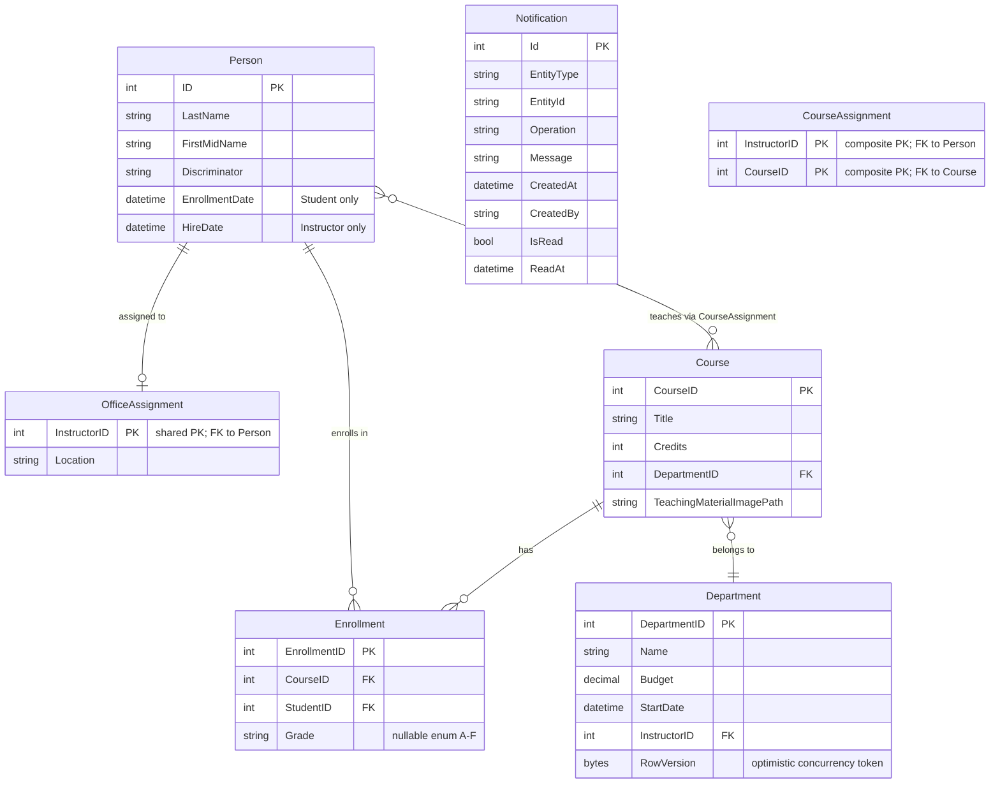

# Data Architecture & Persistence Layer

ContosoUniversity persists 8 domain entities to a single SQL Server database via Entity Framework Core 3.1, using Table-Per-Hierarchy (TPH) inheritance for the Person/Student/Instructor hierarchy and composite primary keys for the CourseAssignment join table.

## Database Configuration

| Service/Module | DB Type | Profile | Driver | Connection | Migration Tool |
|---|---|---|---|---|---|
| ContosoUniversity | SQL Server (LocalDB dev / SQL Server prod) | Single (no profiles) | Microsoft.Data.SqlClient 2.1.4 | LocalDB: `(LocalDb)\MSSQLLocalDB`, catalog `ContosoUniversityNoAuthEFCore` | None — `EnsureCreated()` used at startup; no EF Migrations or Flyway/Liquibase |

Schema management is handled by `EnsureCreated()` called in `DbInitializer.Initialize()` at application startup — the database is created from the EF Core model if it does not exist. No EF Core migrations are configured; schema changes require manual intervention or database re-creation. Seed data is inserted programmatically by `DbInitializer` on first run (when the Students table is empty).

## Data Ownership per Service

| Service | Tables Owned | ORM Framework | Caching | Notes |
|---|---|---|---|---|
| ContosoUniversity | Person, Course, Department, Enrollment, CourseAssignment, OfficeAssignment, Notification | EF Core 3.1.32 (SQL Server) | None | Single-app monolith; all tables in one database; TPH inheritance maps Student/Instructor to Person table |

## Entity Model

## Key Repository Methods

The application does not use the Repository pattern or Spring Data-style repository interfaces. All data access is performed directly on `SchoolContext` DbSets within controller action methods, or via `DbInitializer` at startup.

| Access Point | Entity/DbSet | Notable Queries | Purpose |
|---|---|---|---|
| StudentsController.Index | Students | `Where(LastName/FirstMidName contains searchString)`, `OrderBy/OrderByDescending`, `Skip/Take` via `PaginatedList` | Filterable, sortable, paginated student list |
| StudentsController.Details | Students | `db.Students.Find(id)` with eager load of Enrollments/Course | Student detail view |
| CoursesController.Index | Courses | `db.Courses.Include("Department")` | Course list with department names |
| CoursesController.Edit | Courses, Departments | Populates department dropdown | Course edit form |
| DepartmentsController | Departments | `Include("Administrator")` join to Person | Department list with administrator names |
| InstructorsController.Index | Instructors, CourseAssignments, Enrollments | Multi-level Include chain: Instructors → CourseAssignments → Course → Enrollments | Instructor index with course/enrollment drill-down |
| HomeController.About | Students | LINQ GroupBy EnrollmentDate + Count | Enrollment statistics by date |
| DbInitializer.Initialize | All DbSets | `EnsureCreated()`, bulk Add + SaveChanges | One-time seed of all domain data |

## Caching Strategy

No caching layer is configured or used in this application. There is no Redis, MemoryCache, IDistributedCache, `[ResponseCache]`, or EF Core second-level cache. All database reads are executed synchronously on every request with no result caching. For a read-heavy university management application, introducing `IMemoryCache` for reference data (departments, courses) would be a low-effort improvement.

## Data Ownership Boundaries

ContosoUniversity is a single-process monolith with a single shared SQL Server database — there are no service boundaries, schema-per-service separations, or isolated data stores. All entities are owned by the one application and accessed directly via `SchoolContext`.

Cross-entity access is handled entirely through EF Core navigation properties and LINQ `Include()` chains within controller methods. There is no CQRS, event sourcing, or read-model separation. All operations (reads and writes) target the same database synchronously within an HTTP request lifecycle.

The `Notification` entity is mapped in `SchoolContext` but is not used for persistence in practice — notifications are sent to and read from MSMQ only, and `MarkAsRead` is a no-op stub. The `Notification` table exists in the schema (created by `EnsureCreated`) but is never written to via EF Core.

### Data Classification & Sensitivity

| Entity | Sensitive Fields | Classification | Controls in Place |
|---|---|---|---|
| Person (Student) | LastName, FirstMidName, EnrollmentDate | PII | None — no encryption-at-rest, no field masking, no access controls |
| Person (Instructor) | LastName, FirstMidName, HireDate | PII | None — no encryption-at-rest, no field masking, no access controls |
| Department | Name, Budget, StartDate | Internal | Budget is a financial field; no sensitivity controls |
| Enrollment | StudentID, CourseID, Grade | PII (academic records) | None — no access controls or encryption |
| Notification | CreatedBy, EntityId, Message | Internal | No controls |

The `Person` table stores personal names (first and last) for both students and instructors, and academic records including grades and enrollment/hire dates — these constitute **PII** and potentially **FERPA-protected academic records**. No encryption-at-rest, column-level masking, row-level security, or access control policies are configured at the database or application layer. All data is publicly accessible since authentication and authorization are not implemented.
