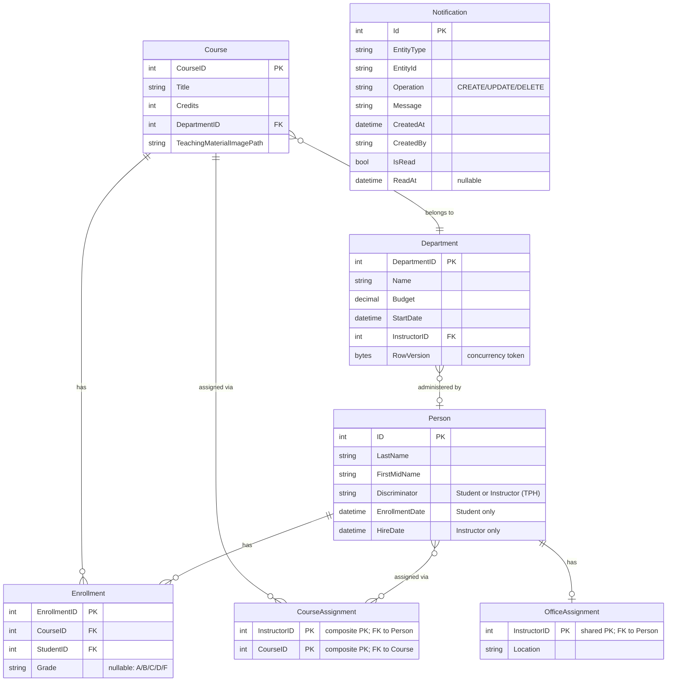

# Data Architecture & Persistence Layer

ContosoUniversity's data layer consists of 9 EF Core 3.1 entities mapped to a single SQL Server LocalDB database through a manually constructed `SchoolContext` DbContext, with no migration tooling and programmatic seed data applied on first startup.

## Database Configuration

| Service/Module | DB Type | Profile | Driver | Connection | Migration Tool |
|---|---|---|---|---|---|
| ContosoUniversity | SQL Server LocalDB | Single (no profiles) | Microsoft.Data.SqlClient 2.1.4 | LocalDB instance `MSSQLLocalDB`; database `ContosoUniversityNoAuthEFCore`; Integrated Security; MultipleActiveResultSets enabled | None — `EnsureCreated()` is used; schema is created from entity model on first run |

Schema is managed entirely by EF Core's `EnsureCreated()` call in `DbInitializer.Initialize()`. There is no Flyway, Liquibase, or EF Core Migrations history; schema changes require dropping and recreating the database. Seed data is inserted programmatically by `DbInitializer` if the `Students` table is empty at startup. For the full connection string property values, see `configuration-inventory.md`.

## Data Ownership per Service

| Service | Tables Owned | ORM Framework | Caching | Notes |
|---|---|---|---|---|
| ContosoUniversity | Person (TPH: Student + Instructor), Course, Department, Enrollment, CourseAssignment, OfficeAssignment, Notification | EF Core 3.1 (SchoolContext) | None | Single-module monolith; all tables in one database; SchoolContext is instantiated directly via SchoolContextFactory, not through DI |

## Entity Model

## Key Repository Methods

There are no repository interfaces in this application. All data access is performed directly through `SchoolContext` (`db.*`) properties in the controllers. The table below documents notable query patterns found in the controllers.

| Controller | Access Pattern | Notable Query | Purpose |
|---|---|---|---|
| StudentsController | `db.Students` | `.Where(s => s.LastName.Contains(...) || s.FirstMidName.Contains(...))` | Full-name search with two-field predicate |
| StudentsController | `db.Students` | `.OrderBy/.OrderByDescending` + `PaginatedList.Create()` | Server-side sort and pagination |
| CoursesController | `db.Courses.Include("Department")` | Eager-load Department for display | Avoids N+1 on course list |
| InstructorsController | `db.People.Include(...)` | Multi-level eager load: CourseAssignments → Course → Department; OfficeAssignment | Populates instructor index with courses and office |
| DepartmentsController | `db.Departments` | Optimistic concurrency via `RowVersion` byte array on edit | Detects conflicting concurrent edits |
| NotificationsController | `notificationService.ReceiveNotification()` | Dequeues up to 10 MSMQ messages per request | Polls queue for pending notifications |
| HomeController | `db.Students.GroupBy(s => s.EnrollmentDate)` | Aggregate enrollment date statistics | About page enrollment counts |
| BaseController | `SchoolContextFactory.Create()` | Reads connection string from `ConfigurationManager` and builds `DbContextOptions` | Manual context creation — bypasses DI |

## Caching Strategy

No caching layer is configured. There is no Redis, MemoryCache (`IMemoryCache`/`IDistributedCache`), EF Core second-level cache, or HTTP response cache applied anywhere in the application. All requests result in a direct database query with no cache-aside or read-through patterns. The `Microsoft.Extensions.Caching.Memory 3.1.32` package is listed in `packages.config` as an indirect transitive dependency of EF Core but is not used by application code.

## Data Ownership Boundaries

The application is a single-module monolith with one shared SQL Server database. There are no service boundaries, schema-per-service separations, or cross-service data access patterns. All entities are owned and accessed exclusively by the `ContosoUniversity` web application.

`SchoolContext` is the sole unit-of-work. Controllers hold a direct reference to it (via `BaseController.db`) for the lifetime of a request and call `SaveChanges()` inline. There is no CQRS separation, no read model, and no event-sourcing. The `Notification` table is defined in `SchoolContext` but in practice notifications are not persisted to the database — they are enqueued to MSMQ in-memory and dequeued on demand. The table exists in the schema but is not written to by the current implementation.

### Data Classification & Sensitivity

| Entity | Sensitive Fields | Classification | Controls in Place |
|---|---|---|---|
| Person (Student) | LastName, FirstMidName, EnrollmentDate | PII | None — no encryption-at-rest, field masking, or access controls configured |
| Person (Instructor) | LastName, FirstMidName, HireDate | PII | None — same as above |
| Department | Name, Budget | Internal | No specific controls |
| Course | Title, Credits, TeachingMaterialImagePath | Internal | No specific controls |
| Enrollment | Grade | PII (academic record) | None — no encryption or access control |
| Notification | EntityType, EntityId, CreatedBy | Internal | No specific controls |

`Person`-derived entities (`Student`, `Instructor`) store personally identifiable information (first and last names, enrollment/hire dates). `Enrollment.Grade` constitutes an academic record (a form of PII in many jurisdictions, e.g., FERPA in the US). No encryption-at-rest, column-level masking, audit logging, or role-based field access controls are in place. All data is stored in plaintext in the SQL Server LocalDB file.
