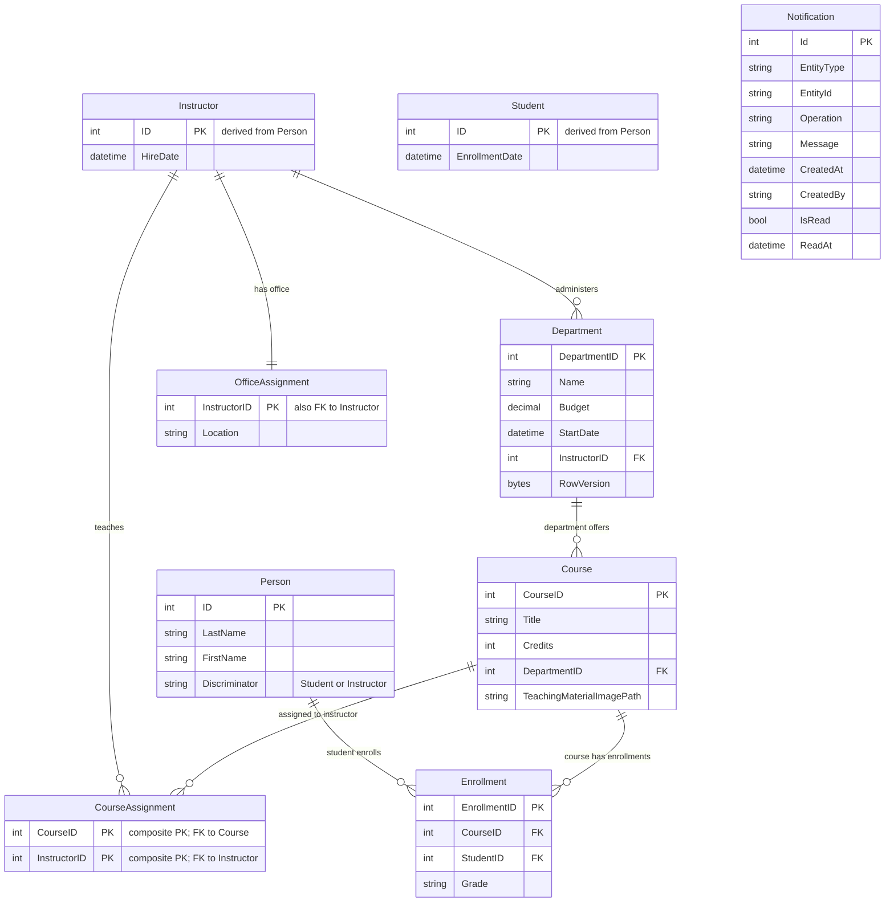

# Data Architecture & Persistence Layer

The data layer uses EF Core 3.1 against SQL Server LocalDB with a single `SchoolContext` that models 9 primary entities and seeds initial academic data at application startup.

## Database Configuration

| Service/Module | DB Type | Profile | Driver | Connection | Migration Tool |
|---|---|---|---|---|---|
| ContosoUniversity | SQL Server LocalDB | Default web config | Microsoft.EntityFrameworkCore.SqlServer + Microsoft.Data.SqlClient | `DefaultConnection` from `Web.config` | No EF migrations detected; `EnsureCreated` + programmatic seed (`DbInitializer`) |

## Data Ownership per Service

| Service | Tables Owned | ORM Framework | Caching | Notes |
|---|---|---|---|---|
| ContosoUniversity monolith | Person (TPH Student/Instructor), Course, Department, Enrollment, CourseAssignment, OfficeAssignment, Notification | Entity Framework Core 3.1 | In-memory cache packages referenced but no explicit cache policy implementation found | Single shared relational schema in one `DbContext` |

## Entity Model

## Key Repository Methods

| Service | Repository | Notable Methods | Purpose |
|---|---|---|---|
| ContosoUniversity | `SchoolContext` (`Data/SchoolContext.cs`) | `DbSet<T>` for all entities, relationship configuration in `OnModelCreating` | Central unit for relational mapping and persistence |
| ContosoUniversity | `DbInitializer` (`Data/DbInitializer.cs`) | `Initialize(SchoolContext context)` | Programmatic database creation and seed data loading |
| ContosoUniversity | Controller-level EF queries | `Include`, `ThenInclude`, `Where`, `OrderBy`, `Find`, `SaveChanges` | Reads/writes domain aggregates without separate repository classes |

## Caching Strategy

| Layer | Provider | TTL / Policy | Pattern | Notes |
|---|---|---|---|---|
| Application data access | None explicitly configured | N/A | Direct DB access | No explicit cache-aside or second-level caching behavior implemented |
| Dependency-level capability | Microsoft.Extensions.Caching.Memory packages | Not configured | Potential in-process caching support | Package references exist but no active cache configuration was identified |

## Data Ownership Boundaries

All domain data is stored in a single shared SQL Server database owned by the monolithic web application, with no database-per-service isolation. Data access remains in-process via `SchoolContext`; cross-service access patterns are not applicable because there are no independently deployed domain services. Reads and writes follow standard MVC controller flows with immediate transactional persistence through EF Core `SaveChanges`.

### Data Classification & Sensitivity

| Entity | Sensitive Fields | Classification (PII/PHI/PCI/None) | Controls in Place |
|---|---|---|---|
| Person / Student / Instructor | Names | PII | No field-level masking or encryption configuration detected in code/config |
| Department | Administrator reference, budget metadata | Internal / low sensitivity | Concurrency token (`RowVersion`) for update integrity, not confidentiality |
| Notification | CreatedBy, message text may include names | PII (contextual) | No explicit masking or at-rest encryption configuration detected |
| Enrollment / Course / CourseAssignment / OfficeAssignment | Academic metadata | None/Internal | Standard relational constraints only |
