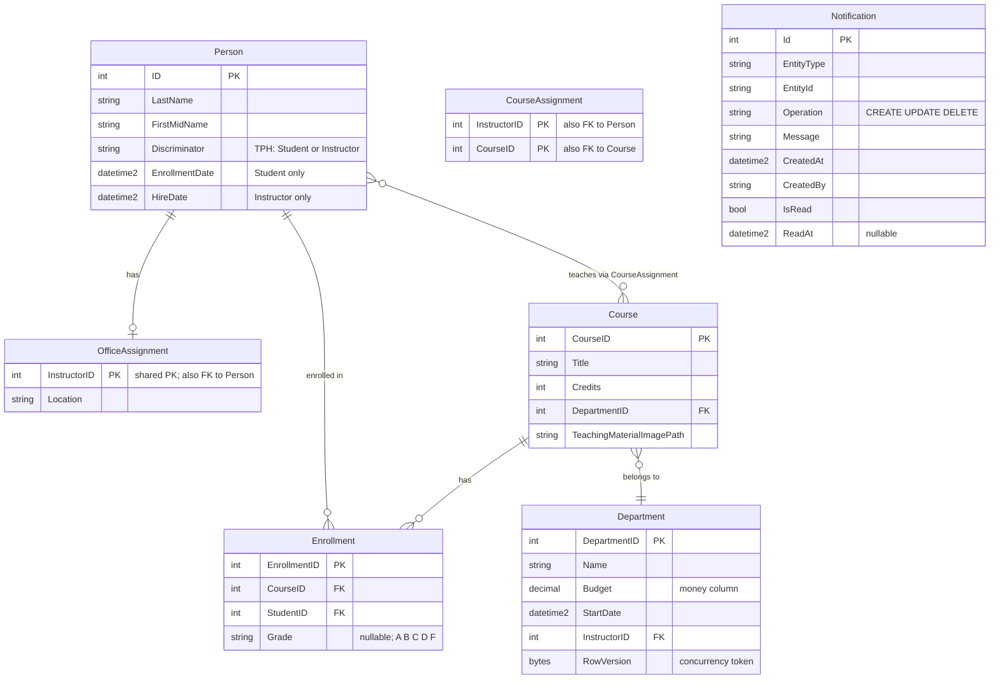

# Data Architecture & Persistence Layer

ContosoUniversity uses a single **SQL Server LocalDB** database accessed via **Entity Framework Core 3.1.32**, with 8 domain entities (plus a transient notification model) organized around a university academic schema. There is no repository abstraction — `SchoolContext` is used directly by controllers.

## Database Configuration

| Module | DB Type | Profile | Driver | Connection | Migration Tool |
|---|---|---|---|---|---|
| ContosoUniversity | SQL Server LocalDB | All (single profile) | Microsoft.Data.SqlClient 2.1.4 | `(LocalDb)\MSSQLLocalDB`, database `ContosoUniversityNoAuthEFCore`, Integrated Security | `EnsureCreated()` + programmatic seed via `DbInitializer` — no Flyway/Liquibase/EF Migrations |

Schema management uses `context.Database.EnsureCreated()` at startup — EF Core creates the database schema from the entity model if the database does not exist, but it does not apply incremental migrations. All `DateTime` columns are mapped to `datetime2` via a convention loop in `OnModelCreating`. For full connection string and app-settings details see `configuration-inventory.md`.

## Data Ownership per Service

| Service | Tables Owned | ORM Framework | Caching | Notes |
|---|---|---|---|---|
| ContosoUniversity Web App | Person (Student + Instructor via TPH), Course, Department, Enrollment, CourseAssignment, OfficeAssignment, Notification | Entity Framework Core 3.1.32 | None | Single shared database; no schema isolation; `Notification` table is defined but notifications are queued via MSMQ in practice |

## Entity Model

## Key Repository Methods

There are no dedicated repository interfaces. All data access is performed directly on `SchoolContext` DbSets via LINQ inside controller actions. The table below documents the notable access patterns found in controllers.

| Controller | DbSet / Access Pattern | Notable Query | Purpose |
|---|---|---|---|
| StudentsController | `db.Students` | `Where(s => s.LastName.Contains(q) \|\| s.FirstMidName.Contains(q))` with `OrderBy`/`OrderByDescending` + `PaginatedList<T>` | Paged, sorted, filtered student search |
| InstructorsController | `db.Instructors.Include(i => i.OfficeAssignment).Include(i => i.CourseAssignments).ThenInclude(...)` | Eager load instructor with office and course data | Instructor index view with master-detail |
| DepartmentsController | `db.Departments.Include(d => d.Administrator)` | Fetch department with administrator navigation | Department list with instructor name |
| DepartmentsController | `db.Entry(department).Property("RowVersion")` + `DbUpdateConcurrencyException` handling | Optimistic concurrency on edit | Prevents lost updates on Department edits |
| CoursesController | `db.Courses.Include(c => c.Department)` | Eager load department for display | Course list with department name |
| NotificationsController | `notificationService.ReceiveNotification()` (MSMQ, not EF) | Dequeue up to 10 messages | Notification polling endpoint |

## Caching Strategy

No caching layer is configured. There is no use of `IMemoryCache`, `IDistributedCache`, EF Core second-level cache, Redis, or any `[Cacheable]`-equivalent annotation. All reads go directly to SQL Server on every request.

This is a notable gap for production scenarios: frequently read, rarely changed data such as the department list (used in `Course` create/edit dropdown) and the instructor list (used in `Department` create/edit dropdown) are fetched from the database on every page load.

## Data Ownership Boundaries

ContosoUniversity uses a **shared monolithic database** with no service-level isolation. All entities are owned by the single `SchoolContext` and reside in the same database. There is no database-per-service, schema-per-module, or logical namespace separation.

**Cross-entity access** is always direct LINQ on `SchoolContext` — there are no REST calls, message-based data queries, or separate read models. The `CourseAssignment` join table serves as the many-to-many bridge between `Person` (Instructor) and `Course`; it is queried as part of instructor eager-load chains.

The `Notification` table is defined in `SchoolContext` (and thus persisted to SQL Server) but is **never read from the database** at runtime — `NotificationService` writes to and reads from MSMQ directly. The `DbSet<Notification>` in `SchoolContext` exists for potential future persistence but is currently unused by any controller query.

### Data Classification & Sensitivity

| Entity | Sensitive Fields | Classification | Controls in Place |
|---|---|---|---|
| Person (Student) | LastName, FirstMidName, EnrollmentDate | PII | None — no encryption-at-rest, no masking, no field-level access control |
| Person (Instructor) | LastName, FirstMidName, HireDate | PII | None — same as above |
| Department | Name, Budget, StartDate | Internal / Financial | None |
| Course | Title, Credits | Non-sensitive | None |
| Enrollment | Grade (linked to student) | PII-adjacent (academic record) | None |
| Notification | CreatedBy (username) | Internal | None |

Student and instructor names and dates are PII under GDPR and FERPA. No encryption-at-rest is configured at the application level — protection depends entirely on the SQL Server LocalDB host configuration. No data masking, audit logging, or field-level access controls are implemented.
