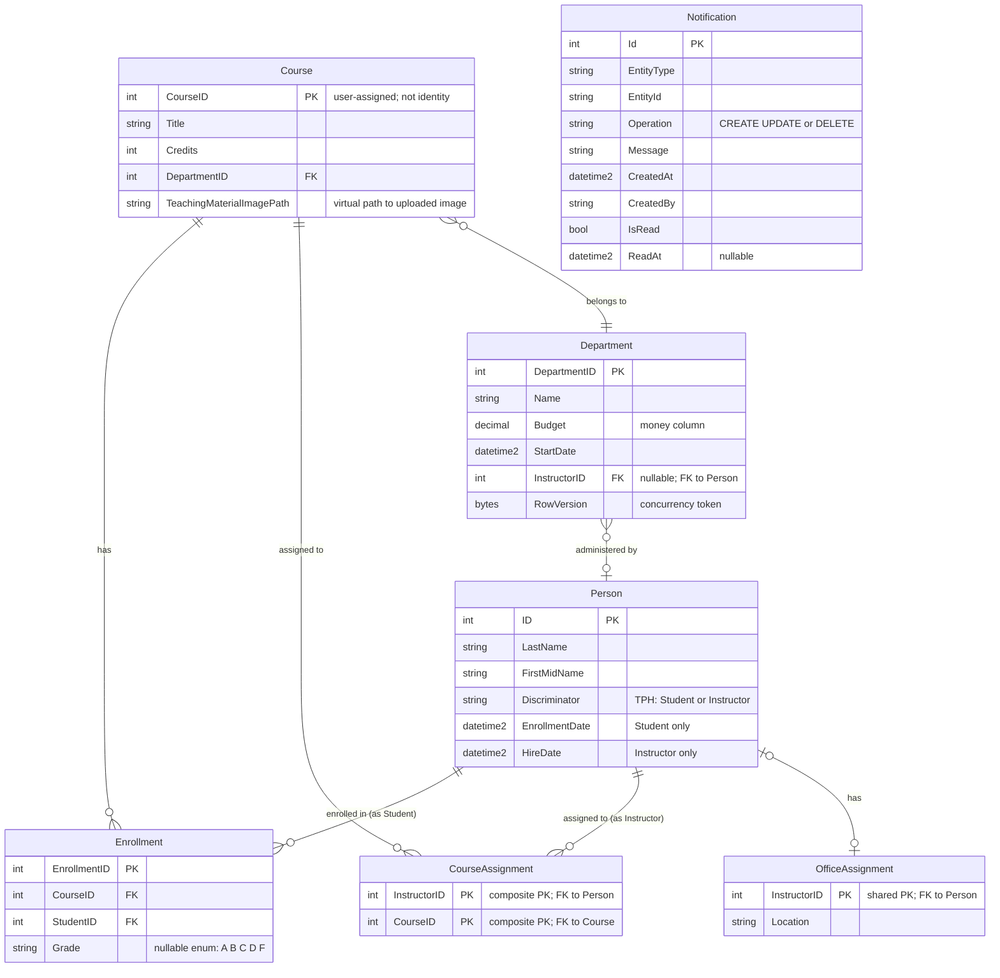

# Data Architecture & Persistence Layer

ContosoUniversity uses a single SQL Server database accessed via Entity Framework Core 3.1, with 9 domain entities organized across a university management domain (students, instructors, courses, departments, enrollments). There is no explicit migration tooling — the schema is managed by EF Core's `EnsureCreated` API.

## Database Configuration

| Module | DB Type | Profile | Driver | Connection | Migration Tool |
|--------|---------|---------|--------|-----------|---------------|
| ContosoUniversity | SQL Server LocalDB | All (single profile) | Microsoft.Data.SqlClient 2.1.4 | `(LocalDb)\MSSQLLocalDB`, catalog `ContosoUniversityNoAuthEFCore`, Integrated Security, MARS enabled | None — `EnsureCreated()` used at startup; no Flyway/Liquibase/EF Migrations |

Schema management behavior: `DbInitializer.Initialize()` calls `context.Database.EnsureCreated()` on application start, which creates the schema from EF Core model conventions if the database does not exist. No migration history table is maintained. Seed data is applied programmatically in `DbInitializer.cs` only if the `Students` table is empty.

## Data Ownership per Service

| Service | Tables Owned | ORM Framework | Caching | Notes |
|---------|-------------|--------------|---------|-------|
| ContosoUniversity Web App | Person (Student + Instructor via TPH), Course, Department, Enrollment, CourseAssignment, OfficeAssignment, Notification | Entity Framework Core 3.1.32 | None | Single-database monolith; all tables in one schema; Notification table is populated via EF in DbInitializer but never written to via EF in production (NotificationService uses MSMQ only) |

## Entity Model

## Key Repository Methods

The application has no dedicated repository interfaces. All data access is performed directly against `SchoolContext` (`DbContext`) using EF Core's `DbSet<T>` API. The following table documents the notable query patterns found in controllers:

| Controller | Entity | Notable Query Pattern | Purpose |
|-----------|--------|----------------------|---------|
| StudentsController | Student | `db.Students.Include(s => s.Enrollments).ThenInclude(e => e.Course).Where(s => s.ID == id)` | Eager-load enrollments and their courses for student detail view |
| StudentsController | Student | `db.Students.Where(...Contains(searchString)).OrderBy/Descending` | Paginated, filterable, sortable student list |
| InstructorsController | Instructor | `db.Instructors.Include(i => i.OfficeAssignment).Include(i => i.CourseAssignments).ThenInclude(c => c.Course).ThenInclude(d => d.Department)` | Deep eager-load for instructor master-detail view |
| InstructorsController | Instructor | `TryUpdateModel(instructorToUpdate, "", ["LastName", "FirstMidName", "HireDate", "OfficeAssignment"])` | Allowlist-based model update to prevent over-posting |
| DepartmentsController | Department | `db.Entry(department).State = EntityState.Modified` + `DbUpdateConcurrencyException` handling with `entry.GetDatabaseValues()` | Optimistic concurrency — RowVersion timestamp checked on update |
| CoursesController | Course | `db.Courses.Include(c => c.Department)` | Eager-load department for course list and details |
| HomeController | Student | `from student in db.Students group student by student.EnrollmentDate into dateGroup select new EnrollmentDateGroup { ... }` | LINQ grouping projection for enrollment statistics |

No Spring Data-style repository interfaces, no `@Query` annotations, and no raw SQL or stored procedures are used.

## Caching Strategy

No caching layer is implemented. The application performs direct database queries on every request with no result caching, output caching, or second-level EF Core query cache configured. `Microsoft.Extensions.Caching.Memory` is declared as a NuGet dependency (transitively required by EF Core) but is not consumed in application code.

| Cache Layer | Provider | TTL | Pattern | Status |
|-------------|---------|-----|---------|--------|
| Application-level cache | None | N/A | N/A | Not configured |
| EF Core second-level cache | None | N/A | N/A | Not configured |
| Output cache | None | N/A | N/A | Not configured |

## Data Ownership Boundaries

**Shared database, single service**: All entities reside in a single SQL Server LocalDB database owned by the one deployable application. There is no database-per-service separation, logical schema separation, or cross-service data access pattern to document.

**Notification entity anomaly**: The `Notification` table is declared as a `DbSet<Notification>` in `SchoolContext` and seeded by `DbInitializer`, but the production `NotificationService` never writes to it — it writes exclusively to an MSMQ queue. The `NotificationsController` reads from MSMQ, not from the database. This means the `Notification` table in SQL Server is effectively unused at runtime, creating a gap between the EF Core model and the actual runtime data flow.

**No CQRS or read/write separation**: All reads and writes go through the same `SchoolContext` instance, created fresh per HTTP request via `SchoolContextFactory.Create()`.

### Data Classification & Sensitivity

| Entity | Sensitive Fields | Classification | Controls in Place |
|--------|-----------------|---------------|------------------|
| Person (Student) | LastName, FirstMidName, EnrollmentDate | PII (student names and academic enrollment dates) | None — no encryption-at-rest, no masking, no field-level access control |
| Person (Instructor) | LastName, FirstMidName, HireDate | PII (employee names and employment dates) | None — no encryption-at-rest, no masking, no field-level access control |
| Department | Name, Budget, StartDate | Internal | No sensitive personal data; budget is organizational-internal |
| Course | Title, Credits, TeachingMaterialImagePath | Internal | No sensitive personal data |
| Enrollment | StudentID, CourseID, Grade | PII-adjacent (academic records linking student identity to grades) | None — grades are stored in plaintext; no access control at the data layer |
| Notification | EntityType, EntityId, CreatedBy, Message | Internal audit log | No sensitive personal data beyond entity identifiers |
| OfficeAssignment | Location | Internal | No sensitive personal data |

**Summary**: Student names, instructor names, hire dates, enrollment dates, and academic grades are stored in plaintext with no encryption-at-rest, no data masking, and no field-level access controls. The application has no authentication layer, meaning any network-accessible user can read this PII directly through the web UI.
