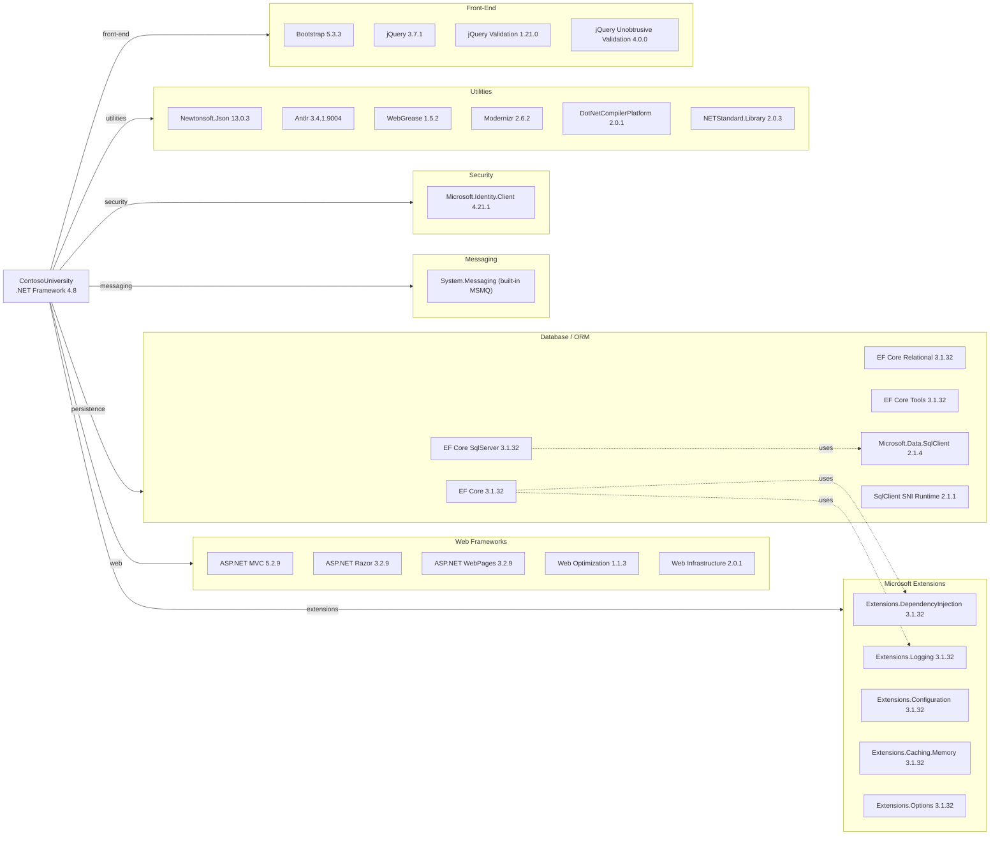

# Dependency Map

ContosoUniversity is an ASP.NET MVC 5 web application on .NET Framework 4.8, with 47 declared NuGet package dependencies covering web frameworks, data access, security, messaging, and front-end utilities.

## Dependencies

### Dependency Summary

| Category | Count | Key Libraries | Notes |
|---|---|---|---|
| Web Frameworks | 5 | ASP.NET MVC 5.2.9, Razor 3.2.9, WebPages 3.2.9 | Legacy MVC stack on .NET Framework 4.8; significant migration effort required to move to ASP.NET Core |
| Database / ORM | 6 | EF Core 3.1.32, Microsoft.Data.SqlClient 2.1.4, EF Core SqlServer 3.1.32 | EF Core 3.1 is end-of-life; mixed framework (ASP.NET MVC 5 on .NET FX with EF Core 3.1) is unusual |
| Messaging | 1 | System.Messaging (MSMQ, built-in) | Windows-only MSMQ via System.Messaging; major blocker for Linux/cloud migration |
| Security | 1 | Microsoft.Identity.Client 4.21.1 | MSAL 4.21.1 present but no authentication applied in the application |
| Utilities | 6 | Newtonsoft.Json 13.0.3, Antlr 3.4.1, WebGrease 1.5.2 | Antlr and WebGrease are legacy bundling dependencies tied to ASP.NET Web Optimization |
| Front-End | 4 | Bootstrap 5.3.3, jQuery 3.7.1, jQuery Validation 1.21.0 | Client-side libs are reasonably current |
| Microsoft Extensions | 5 | Extensions.DependencyInjection 3.1.32, Extensions.Logging 3.1.32, Extensions.Configuration 3.1.32 | .NET Core 3.1 Extensions backported to .NET Framework 4.8; all are end-of-life |

### Version & Compatibility Risks

EF Core 3.1 reached end-of-life in December 2022 and must be upgraded to EF Core 8 or later. The entire Microsoft Extensions suite (DependencyInjection, Logging, Configuration, Caching) is pinned to 3.1.32, which is also EOL. ASP.NET MVC 5.2.9 runs on .NET Framework 4.8 (maintenance-mode) and has no upgrade path within the .NET Framework — a full rewrite or migration to ASP.NET Core MVC is required. `System.Messaging` (MSMQ) is a Windows-only API with no Linux support, making it a hard blocker for any cloud or containerised Linux deployment. Microsoft.Data.SqlClient 2.1.4 is outdated; version 5.x is current. MSAL 4.21.1 is functional but superseded by newer releases with additional security features.

### Notable Observations

- **MSMQ is a critical cloud migration blocker**: `System.Messaging` and the MSMQ infrastructure are Windows-only and have no equivalent in Linux or containerised environments; migration to Azure Service Bus or a similar managed messaging service is required.
- **Mixed-framework dependency anomaly**: The project uses ASP.NET MVC 5 (classic .NET Framework) together with EF Core 3.1 and Microsoft.Extensions.*; this combination is atypical and results in EF Core being run outside its intended hosting environment, limiting DI and lifecycle management.
- **Antlr and WebGrease are legacy artefacts**: These packages are indirect dependencies of `Microsoft.AspNet.Web.Optimization` and `WebGrease` for JavaScript/CSS bundling at build time; they are obsolete and have no active development.
- **No structured logging library**: The application depends on `Microsoft.Extensions.Logging 3.1.32` but does not include a concrete logging provider (e.g., Serilog, NLog, or Application Insights sink); diagnostic output is limited to `System.Diagnostics.Debug.WriteLine`.

## Test Dependencies

| Framework | Version | Notes |
|---|---|---|
| — | — | No test project or test packages detected |

Total test-scope dependencies: 0

No test project was found in the solution. The solution contains a single project (`ContosoUniversity.csproj`) with no associated unit or integration test project, and no test-scoped NuGet packages are declared in `packages.config`. Adding a test project with xUnit or MSTest and EF Core In-Memory provider is recommended.
