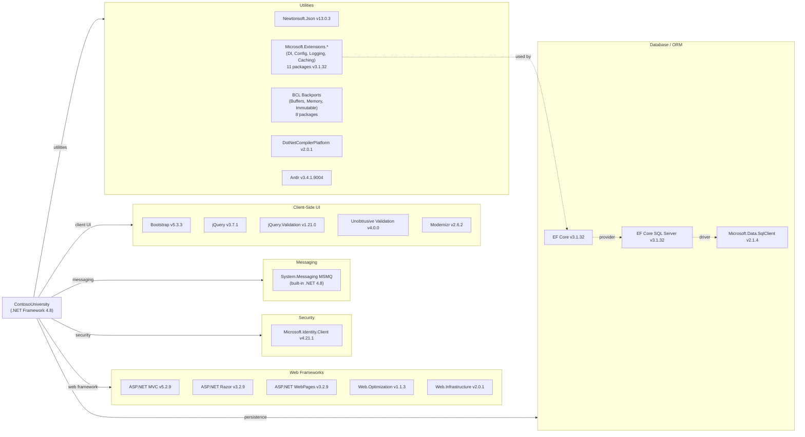

# Dependency Map

ContosoUniversity is a single-project ASP.NET MVC 5 application targeting .NET Framework 4.8. It declares **47 NuGet packages** in `packages.config` spanning web frameworks, data access, security, client-side UI, and runtime utilities.

## Dependencies

### Dependency Summary

| Category | Count | Key Libraries | Notes |
|---|---|---|---|
| Web Frameworks | 5 | ASP.NET MVC 5.2.9, Razor 3.2.9, Web.Optimization 1.1.3 | Legacy .NET Framework MVC 5 stack; not compatible with .NET Core/5+ without rewrite |
| Database / ORM | 8 | EF Core 3.1.32, EF Core SQL Server 3.1.32, SqlClient 2.1.4 | EF Core 3.1 is end-of-life; SqlClient 2.1.4 is several major versions behind |
| Security | 1 | Microsoft.Identity.Client 4.21.1 | MSAL library present; no authentication middleware wired up in current code |
| Messaging | 1 | System.Messaging (MSMQ) | Built-in .NET Framework assembly; MSMQ is Windows-only and not supported on Linux or .NET Core |
| Client-Side UI | 5 | Bootstrap 5.3.3, jQuery 3.7.1, jQuery.Validation 1.21.0 | Client-side libs are reasonably current |
| Utilities | 19 | Newtonsoft.Json 13.0.3, Microsoft.Extensions.* 3.1.32, BCL backports | Large set of backport packages compensating for .NET Framework 4.8 limitations |

### Version & Compatibility Risks

The most significant risk is the **ASP.NET MVC 5 / .NET Framework 4.8** stack itself — it is in long-term maintenance mode and cannot run on Linux without a full rewrite to ASP.NET Core. **Entity Framework Core 3.1** reached end-of-life in December 2022; upgrading to EF Core 8 or 9 is strongly recommended. **MSMQ (System.Messaging)** is a Windows-only technology with no direct equivalent on .NET Core, making containerisation or Linux-based deployment impossible without replacing it with a cross-platform broker such as Azure Service Bus or RabbitMQ. **Microsoft.Data.SqlClient 2.1.4** is several major versions behind (current stable is 5.x) and contains patched CVEs. The 11 `Microsoft.Extensions.*` packages at version 3.1.32 (EF Core era) are outdated and should be aligned with the target runtime version during migration.

### Notable Observations

- **MSMQ dependency blocks cross-platform migration**: `System.Messaging` is a Windows-only, .NET Framework-exclusive assembly. It will not compile or run on .NET Core or Linux, making it a mandatory migration target before any containerisation effort.
- **MSAL included but unused**: `Microsoft.Identity.Client 4.21.1` is declared in `packages.config` but no authentication middleware is configured in `FilterConfig.cs` or `Global.asax.cs`, suggesting incomplete identity integration.
- **Large BCL backport footprint**: 8 BCL polyfill packages (`System.Buffers`, `System.Memory`, `System.Collections.Immutable`, etc.) exist only to support EF Core 3.1 on .NET Framework 4.8. These become unnecessary after migrating to .NET 6+.
- **No logging framework**: Despite `Microsoft.Extensions.Logging 3.1.32` being present as a transitive dependency of EF Core, the application uses `LoggingService.cs` (backed by `System.Diagnostics.Debug`) with no structured logging provider (Serilog, NLog, etc.) configured.

## Test Dependencies

No test projects or test-scoped packages were found in `packages.config`. The solution contains only a single application project (`ContosoUniversity.csproj`) with no accompanying test project.

Total test-scope dependencies: **0**

No automated test infrastructure is present. Consider adding an xUnit or MSTest project with a mocking framework (Moq or NSubstitute) as part of the modernization effort to establish a test safety net before migrating the application.
