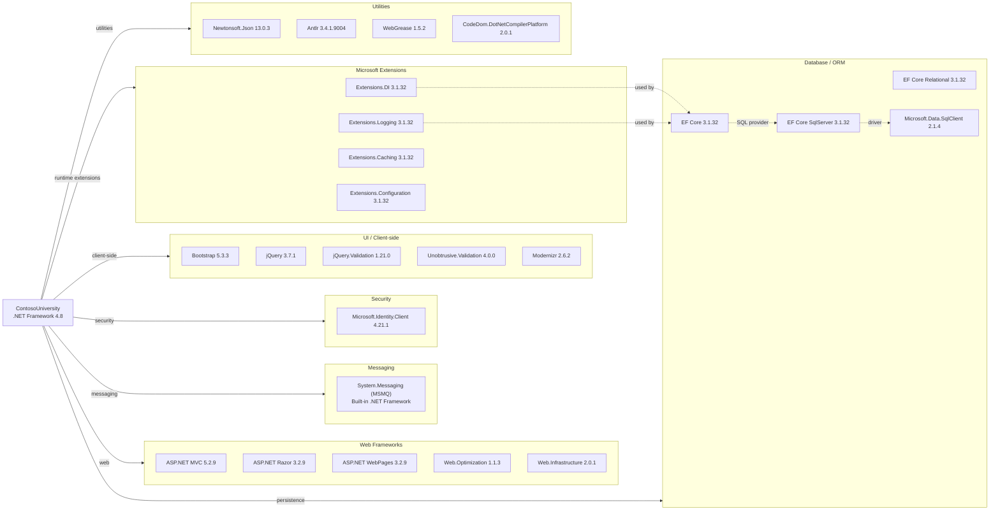

# Dependency Map

ContosoUniversity is an ASP.NET MVC 5 / .NET Framework 4.8 application with approximately 43 declared external dependencies spanning web frameworks, data access, messaging, security, and UI tooling.

## Dependencies

### Dependency Summary

| Category | Count | Key Libraries | Notes |
|---|---|---|---|
| Web Frameworks | 5 | ASP.NET MVC 5.2.9, Razor 3.2.9, WebPages 3.2.9 | Legacy System.Web stack — not portable to .NET 6+ without rewrite |
| Database / ORM | 4 | EF Core 3.1.32, SqlServer provider, Data.SqlClient 2.1.4 | EF Core 3.1 is end-of-life; mixed with legacy ASP.NET MVC |
| Messaging | 1 | System.Messaging (MSMQ, built-in) | Windows-only; incompatible with Linux/cloud-native deployments |
| Security | 1 | Microsoft.Identity.Client 4.21.1 | MSAL present but authentication not wired up in application |
| UI / Client-side | 5 | Bootstrap 5.3.3, jQuery 3.7.1 | Modern frontend libraries but bundled via legacy System.Web.Optimization |
| Microsoft Extensions | 4 | DI, Logging, Caching, Configuration (3.1.32) | EOL version of Microsoft.Extensions stack |
| Utilities | 4 | Newtonsoft.Json 13.0.3, Antlr 3.4.1, WebGrease 1.5.2 | Antlr and WebGrease are legacy build-time dependencies of MVC bundling |

### Version & Compatibility Risks

The most critical compatibility risk is the **System.Web / ASP.NET MVC 5** stack, which is strictly tied to .NET Framework and **cannot run on .NET 6+** without a full rewrite to ASP.NET Core. **Entity Framework Core 3.1** reached end-of-life in December 2022 and has known security vulnerabilities; upgrading to EF Core 8 or 9 is required before any cloud migration. **Microsoft.Extensions.* 3.1.32** packages are similarly end-of-life and must be upgraded. **System.Messaging (MSMQ)** is a Windows-only API with no .NET 6+ equivalent — a migration to Azure Service Bus or another cloud-native broker is necessary for Linux/container deployments. **Antlr 3.4.1** and **WebGrease 1.5.2** are obsolete build-time dependencies brought in by the legacy bundling infrastructure and should be replaced.

### Notable Observations

- **Hybrid EF Core + legacy MVC**: Using EF Core (a modern cross-platform ORM) inside a legacy `System.Web`-based MVC application is an unusual and unsupported combination that creates migration complexity — the EF Core stack is ready to move but the web layer is not.
- **MSMQ is a hard blocker for cloud migration**: `System.Messaging` relies on Windows MSMQ infrastructure, which is unavailable in Azure App Service on Linux or Azure Container Apps; this service must be replaced with Azure Service Bus or Azure Queue Storage.
- **MSAL (Microsoft.Identity.Client) is unreferenced**: The `Microsoft.Identity.Client 4.21.1` package is declared but no authentication middleware is wired in `Global.asax.cs` or `FilterConfig.cs`, suggesting incomplete or abandoned authentication work.
- **No logging framework declared**: The application uses `System.Diagnostics.Debug.WriteLine` for logging with no structured logging library (Serilog, NLog, or Microsoft.Extensions.Logging integration) — a gap that will need addressing for production observability.

## Test Dependencies

No test project was detected in the solution. The repository contains a single `ContosoUniversity.csproj` with no test-scoped dependencies.

Total test-scope dependencies: **0**

No unit, integration, or end-to-end test infrastructure is present. Adding a test project (e.g., xUnit with Moq) should be considered as part of modernization to validate migration outcomes.
