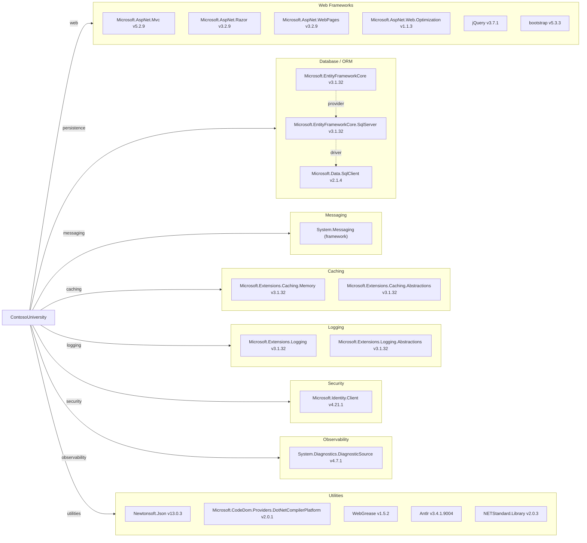

# Dependency Map

This map summarizes declared external dependencies for ContosoUniversity (46 declared NuGet packages in `packages.config`) and groups them by modernization-relevant function.

## Dependencies

### Dependency Summary

| Category | Count | Key Libraries | Notes |
|---|---:|---|---|
| Web Frameworks | 6 | ASP.NET MVC 5.2.9, Razor 3.2.9, Bootstrap 5.3.3 | Legacy ASP.NET MVC stack on .NET Framework |
| Database / ORM | 3 | EF Core 3.1.32, SqlServer provider 3.1.32, SqlClient 2.1.4 | ORM and SQL provider are out of mainstream support |
| Messaging | 1 | System.Messaging | MSMQ dependency ties deployment to Windows features |
| Caching | 2 | Microsoft.Extensions.Caching.Memory 3.1.32 | Local in-process caching abstractions available |
| Logging | 2 | Microsoft.Extensions.Logging 3.1.32 | Basic logging abstractions only |
| Security | 1 | Microsoft.Identity.Client 4.21.1 | Identity client library present |
| Observability | 1 | DiagnosticSource 4.7.1 | Minimal diagnostic primitives |
| Utilities | 30 | Newtonsoft.Json 13.0.3, NETStandard.Library 2.0.3 | Large utility/transitive-support footprint from .NET Framework compatibility |

### Version & Compatibility Risks

The project targets .NET Framework 4.8 with ASP.NET MVC 5 and EF Core 3.1.x; EF Core 3.1 reached end of support and may require API and package updates before moving to supported modern .NET targets. System.Messaging usage also introduces migration risk because MSMQ is Windows-specific and not cloud-native by default.

### Notable Observations

- The dependency graph mixes legacy ASP.NET MVC packages with EF Core, creating a hybrid stack that can increase upgrade complexity.
- `System.Messaging` indicates queueing behavior is coupled to MSMQ and likely unavailable in Linux-based container environments without redesign.
- Utility and compatibility packages are numerous, suggesting potentially large transitive cleanup during modernization.

## Test Dependencies

| Framework | Version | Notes |
|---|---|---|
| None detected | N/A | No dedicated test package references found in `packages.config` |

Total test-scope dependencies: 0  
No test dependency declarations were detected in build/package files for this workspace.
