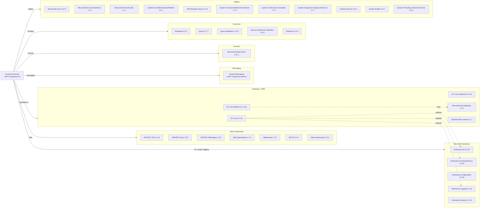

# Dependency Map

ContosoUniversity is an ASP.NET MVC 5 web application (.NET Framework 4.8) with 47 declared NuGet package dependencies spanning web frameworks, ORM, messaging, security, and front-end UI libraries.

## Dependencies

### Dependency Summary

| Category | Count | Key Libraries | Notes |
|----------|-------|--------------|-------|
| Web Frameworks | 7 | ASP.NET MVC 5.2.9, Razor 3.2.9, Web.Optimization 1.1.3 | Legacy .NET Framework MVC stack; not cross-platform |
| Database / ORM | 5 | EF Core 3.1.32, Microsoft.Data.SqlClient 2.1.4 | EF Core 3.1 is end-of-life; mixed with .NET Framework host |
| Messaging | 1 | System.Messaging (MSMQ, built-in) | Windows-only; not declared as NuGet package |
| Security | 1 | Microsoft.Identity.Client 4.21.1 | MSAL for authentication; no auth middleware wired in |
| Microsoft Extensions | 5 | DI, Caching, Configuration, Logging, Options 3.1.32 | Backported from .NET Core 3.1; all end-of-life |
| Front-End | 5 | Bootstrap 5.3.3, jQuery 3.7.1, jQuery Validation 1.21.0 | Frontend is up-to-date; Bootstrap 5 used despite MVC 5 |
| Utilities | 11 | Newtonsoft.Json 13.0.3, NETStandard.Library 2.0.3 | Several BCL polyfills needed to bridge .NET Fx and netstandard2.0 |

### Version & Compatibility Risks

**Entity Framework Core 3.1** reached end-of-life in December 2022 and should be upgraded to EF Core 8 or 9. It is running on **.NET Framework 4.8** as a netstandard2.0 library, which is an unusual configuration — EF Core was designed for .NET Core/.NET 5+ hosts. The entire **Microsoft.Extensions.\* 3.1.x** suite is equally end-of-life. **Microsoft.Data.SqlClient 2.1.4** is a legacy release; the current supported version is 5.x. **ASP.NET MVC 5.2.9** is a maintenance-mode framework tied exclusively to .NET Framework — it will not run on .NET 6+. The **System.Messaging (MSMQ)** integration is Windows-platform-only and has no cross-platform equivalent, representing a significant cloud-migration blocker. **Modernizr 2.6.2** is outdated (latest is 3.x) and largely unnecessary for modern browsers. **Microsoft.Identity.Client 4.21.1** should be updated to 4.61+ to pick up security and protocol fixes.

### Notable Observations

- **MSMQ is a cloud migration blocker**: `System.Messaging` is Windows-only and unavailable on Linux or in containerized environments. Migrating to Azure Service Bus or Azure Queue Storage would be required for cloud deployment.
- **Mixed framework targets**: The project hosts .NET Framework 4.8 code but references `netstandard2.0` EF Core and Extensions libraries — this works on Windows but constrains the upgrade path and introduces assembly binding redirects for every Microsoft.Extensions.* package.
- **No logging framework declared**: Despite referencing `Microsoft.Extensions.Logging.Abstractions`, there is no concrete logging provider (e.g., Serilog, NLog, Application Insights) configured; `System.Diagnostics.Debug` and `Trace` are used directly in source code.
- **Bootstrap 5 / jQuery 3 are current**, but the project still ships `Modernizr 2.6.2` and `respond.js` — legacy polyfills for IE 8/9 that are unnecessary for modern browser targets.

## Test Dependencies

No test-scoped NuGet packages were detected in `packages.config` or any `*.csproj` in the workspace. There are no unit test, integration test, or UI test projects present in the solution.

Total test-scope dependencies: **0**

No test infrastructure is configured. Adding a test project with xUnit or MSTest and a mocking library (e.g., Moq) would be recommended before any significant modernization effort.
