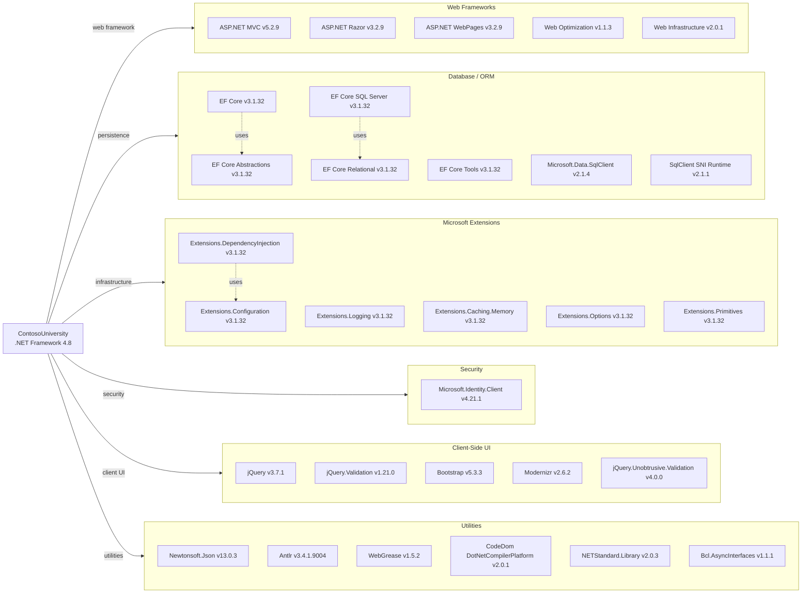

# Dependency Map

ContosoUniversity is an ASP.NET MVC 5 / .NET Framework 4.8 web application with 47 declared NuGet dependencies spanning web frameworks, data access, messaging, security, and client-side libraries.

## Dependencies

### Dependency Summary

| Category | Count | Key Libraries | Notes |
|----------|-------|--------------|-------|
| Web Frameworks | 5 | ASP.NET MVC 5.2.9, Razor 3.2.9, WebPages 3.2.9 | Legacy ASP.NET MVC 5 stack on .NET Framework 4.8 — not cross-platform |
| Database / ORM | 7 | EF Core 3.1.32, Microsoft.Data.SqlClient 2.1.4 | EF Core 3.1 is end-of-life; SQL Server only |
| Microsoft Extensions | 6 | DI, Configuration, Logging, Caching 3.1.32 | Backported from .NET Core 3.1 (EOL); used to bring DI/config into .NET Framework app |
| Security | 1 | Microsoft.Identity.Client 4.21.1 | MSAL library present but authentication disabled in FilterConfig |
| Client-Side UI | 5 | jQuery 3.7.1, Bootstrap 5.3.3, jQuery.Validation 1.21.0 | Client libraries current; Bootstrap 5 mixed with legacy MVC bundle pipeline |
| Utilities | 6 | Newtonsoft.Json 13.0.3, Antlr 3.4.1.9004, WebGrease 1.5.2 | Antlr and WebGrease are effectively unmaintained; Newtonsoft.Json is current |

### Version & Compatibility Risks

Entity Framework Core 3.1.32 is a long-term-support (LTS) release that reached end-of-life in December 2022 — migrating to EF Core 8 or 9 would require targeting .NET 8+ and porting the application off .NET Framework. All `Microsoft.Extensions.*` packages are pinned to 3.1.32, which is the backport compatible with .NET Framework but is equally end-of-life. ASP.NET MVC 5.2.9 on .NET Framework 4.8 is in maintenance-only mode; there is no in-place upgrade path — a rewrite targeting ASP.NET Core is required for cross-platform deployment or containerization. The `Microsoft.Data.SqlClient` v2.1.4 is two major versions behind the current 5.x series and has known CVEs in its SNI native runtime component. `Antlr 3.4.1.9004` and `WebGrease 1.5.2` are legacy dependencies pulled in by the `System.Web.Optimization` bundle pipeline; both are unmaintained. MSMQ (used via `System.Messaging`) is Windows-only and has no NuGet-declared dependency — it is an implicit OS component not portable to Linux containers.

### Notable Observations

- **MSMQ dependency is implicit**: The notification system uses `System.Messaging` (a Windows-only BCL type) with no NuGet package reference, making it invisible in the dependency graph but a significant cloud migration blocker.
- **Mixed EF version targeting**: The project uses EF Core 3.1 (`Microsoft.EntityFrameworkCore`) with the older `Microsoft.AspNet.Mvc` 5.x — a combination that bridges two incompatible runtime paradigms (.NET Standard 2.0 backport vs. full .NET Framework), creating complex assembly binding redirects.
- **Authentication library unused**: `Microsoft.Identity.Client` (MSAL) v4.21.1 is declared but the `[Authorize]` filter is commented out in `FilterConfig.cs`, meaning no authentication is enforced despite the library being present.
- **Client-side library version gap**: Bootstrap 5.3.3 is bundled alongside the legacy `Microsoft.AspNet.Web.Optimization` pipeline (WebGrease/Antlr), which was designed for Bootstrap 3.x-era workflows; the bundle configuration likely delivers Bootstrap CSS/JS correctly but tooling support is stale.

## Test Dependencies

| Framework | Version | Notes |
|-----------|---------|-------|
| — | — | No test project detected |

Total test-scope dependencies: 0

No test project or test-scoped NuGet packages were detected in the solution. The `packages.config` contains no testing frameworks (xUnit, MSTest, NUnit) or mocking libraries, indicating the application currently has no automated test coverage.
