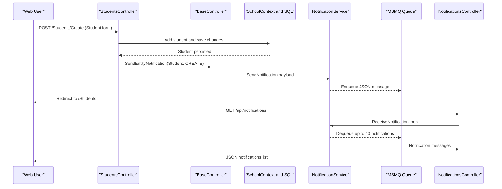

# API & Service Communication Contracts

This document captures the API-facing surface of ContosoUniversity, including MVC endpoints and queue-backed notification communication.

## Service Catalog

| Service | Port | Category | Purpose |
|---|---|---|---|
| ContosoUniversity Web App | 44300 (IIS Express URL) | API Layer | Hosts MVC controllers and JSON notification endpoints |
| SQL Server LocalDB | DefaultConnection string | Infrastructure | Persists school and notification data |
| MSMQ Queue | `.\Private$\ContosoUniversityNotifications` path | Infrastructure | Asynchronous notification transport |

## API Endpoints Inventory

| Service | Method | Path | Request Type | Response Type |
|---|---|---|---|---|
| Web App | GET | `/Home/Index` | none | Razor view |
| Web App | GET | `/Students` | query params (`sortOrder`, `searchString`, `page`) | Razor view with paginated students |
| Web App | GET | `/Students/Details/{id}` | path id | Razor view with student + enrollments |
| Web App | POST | `/Students/Create` | form-bound `Student` | redirect to index or validation errors |
| Web App | POST | `/Students/Edit` | form-bound `Student` | redirect to index or validation errors |
| Web App | POST | `/Students/Delete/{id}` | path id | redirect to index |
| Web App | GET | `/Courses` | none | Razor view with course list |
| Web App | POST | `/Courses/Create` | form `Course` + file upload | redirect or validation errors |
| Web App | POST | `/Courses/Edit` | form `Course` + file upload | redirect or validation errors |
| Web App | GET | `/api/notifications` | none | JSON `{ success, notifications, count }` |
| Web App | POST | `/api/notifications/mark-read` | form/body id | JSON `{ success }` |

## Management & Observability Endpoints

| Service | Endpoint | Custom Metrics (if any) |
|---|---|---|
| Web App | None explicitly configured (no actuator/health controller found) | None detected |

## DTOs & Contracts

The application primarily uses MVC model binding with domain classes such as `Student`, `Course`, `Department`, `Instructor`, and `Notification` as request/response contract types for form posts and JSON payloads. `EnrollmentDateGroup`, `InstructorIndexData`, and `AssignedCourseData` are view-model contracts used for aggregated UI responses. Serialization for queue messages is JSON-based through `Newtonsoft.Json`.

## Communication Patterns

Communication is mostly synchronous inside a single web application process: browser to MVC actions, controller to EF Core, and SQL operations to LocalDB. The notification path adds asynchronous messaging by publishing serialized `Notification` payloads to a local MSMQ queue, then polling that queue from `NotificationsController`. No circuit breaker, retry library, service discovery, or API gateway composition layer was detected. Authentication and authorization appear absent in controller attributes, and transport security is dependent on IIS hosting configuration rather than explicit in-app enforcement.

## Service Technology Matrix

| Service | Web | Data Access | Discovery | Gateway | Actuator | Cache | Metrics |
|---|---|---|---|---|---|---|---|
| ContosoUniversity Web App | ASP.NET MVC 5 | EF Core 3.1 + SQL Server provider | none | none | none | package present, no explicit usage found | none |

## Service Communication Sequence

