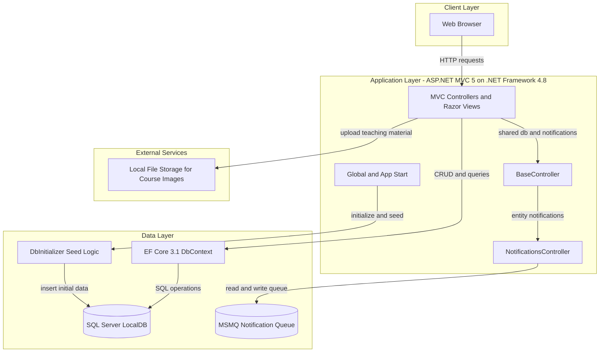
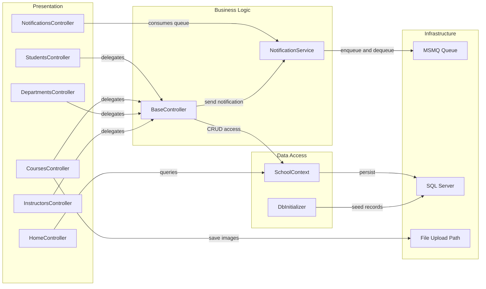

# Architecture Diagram

This document summarizes the current ContosoUniversity web application's architecture and key component interactions.

## Application Architecture

### Technology Stack Summary

| Layer | Technology | Version | Purpose |
|---|---|---|---|
| Presentation | ASP.NET MVC | 5.2.9 | Server-rendered UI and controller routing |
| Data Access | Entity Framework Core | 3.1.32 | ORM-based persistence with `SchoolContext` |
| Runtime | .NET Framework | 4.8 | Application runtime |
| Database | SQL Server LocalDB | configured in `Web.config` | Primary relational storage |
| Messaging | MSMQ (`System.Messaging`) | .NET Framework API | Notification queue transport |

### Data Storage & External Services

The application persists academic and notification entities in SQL Server LocalDB via EF Core. It also uses a private MSMQ queue for notification delivery and local file-system storage for uploaded course teaching material images.

### Key Architectural Decisions

- Uses an MVC monolith with a shared `BaseController` to centralize `SchoolContext` and notification dispatch.
- Uses EF Core with table-per-hierarchy inheritance for `Person` (`Student` and `Instructor`).
- Uses queue-based notification delivery (MSMQ) to decouple CRUD actions from notification consumption.

## Component Relationships

### Component Inventory

| Component | Layer | Type | Responsibility |
|---|---|---|---|
| `StudentsController` | Presentation | MVC Controller | Student list/search and CRUD operations |
| `CoursesController` | Presentation | MVC Controller | Course CRUD and teaching material upload |
| `DepartmentsController` | Presentation | MVC Controller | Department CRUD with concurrency handling |
| `InstructorsController` | Presentation | MVC Controller | Instructor CRUD and course assignment workflows |
| `NotificationsController` | Presentation | MVC/JSON Controller | Notification queue polling and mark-as-read endpoint |
| `BaseController` | Business Logic | Shared base controller | Creates context and dispatches entity notifications |
| `NotificationService` | Business Logic | Service | Serializes and sends/receives notification messages |
| `SchoolContext` | Data Access | EF Core DbContext | Entity sets, relationships, and mappings |
| `DbInitializer` | Data Access | Seeder | Initial data creation and seeding |

