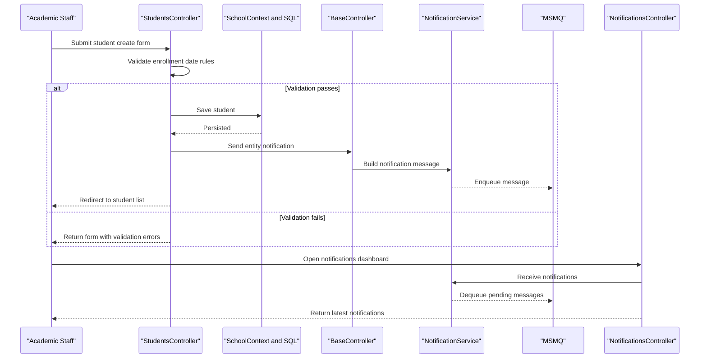

# Core Business Workflows

ContosoUniversity supports academic administration workflows for managing students, instructors, courses, and departments, with queue-backed notifications for change tracking.

## Domain Entities

| Entity | Service / Bounded Context | Description | Key Relationships |
|---|---|---|---|
| Student | Academic Records | Learner profile and enrollment lifecycle | Enrolls in many courses through enrollments |
| Instructor | Academic Staffing | Faculty profile and teaching assignments | Assigned to courses and departments |
| Course | Curriculum Management | Course catalog and teaching materials | Belongs to department; has enrollments and assignments |
| Department | Academic Organization | Organizational unit and budget ownership | Owns courses and optional administrator |
| Enrollment | Academic Records | Student-to-course registration record | Connects student and course with optional grade |
| Notification | Operations Monitoring | Message for create/update/delete events | Produced by CRUD workflows and consumed by notifications dashboard |

## Service-to-Domain Mapping

| Service | Domain Context | Owned Entities | External Dependencies |
|---|---|---|---|
| ContosoUniversity MVC App | Academic Administration | Student, Instructor, Course, Department, Enrollment, Notification | SQL Server LocalDB, MSMQ |
| NotificationService component | Operational Notifications | Notification message payloads | MSMQ queue, JSON serializer |

## Primary Workflows

### Workflow 1: Student lifecycle management

Staff opens student pages, searches and sorts records, and submits create/edit/delete actions. The workflow validates enrollment date bounds, persists changes through `SchoolContext`, and emits a notification event for each successful mutation.

### Workflow 2: Course management with teaching material upload

Staff creates or updates a course and optionally uploads an image. The workflow validates extension and file size, stores the file in `Uploads/TeachingMaterials`, updates SQL records, and emits a corresponding course notification event.

### Workflow 3: Instructor assignment and schedule maintenance

Staff creates or edits instructor records and course assignments. The workflow updates office assignment and many-to-many course links, persists entity changes, and emits instructor notification events.

## Cross-Service Data Flows

The solution is a monolith, so most business data flow is intra-process: controllers query/update through `SchoolContext` directly. Notification generation introduces a cross-component flow where CRUD controllers push serialized `Notification` payloads to MSMQ via `NotificationService`, and `NotificationsController` later dequeues those messages for the admin dashboard API. If queue access fails, the main CRUD transaction still completes because notification dispatch errors are caught and logged.

## Business Workflow Sequence

## Business Rules & Decision Logic

- Student enrollment date and instructor hire date are constrained to valid SQL Server datetime ranges.
- Course image uploads are permitted only for specific image extensions and up to 5 MB size.
- Department update flow handles optimistic concurrency conflicts by comparing client and database values.
- Notification dispatch is best-effort: failures do not block the underlying business operation.
- Delete workflows remove entity data and then issue delete notifications for downstream awareness.

