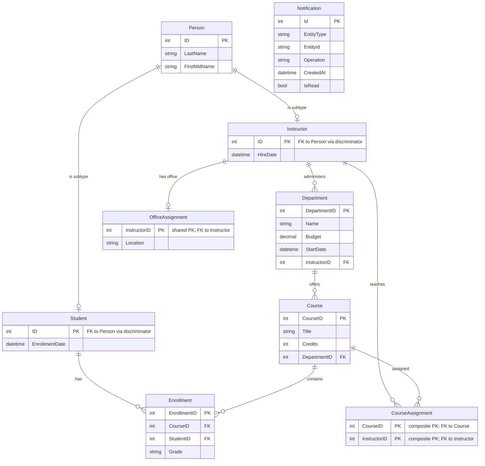

# Data Architecture & Persistence Layer

This document summarizes the ContosoUniversity persistence layer, including EF Core mappings, SQL Server usage, and queue-backed notification storage patterns.

## Database Configuration

| Service/Module | DB Type | Profile | Driver | Connection | Migration Tool |
|---|---|---|---|---|---|
| ContosoUniversity | SQL Server LocalDB | default | Microsoft.Data.SqlClient 2.1.4 | `DefaultConnection` in `Web.config` | None detected (startup `EnsureCreated` + seed initializer) |

## Data Ownership per Service

| Service | Tables Owned | ORM Framework | Caching | Notes |
|---|---|---|---|---|
| ContosoUniversity monolith | Person, Student, Instructor, Course, Department, Enrollment, OfficeAssignment, CourseAssignment, Notification | EF Core 3.1 | No explicit runtime cache behavior found | Single shared database context in one web app |

## Entity Model

## Key Repository Methods

| Service | Repository | Notable Methods | Purpose |
|---|---|---|---|
| ContosoUniversity | `SchoolContext` (`Data/SchoolContext.cs`) | `DbSet<T>` collections for all entities | Unit-of-work style persistence entry point |
| ContosoUniversity | LINQ via controllers (`StudentsController`, `InstructorsController`) | `Include`, `ThenInclude`, `Where`, `OrderBy`, `Single`, `Find` | Query composition for list/detail workflows |
| ContosoUniversity | `DbInitializer` | `Initialize(context)`, `EnsureCreated()`, repeated `SaveChanges()` | Schema initialization and baseline seed data |

## Caching Strategy

| Layer | Provider | Pattern | Configuration | Observations |
|---|---|---|---|---|
| Application | `Microsoft.Extensions.Caching.Memory` package referenced | Not explicitly implemented in controllers/services | No cache regions or TTL settings found | Caching dependency exists but active cache calls were not detected |

## Data Ownership Boundaries

The application uses a single shared SQL database accessed by one web application service through a single `SchoolContext`. Data reads and writes are synchronous and directly coupled to MVC workflows, with no cross-service API data ownership boundaries. Notification events are duplicated into MSMQ for asynchronous consumption in the same application boundary.

### Data Classification & Sensitivity

| Entity | Sensitive Fields | Classification (PII/PHI/PCI/None) | Controls in Place |
|---|---|---|---|
| Person / Student / Instructor | Names and derived full name | PII | No explicit field-level masking or encryption controls detected in code |
| Department | None clearly sensitive | None | N/A |
| Course | Teaching material file path | Internal | File type and size validation present in controller logic |
| Notification | `CreatedBy`, message text may contain actor context | Internal / potential PII | No explicit masking/encryption found |

No PHI or PCI-specific fields were detected in the current entity model.

