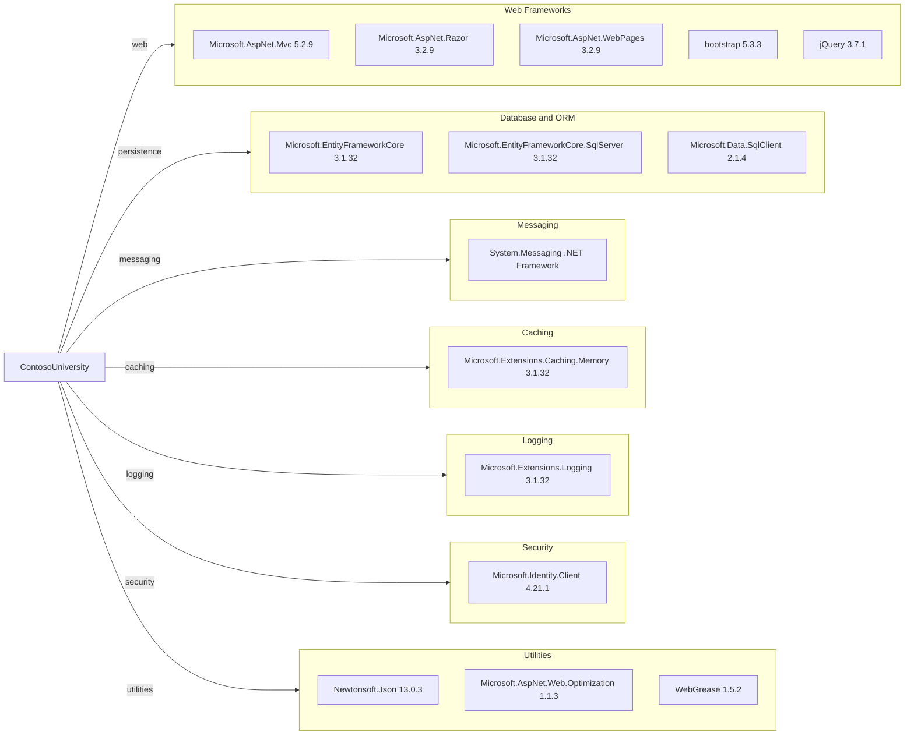

# Dependency Map

This map summarizes declared package dependencies for ContosoUniversity and groups them by functional purpose.

## Dependencies

### Dependency Summary

| Category | Count | Key Libraries | Notes |
|---|---|---|---|
| Web Frameworks | 5 | Microsoft.AspNet.Mvc, Razor, bootstrap | ASP.NET MVC 5 server-rendered stack |
| Database / ORM | 3 | EF Core, EF Core SqlServer, SqlClient | EF Core 3.1 on .NET Framework |
| Messaging | 1 | System.Messaging | MSMQ-based local queue notifications |
| Caching | 1 | Microsoft.Extensions.Caching.Memory | Memory cache package referenced |
| Logging | 1 | Microsoft.Extensions.Logging | Logging abstractions package referenced |
| Security | 1 | Microsoft.Identity.Client | Identity client dependency present |
| Utilities | 3 | Newtonsoft.Json, Web.Optimization, WebGrease | JSON and asset bundling support |

### Version & Compatibility Risks

The project targets .NET Framework 4.8 with ASP.NET MVC 5 and EF Core 3.1. Both MVC 5 and EF Core 3.1 are older stacks compared with current .NET LTS versions, so package compatibility and framework modernization effort should be expected during migration planning.

### Notable Observations

- The solution mixes classic ASP.NET MVC with newer Microsoft.Extensions packages.
- Messaging relies on MSMQ (`System.Messaging`), which is Windows-specific and may require redesign for cloud portability.
- Client libraries are modernized (Bootstrap 5.3.3 and jQuery 3.7.1), while server framework remains legacy.

## Test Dependencies

| Framework | Version | Notes |
|---|---|---|
| None detected | N/A | No test-scoped packages found in `packages.config` |

Total test-scope dependencies: 0
No dedicated test infrastructure was detected in this repository snapshot.

