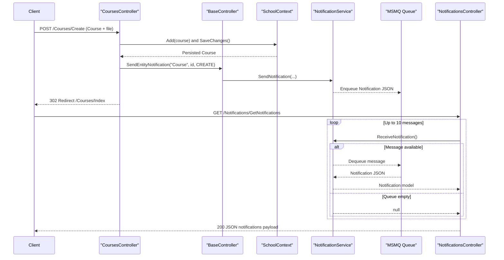

# API & Service Communication Contracts

This application exposes a single ASP.NET MVC service with HTML endpoints and a small JSON notification API. Communication is mostly synchronous request-response with asynchronous notification exchange through MSMQ.

## Service Catalog

| Service | Port | Category | Purpose |
| --- | --- | --- | --- |
| ContosoUniversity.Web | 44300 (IIS Express), default MVC route | API Layer | Handles MVC routes for students, courses, instructors, departments, and notifications |
| Local MSMQ Queue | N/A (machine queue path) | Infrastructure | Buffers entity change notifications for retrieval by notification endpoints |

## API Endpoints Inventory

| Service | Method | Path | Request Type | Response Type |
| --- | --- | --- | --- | --- |
| ContosoUniversity.Web (HomeController) | GET | /Home/Index | None | Razor ViewResult |
| ContosoUniversity.Web (HomeController) | GET | /Home/About | None | Razor ViewResult using `EnrollmentDateGroup` projection |
| ContosoUniversity.Web (StudentsController) | GET | /Students/Index | Query params: `sortOrder`, `currentFilter`, `searchString`, `page` | Razor ViewResult using `PaginatedList<Student>` |
| ContosoUniversity.Web (StudentsController) | POST | /Students/Create | Form body bound to `Student` | Redirect to `/Students/Index` or validation ViewResult |
| ContosoUniversity.Web (StudentsController) | POST | /Students/Edit | Form body bound to `Student` | Redirect to `/Students/Index` or validation ViewResult |
| ContosoUniversity.Web (StudentsController) | POST | /Students/Delete/{id} | Path/Form id | Redirect to `/Students/Index` |
| ContosoUniversity.Web (CoursesController) | POST | /Courses/Create | Form body bound to `Course` + `HttpPostedFileBase` | Redirect to `/Courses/Index` or validation ViewResult |
| ContosoUniversity.Web (CoursesController) | POST | /Courses/Edit | Form body bound to `Course` + `HttpPostedFileBase` | Redirect to `/Courses/Index` or validation ViewResult |
| ContosoUniversity.Web (CoursesController) | POST | /Courses/Delete/{id} | Path/Form id | Redirect to `/Courses/Index` |
| ContosoUniversity.Web (InstructorsController) | GET | /Instructors/Index | Query params: `id`, `courseID` | Razor ViewResult using `InstructorIndexData` |
| ContosoUniversity.Web (InstructorsController) | POST | /Instructors/Create | Form body bound to `Instructor` + `selectedCourses[]` | Redirect to `/Instructors/Index` or validation ViewResult |
| ContosoUniversity.Web (InstructorsController) | POST | /Instructors/Edit/{id} | Path/Form id + `selectedCourses[]` | Redirect to `/Instructors/Index` or validation ViewResult |
| ContosoUniversity.Web (InstructorsController) | POST | /Instructors/Delete/{id} | Path/Form id | Redirect to `/Instructors/Index` |
| ContosoUniversity.Web (DepartmentsController) | POST | /Departments/Create | Form body bound to `Department` | Redirect to `/Departments/Index` or validation ViewResult |
| ContosoUniversity.Web (DepartmentsController) | POST | /Departments/Edit | Form body bound to `Department` | Redirect to `/Departments/Index` or concurrency handling ViewResult |
| ContosoUniversity.Web (DepartmentsController) | POST | /Departments/Delete/{id} | Path/Form id | Redirect to `/Departments/Index` |
| ContosoUniversity.Web (NotificationsController) | GET | /Notifications/GetNotifications | None | JSON `{ success, notifications, count }` |
| ContosoUniversity.Web (NotificationsController) | POST | /Notifications/MarkAsRead | Form/query param `id` | JSON `{ success }` or `{ success, message }` |

## Management & Observability Endpoints

| Service | Endpoint | Custom Metrics (if any) |
| --- | --- | --- |
| ContosoUniversity.Web | No explicit health, metrics, or swagger endpoints detected | None detected |

## DTOs & Contracts

Service-level API contracts are model-driven and use classes such as `Student`, `Course`, `Instructor`, `Department`, `Notification`, plus view models like `InstructorIndexData`, `AssignedCourseData`, and `EnrollmentDateGroup`. Notification JSON payloads are serialized/deserialized from `Notification` using Newtonsoft.Json in `NotificationService`. No gateway-level aggregation DTOs, protobuf contracts, GraphQL schema, or OpenAPI/Swagger contract files were detected. Contract validation is server-side through MVC model state, with invalid payloads returning the same view or JSON error responses.

## Communication Patterns

The application uses synchronous controller-to-DbContext calls for CRUD and query operations through Entity Framework Core. It also uses asynchronous messaging semantics via MSMQ: entity mutations enqueue notification events, and the notifications endpoint dequeues them for client polling. No circuit breaker, retry policy library, service discovery, gateway, or client-side load balancing configuration was detected. Security posture at API level is minimal: no explicit authentication, authorization attributes, or TLS enforcement logic is present in controllers; endpoint protection appears to rely on hosting configuration rather than in-code policies.

## Service Technology Matrix

| Service | Web | Data Access | Discovery | Gateway | Actuator | Cache | Metrics |
| --- | --- | --- | --- | --- | --- | --- | --- |
| ContosoUniversity.Web | ASP.NET MVC 5 controllers/views | Entity Framework Core `SchoolContext` | None | None | None | None detected | None detected |
| Local MSMQ Queue | N/A | N/A | None | None | None | N/A | None |

## Service Communication Sequence

