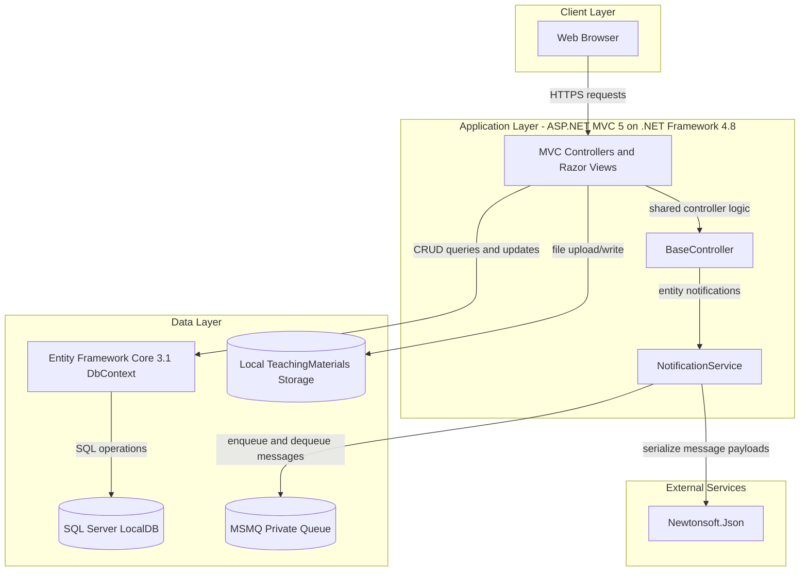
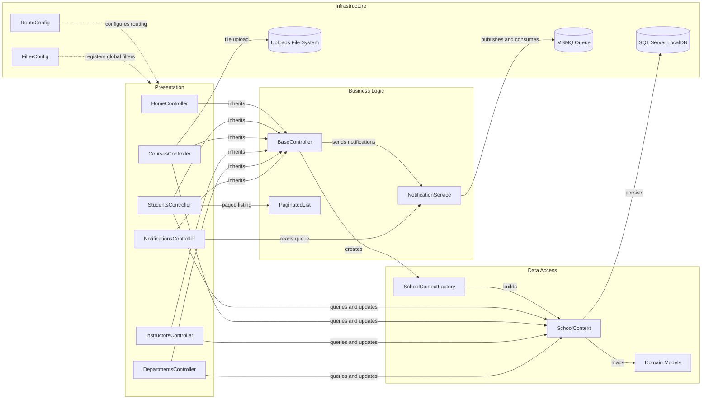

# Architecture Diagram

This document summarizes the current ContosoUniversity application architecture and its key component interactions.

## Application Architecture

### Technology Stack Summary

| Layer | Technology | Version | Purpose |
| --- | --- | --- | --- |
| Presentation | ASP.NET MVC | 5.2.9 | HTTP routing, controllers, Razor views |
| Runtime | .NET Framework | 4.8 | Application runtime and hosting |
| Data Access | Entity Framework Core | 3.1.32 | ORM mapping and persistence through `SchoolContext` |
| Database | SQL Server LocalDB | N/A (instance-based) | Stores students, instructors, courses, departments, and notifications |
| Messaging | MSMQ (`System.Messaging`) | Framework component | Queues entity change notifications |
| Front-end | Bootstrap + jQuery | Bootstrap 3.x, jQuery 3.4.1 | UI styling and client-side behavior |

### Data Storage & External Services

The application persists core university domain data in SQL Server LocalDB through `SchoolContext`. Notification events are serialized with Newtonsoft.Json and exchanged through a private MSMQ queue configured by `NotificationQueuePath`. Teaching material files are stored on the local file system under `Uploads/TeachingMaterials`.

### Key Architectural Decisions

- Uses a classic ASP.NET MVC controller-view pattern with a shared `BaseController` to centralize context and notification behaviors.
- Uses Entity Framework Core `DbContext` with explicit model configuration (table mappings, TPH inheritance, composite keys).
- Uses asynchronous-style decoupling for notifications through MSMQ instead of direct synchronous UI updates.

## Component Relationships

### Component Inventory

| Component | Layer | Type | Responsibility |
| --- | --- | --- | --- |
| StudentsController | Presentation | MVC Controller | CRUD and filtering for student records |
| CoursesController | Presentation | MVC Controller | Course management and related material uploads |
| InstructorsController | Presentation | MVC Controller | Instructor and course assignment workflows |
| DepartmentsController | Presentation | MVC Controller | Department CRUD and administrator assignment |
| NotificationsController | Presentation | MVC Controller (JSON endpoints) | Retrieves and updates notification status for UI |
| BaseController | Business Logic | Abstract Controller Base | Provides shared `SchoolContext` and notification helpers |
| NotificationService | Business Logic | Service | Creates and consumes notification messages via MSMQ |
| SchoolContext | Data Access | EF Core DbContext | Entity mapping, relationships, and persistence |
| SchoolContextFactory | Data Access | Factory | Creates configured `SchoolContext` instances |
| Domain Models | Data Access | Entity Classes | Represents university domain entities and relationships |
| RouteConfig | Infrastructure | Configuration | Defines application routes |
| FilterConfig | Infrastructure | Configuration | Registers global MVC filters |
