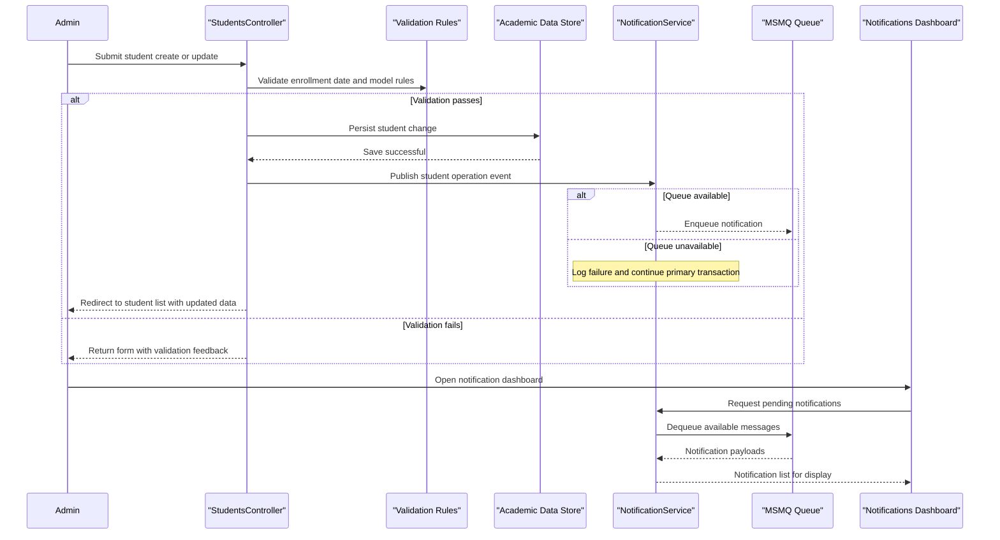

# Core Business Workflows

ContosoUniversity supports academic administration workflows for managing students, instructors, courses, and departments. The core business behavior combines enrollment lifecycle updates with operational notifications for administrative monitoring.

## Domain Entities

| Entity | Service / Bounded Context | Description | Key Relationships |
| --- | --- | --- | --- |
| Student | Academic Records | Represents a learner managed by admissions and enrollment workflows | Linked to Enrollment records and Course participation |
| Instructor | Academic Staffing | Represents teaching personnel and assignment ownership | Linked to CourseAssignment, OfficeAssignment, and Department administration |
| Course | Curriculum Management | Represents classes offered by departments, including teaching material metadata | Belongs to a Department and participates in Enrollment and CourseAssignment |
| Department | Academic Organization | Represents administrative units managing budgets and course offerings | Owns Courses and references Instructor as administrator |
| Enrollment | Registration Management | Tracks student participation and grade outcomes for courses | Bridges Student and Course |
| Notification | Operations Monitoring | Captures create/update/delete operational events for entities | Produced by entity workflows and consumed by notification dashboard |

## Service-to-Domain Mapping

| Service | Domain Context | Owned Entities | External Dependencies |
| --- | --- | --- | --- |
| MVC Controllers (`Students`, `Courses`, `Instructors`, `Departments`) | Academic Operations | Student, Instructor, Course, Department, Enrollment | Shared `SchoolContext`, file system for teaching materials |
| NotificationService + NotificationsController | Operational Communication | Notification | MSMQ queue for asynchronous message delivery |
| HomeController | Reporting and dashboard context | Enrollment trend projections and summary views | Shared `SchoolContext` |

## Primary Workflows

### Workflow 1: Manage Student Lifecycle

1. Administrator opens student management view and searches/sorts current records.
2. For create or edit, the system validates enrollment date boundaries and required model state.
3. If valid, the student record is persisted to the academic data store.
4. The workflow emits a domain notification event for create, update, or delete actions.
5. User is redirected to the updated student listing; on failures, a user-safe error is shown.

Business rules involved: valid enrollment date range, model validation gating persistence, failure-safe notification publishing.

### Workflow 2: Manage Course and Teaching Material

1. Staff submits course create/edit form, optionally with a teaching material image.
2. The system validates allowed image type and max size before processing.
3. For updates, old material files are removed when replacing with a new upload.
4. Course data is persisted and linked to the selected department.
5. A course operation notification is published for admin visibility.

Business rules involved: accepted media types, file size threshold, replacement behavior for existing materials.

### Workflow 3: Manage Instructor Assignment

1. Staff creates or edits an instructor profile and selected teaching assignments.
2. The system maps selected courses into assignment links and updates relationships.
3. During updates, removed assignments are deleted and new assignments are created.
4. Instructor and related assignment state are saved in one operation scope.
5. A notification is emitted to signal administrative changes.

Business rules involved: selected course set determines assignment state; blank office location clears office assignment.

## Cross-Service Data Flows

Cross-context interaction is implemented in-process rather than across networked services. Academic workflows write domain changes through shared data access, then publish asynchronous notification messages via MSMQ for later retrieval by the notification dashboard workflow. This creates a business-visible eventual-consistency pattern: entity changes appear immediately in CRUD views, while notification visibility depends on queue processing; if queue processing fails, primary academic transactions still complete.

## Business Workflow Sequence

## Business Rules & Decision Logic

- **Validation rules**: Student and instructor date fields must be within valid SQL datetime range; course uploads must be image formats and within size threshold; model state must pass before persistence.
- **Decision logic**: Course upload branch determines whether file processing occurs; instructor edit path determines add/remove assignment operations; notification publishing branches on queue availability.
- **State transitions**: Core entities transition through create, update, and delete states with corresponding operational notifications.
- **Business constraints**: Department updates include concurrency conflict handling to avoid stale overwrite; assignment updates maintain current instructor-course linkage set.
- **Computed values**: Home reporting groups enrollment counts by date for administrative summary insights.
- **Transactions and error handling**: CRUD operations complete even when notification publishing fails; exception handling provides user-safe errors and traces operational issues.
- **Authorization posture**: Commented intent references role-based behavior, but enforced authorization attributes are not consistently applied in controllers.
