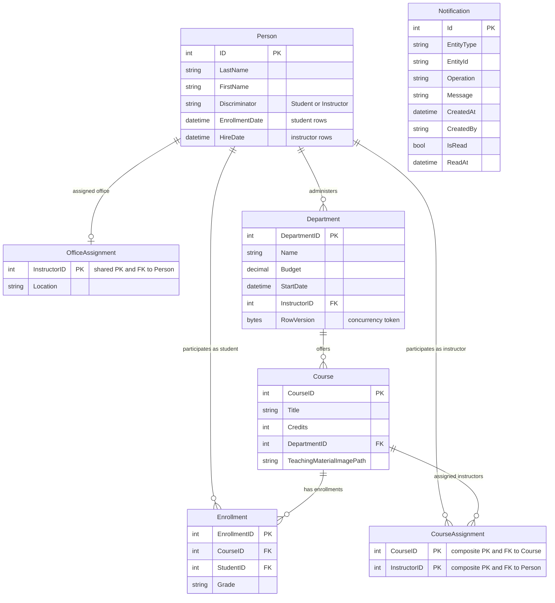

# Data Architecture & Persistence Layer

The persistence layer is centered on a single SQL Server database accessed through Entity Framework Core `SchoolContext`, with 8 primary domain entities and related view models. Data is seeded programmatically and supplemented by a queue-backed notification model.

## Database Configuration

| Service/Module | DB Type | Profile | Driver | Connection | Migration Tool |
| --- | --- | --- | --- | --- | --- |
| ContosoUniversity.Data (`SchoolContextFactory`) | SQL Server LocalDB | Default web runtime | `Microsoft.EntityFrameworkCore.SqlServer` + `Microsoft.Data.SqlClient` | LocalDB connection named `DefaultConnection`; context created with `UseSqlServer` | No versioned migration tool detected; startup uses `EnsureCreated` and initializer seeding |
| Notification queue path | MSMQ private queue | Default web runtime | `System.Messaging` | Queue path resolved from app configuration and created if absent | Not applicable |

## Data Ownership per Service

| Service | Tables Owned | ORM Framework | Caching | Notes |
| --- | --- | --- | --- | --- |
| ContosoUniversity.Web | `Person` (TPH), `Course`, `Enrollment`, `Department`, `CourseAssignment`, `OfficeAssignment`, `Notification` | Entity Framework Core 3.1 | No dedicated cache provider detected | Single shared context handles all CRUD and relationship mapping |
| NotificationService | MSMQ notification messages (not relational tables) | N/A | None | Serializes `Notification` payloads into queue messages for asynchronous retrieval |

## Entity Model

## Key Repository Methods

| Service | Repository | Notable Methods | Purpose |
| --- | --- | --- | --- |
| ContosoUniversity.Web | `SchoolContext` (`Data/SchoolContext.cs`) | `OnModelCreating(ModelBuilder)` | Defines table mappings, inheritance discriminator, composite keys, and relationship constraints |
| ContosoUniversity.Web | `DbInitializer` (`Data/DbInitializer.cs`) | `Initialize(SchoolContext context)` | Seeds reference/domain data after checking existing student rows |
| ContosoUniversity.Web | `SchoolContextFactory` (`Data/SchoolContextFactory.cs`) | `Create()` | Centralized context creation from configured SQL connection |
| ContosoUniversity.Web | Direct `DbSet` usage in controllers | `Include`, `ThenInclude`, `Where`, `Single`, `Find`, `Add`, `Remove`, `SaveChanges` | Implements query composition and transactional CRUD without separate repository interfaces |

## Caching Strategy

No explicit caching provider, cache regions, TTL policy, or cache abstraction usage was detected in the data layer. Reads and writes are served directly through EF Core and SQL Server. MSMQ is used for asynchronous notification delivery, but it functions as a message transport queue rather than a query/result cache.

## Data Ownership Boundaries

The solution uses a shared-database model: one application owns and accesses a single SQL Server schema through one `DbContext`. There is no service-level database isolation or CQRS split; all reads and writes are handled through the same context and transaction boundaries in controller actions. Cross-module data access is in-process (controller to context) and uses eager-loading patterns (`Include`/`ThenInclude`) to assemble related entities.

### Data Classification & Sensitivity

| Entity | Sensitive Fields | Classification (PII/PHI/PCI/None) | Controls in Place |
| --- | --- | --- | --- |
| Person (Student/Instructor) | `FirstName`, `LastName` | PII | No field-level encryption or masking detected in code/config |
| Department | Administrator link (`InstructorID`) | None | Standard relational constraints only |
| Course | `TeachingMaterialImagePath` | None | File path stored as string; no additional data protection controls detected |
| Enrollment | Student and course linkage (`StudentID`, `CourseID`) | PII (indirect educational record association) | No explicit access control or masking logic in data layer |
| Notification | `CreatedBy`, message text with entity descriptors | PII (operational identity metadata) | No explicit encryption-at-rest or masking logic detected |
| OfficeAssignment | `Location` | Potential PII (work location) | No explicit encryption or masking detected |

