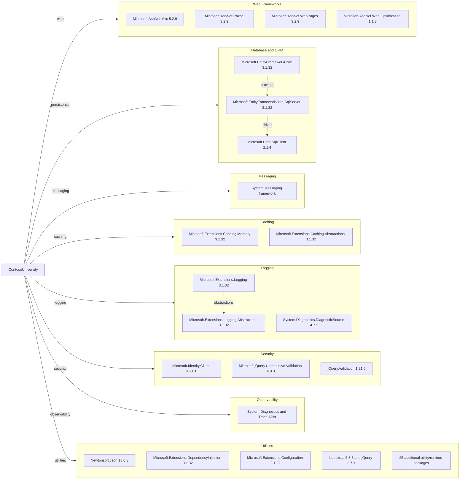

# Dependency Map

This document maps declared external dependencies for ContosoUniversity from `packages.config` and project references. The project declares 45 package dependencies.

## Dependencies

### Dependency Summary

| Category | Count | Key Libraries | Notes |
| --- | --- | --- | --- |
| Web Frameworks | 4 | Microsoft.AspNet.Mvc 5.2.9, Microsoft.AspNet.Razor 3.2.9 | Classic ASP.NET MVC 5 stack on .NET Framework |
| Database and ORM | 6 | EntityFrameworkCore 3.1.32, SqlServer provider 3.1.32, SqlClient 2.1.4 | EF Core 3.1 is out of support and tied to legacy runtime |
| Messaging | 1 | System.Messaging (framework) | Uses MSMQ APIs from .NET Framework |
| Caching | 2 | Microsoft.Extensions.Caching.Memory 3.1.32 | Local in-memory caching primitives |
| Logging | 3 | Microsoft.Extensions.Logging 3.1.32, DiagnosticSource 4.7.1 | Mixed logging abstractions and framework tracing |
| Security | 3 | Microsoft.Identity.Client 4.21.1, jQuery validation libs | Client/server validation and identity client usage |
| Observability | 1 | System.Diagnostics tracing APIs | Trace-based diagnostics in controllers/services |
| Utilities | 25 | Newtonsoft.Json 13.0.3, configuration/DI/runtime support packages | Includes compiler, primitives, and front-end support libs |

### Version and Compatibility Risks

The application depends on .NET Framework 4.8 and ASP.NET MVC 5.2.9, which are mature but not aligned with modern .NET hosting models. Entity Framework Core 3.1 and the related Microsoft.Extensions 3.1 packages are out of support, creating modernization pressure for runtime and API upgrades. MSMQ via System.Messaging is Windows-specific and requires redesign when moving to cloud-native messaging platforms.

### Notable Observations

- Both ASP.NET MVC 5 packages and EF Core 3.1 packages are combined in a .NET Framework project, increasing migration complexity.
- Front-end package versions in `packages.config` (jQuery 3.7.1, Bootstrap 5.3.3) differ from checked-in script assets (jQuery 3.4.1), indicating potential asset drift.
- Utility/runtime packages are numerous; several support EF Core 3.1 and will likely consolidate after target framework upgrade.
- Messaging relies on `System.Messaging` and private MSMQ queues, a portability concern for Linux-based hosting.

## Test Dependencies

| Framework | Version | Notes |
| --- | --- | --- |
| None detected | N/A | No test-scoped dependencies were declared in build/package manifests |

Total test-scope dependencies: 0
No test dependencies were detected in the repository build/package files, indicating tests may be absent or external to this project.
