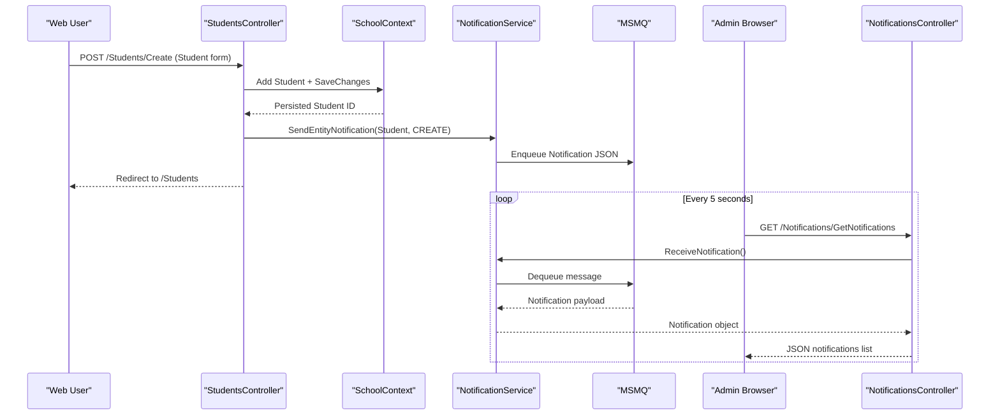

# API & Service Communication Contracts

The application exposes a server-rendered MVC surface with controller action endpoints and a small JSON notification API used by browser polling.

## Service Catalog

| Service | Port | Category | Purpose |
|---|---:|---|---|
| ContosoUniversity (single web app) | 44300 (IIS Express URL) | API Layer + Business | Handles university domain CRUD, dashboard pages, and notification endpoints |
| SQL Server LocalDB | n/a | Infrastructure | Stores university and notification tables via EF Core |
| MSMQ Private Queue | n/a | Infrastructure | Buffers create/update/delete notifications for admin polling |

## API Endpoints Inventory

| Service | Method | Path | Request Type | Response Type |
|---|---|---|---|---|
| HomeController | GET | /Home/Index, /Home/About, /Home/Contact | Query params (optional) | Razor views |
| StudentsController | GET | /Students, /Students/Details/{id}, /Students/Create, /Students/Edit/{id}, /Students/Delete/{id} | Query + path parameters | Razor views |
| StudentsController | POST | /Students/Create, /Students/Edit/{id}, /Students/Delete/{id} | `Student` form payload | Redirect/result view |
| CoursesController | GET | /Courses, /Courses/Details/{id}, /Courses/Create, /Courses/Edit/{id}, /Courses/Delete/{id} | Path/query parameters | Razor views |
| CoursesController | POST | /Courses/Create, /Courses/Edit/{id}, /Courses/Delete/{id} | `Course` + file upload (`HttpPostedFileBase`) | Redirect/result view |
| InstructorsController | GET | /Instructors, /Instructors/Details/{id}, /Instructors/Create, /Instructors/Edit/{id}, /Instructors/Delete/{id} | Query + path parameters | Razor views |
| InstructorsController | POST | /Instructors/Create, /Instructors/Edit/{id}, /Instructors/Delete/{id} | `Instructor` form + selected courses | Redirect/result view |
| DepartmentsController | GET | /Departments, /Departments/Details/{id}, /Departments/Create, /Departments/Edit/{id}, /Departments/Delete/{id} | Path/query parameters | Razor views |
| DepartmentsController | POST | /Departments/Create, /Departments/Edit/{id}, /Departments/Delete/{id} | `Department` form payload | Redirect/result view |
| NotificationsController | GET | /Notifications/GetNotifications | none | JSON `{ success, notifications, count }` |
| NotificationsController | POST | /Notifications/MarkAsRead | `id` | JSON `{ success }` |
| NotificationsController | GET | /Notifications/Index | none | Razor view |

## Management & Observability Endpoints

| Service | Endpoint | Custom Metrics (if any) |
|---|---|---|
| ContosoUniversity | No dedicated health/metrics endpoint configured | None detected |

## DTOs & Contracts

The API contracts are mostly MVC model-bound entities (`Student`, `Course`, `Instructor`, `Department`) and view-model helpers (`InstructorIndexData`, `AssignedCourseData`, `EnrollmentDateGroup`) for page rendering. JSON contracts are centered on `Notification` payloads returned by `GetNotifications`. No OpenAPI/Swagger, protobuf, or GraphQL schema artifacts were found. Serialization for queue payloads is JSON via Newtonsoft.Json and queue body formatters in `NotificationService`.

## Communication Patterns

Communication is primarily synchronous browser-to-controller HTTP calls inside a monolith, with asynchronous notification delivery through MSMQ. Controllers call EF Core-backed `SchoolContext` directly (no external service discovery or gateway). Resilience policies such as circuit breakers/retries are not explicitly implemented for DB or queue calls. Security posture is minimal at API contract level: anti-forgery is used on form posts, but no explicit authentication/authorization attributes or TLS enforcement logic is configured in controllers.

## Service Technology Matrix

| Service | Web | Data Access | Discovery | Gateway | Actuator | Cache | Metrics |
|---|---|---|---|---|---|---|---|
| ContosoUniversity | ASP.NET MVC 5 | EF Core 3.1 + SQL Server | none | none | none | In-proc memory package referenced | none |

## Service Communication Sequence

