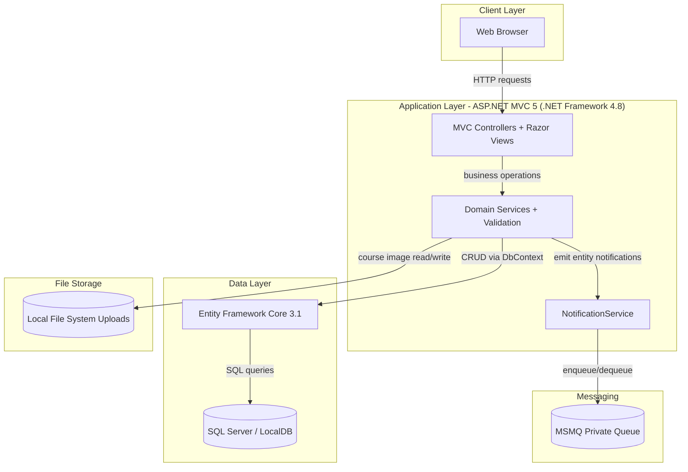
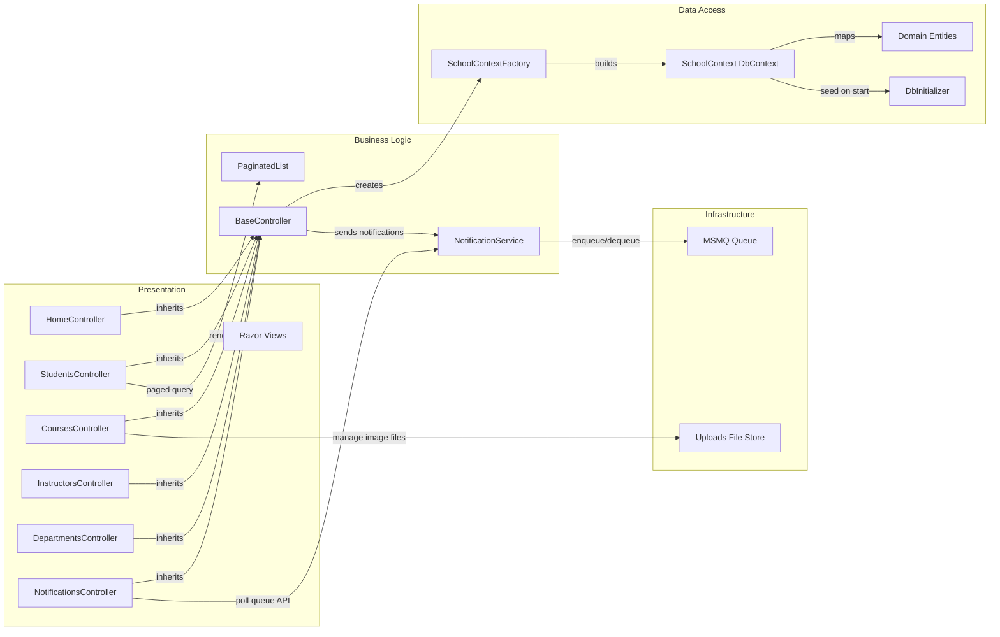

# Architecture Diagram

This repository contains a single ASP.NET MVC web application with server-rendered UI, EF Core-based persistence, and MSMQ-backed notification messaging.

## Application Architecture

### Technology Stack Summary

| Layer | Technology | Version | Purpose |
|---|---|---|---|
| Presentation | ASP.NET MVC + Razor | MVC 5.2.9 | Server-rendered web UI and routing |
| Business | Controllers + BaseController + NotificationService | .NET Framework 4.8 | Request orchestration and domain operations |
| Data | EF Core + SQL Client | EF Core 3.1.32 | Data access and relational persistence |
| Messaging | System.Messaging (MSMQ) | .NET Framework | Async admin notification pipeline |
| Frontend | jQuery + Bootstrap | jQuery 3.7.1 / Bootstrap 5.3.3 | UI behaviors and styling |

### Data Storage & External Services

The app persists academic and notification entities in SQL Server (LocalDB by default), stores course teaching material images on local disk under `Uploads/TeachingMaterials`, and uses MSMQ private queues for near-real-time admin notification delivery.

### Key Architectural Decisions

- Uses a shared `BaseController` for common `SchoolContext` creation and notification dispatch.
- Uses EF Core table-per-hierarchy mapping for `Person` (`Student` and `Instructor`) plus relationship mapping in `OnModelCreating`.
- Uses conventional MVC route mapping (`{controller}/{action}/{id}`) rather than attribute routing.

## Component Relationships

### Component Inventory

| Component | Layer | Type | Responsibility |
|---|---|---|---|
| StudentsController | Presentation | MVC Controller | Student CRUD, search, paging, and validation |
| CoursesController | Presentation | MVC Controller | Course CRUD and teaching material upload management |
| InstructorsController | Presentation | MVC Controller | Instructor CRUD and course assignment orchestration |
| DepartmentsController | Presentation | MVC Controller | Department CRUD and concurrency handling |
| NotificationsController | Presentation | MVC Controller | JSON endpoints for admin notification polling |
| BaseController | Business | Abstract Controller | Shared DB context lifecycle and entity notification emission |
| NotificationService | Business/Infra | Service | Serialize and push/pull notification payloads via MSMQ |
| SchoolContext | Data Access | DbContext | EF Core model and table/relationship mapping |
| DbInitializer | Data Access | Initializer | Seeds default university data at application start |
