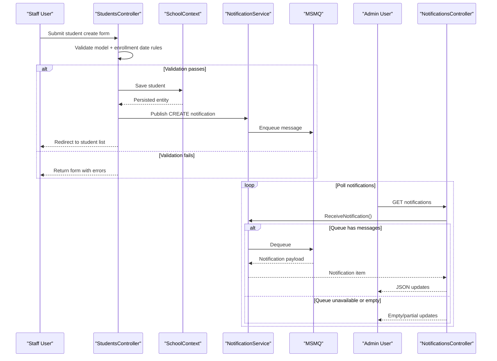

# Core Business Workflows

The application supports university administration workflows for managing students, courses, instructors, and departments, with cross-cutting admin notifications on data changes.

## Domain Entities

| Entity | Service / Bounded Context | Description | Key Relationships |
|---|---|---|---|
| Student | Academic Records | Learner profile and enrollment history | Enrollments link student to courses |
| Instructor | Faculty Management | Teacher profile, hire data, office assignment | Teaches many courses via assignments |
| Course | Curriculum Management | Course catalog item with credits and department | Belongs to department; has enrollments |
| Department | Organization Management | Academic department with budget/admin | Owns courses; may reference instructor admin |
| Enrollment | Academic Records | Registration of student in course with grade | Connects student and course |
| Notification | Operations Monitoring | Audit-style event for entity CRUD operations | Produced by all CRUD controllers |

## Service-to-Domain Mapping

| Service | Domain Context | Owned Entities | External Dependencies |
|---|---|---|---|
| StudentsController | Academic Records | Student, Enrollment (read/update) | SchoolContext, NotificationService |
| CoursesController | Curriculum Management | Course | SchoolContext, local file storage, NotificationService |
| InstructorsController | Faculty Management | Instructor, CourseAssignment, OfficeAssignment | SchoolContext, NotificationService |
| DepartmentsController | Organization Management | Department | SchoolContext, NotificationService |
| NotificationsController | Operational Monitoring | Notification contract | NotificationService (MSMQ) |

## Primary Workflows

### Workflow 1: Maintain Student Records

Users access student pages, search/sort lists, and submit create/edit/delete forms. The controller validates enrollment date constraints and model state, persists changes through EF Core, then emits a notification event for admin visibility.

### Workflow 2: Manage Course Catalog with Teaching Materials

Staff create or edit courses, optionally uploading an image. The controller enforces extension and size checks, stores files on disk, updates DB records, and sends a create/update/delete notification event.

### Workflow 3: Assign Instructors to Courses

Staff create/edit instructor profiles, then select assigned courses. The workflow updates join-table assignments (`CourseAssignment`) and optional office assignment state, then persists and emits notifications.

## Cross-Service Data Flows

This is a monolith, so domain flows are intra-process through shared `SchoolContext`. Cross-feature composition is achieved through entity navigation queries (for example instructor-course-department and student-enrollment-course traversals). Notification data flow is asynchronous: CRUD controllers publish MSMQ messages, and browser clients poll `NotificationsController` for queue-drained updates. If queue retrieval fails, UI continues without new notifications.

## Business Workflow Sequence

## Business Rules & Decision Logic

- Enrollment and hire dates must fall within SQL-supported ranges; invalid dates block persistence.
- Course material upload accepts only image extensions and enforces max size limits.
- Department edit handles optimistic concurrency using row version comparison and user feedback.
- Instructor-course assignment logic maintains many-to-many consistency when selections change.
- Notification publishing is non-blocking; operational failures are logged and do not cancel business transactions.
