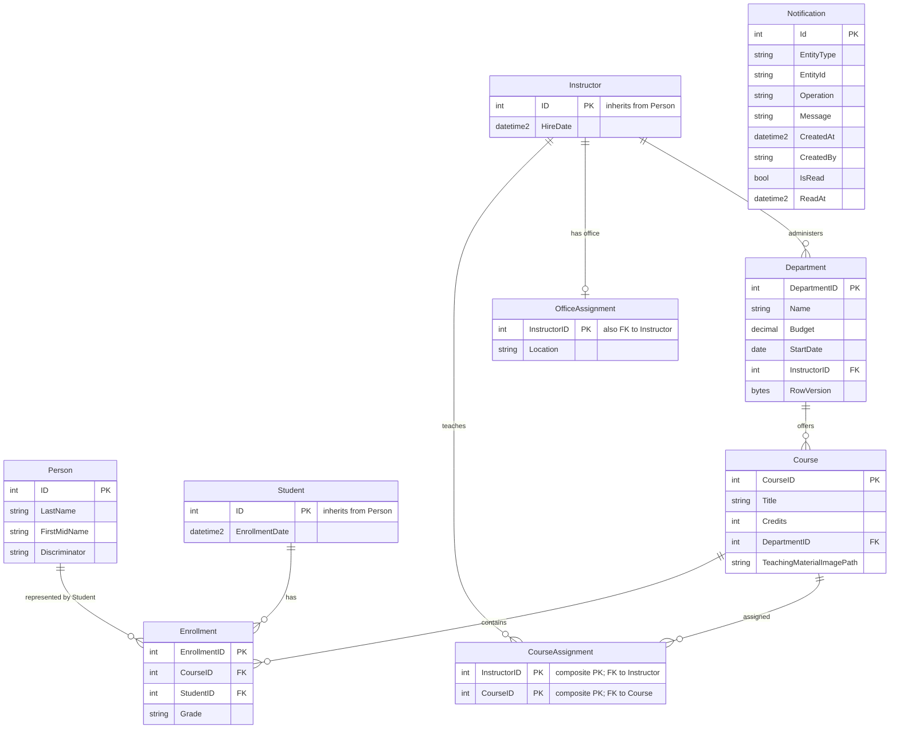

# Data Architecture & Persistence Layer

The data layer uses EF Core over SQL Server with a university domain model plus notification persistence, including inheritance and many-to-many mappings.

## Database Configuration

| Service/Module | DB Type | Profile | Driver | Connection | Migration Tool |
|---|---|---|---|---|---|
| ContosoUniversity | SQL Server (LocalDB default) | Default | Microsoft.Data.SqlClient | `DefaultConnection` from Web.config | No explicit migrations; startup seeding via `DbInitializer` |

## Data Ownership per Service

| Service | Tables Owned | ORM Framework | Caching | Notes |
|---|---|---|---|---|
| ContosoUniversity web app | Person, Course, Department, Enrollment, CourseAssignment, OfficeAssignment, Notification | EF Core 3.1 | No explicit data cache policy detected | Single shared database for all modules |

## Entity Model

## Key Repository Methods

| Service | Repository | Notable Methods | Purpose |
|---|---|---|---|
| ContosoUniversity | `SchoolContext` (`DbSet<>`) | `SaveChanges`, relationship includes (`Include/ThenInclude` in controllers) | Standard CRUD and eager loading |
| Instructors module | Controller-level query logic | `UpdateInstructorCourses(string[] selectedCourses, Instructor)` | Maintains join-table assignments for instructor/course |
| Notifications module | `NotificationService` queue operations | `SendNotification(...)`, `ReceiveNotification()` | Asynchronous notification persistence/transport |

## Caching Strategy

No explicit application-level cache policy (`@Cacheable`/Redis/distributed cache) was detected in data workflows. The project references `Microsoft.Extensions.Caching.Memory`, but persistence flows observed in controllers and services rely directly on EF Core and MSMQ without cache-aside or read-through patterns.

## Data Ownership Boundaries

All domain areas share a single database context and connection string. There is no database-per-module isolation, and cross-domain reads are implemented via EF navigation loading within the same process. Async notification flow writes message payloads to MSMQ and optionally reads them back through polling endpoints, without a separate notification database.

### Data Classification & Sensitivity

| Entity | Sensitive Fields | Classification (PII/PHI/PCI/None) | Controls in Place |
|---|---|---|---|
| Person/Student/Instructor | FirstMidName, LastName | PII | No field-level masking/encryption configured in code |
| Department | Administrator linkage (`InstructorID`) | Internal | Concurrency token (`RowVersion`) only |
| Notification | CreatedBy, message content may include entity names | PII/Internal | No masking/encryption controls detected |
| Course/Enrollment/CourseAssignment/OfficeAssignment | Academic and assignment records | Internal | Standard DB access through app only |
