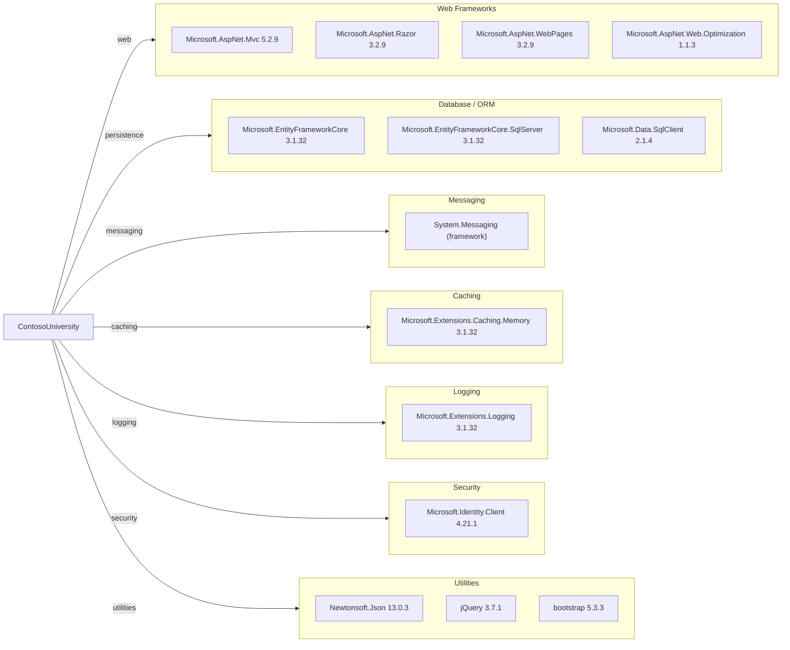

# Dependency Map

This dependency map summarizes the declared NuGet package set for the ContosoUniversity application and groups external libraries by modernization-relevant function.

## Dependencies

### Dependency Summary

| Category | Count | Key Libraries | Notes |
|---|---:|---|---|
| Web Frameworks | 4 | ASP.NET MVC, Razor, WebPages, Optimization | Legacy ASP.NET MVC stack on .NET Framework |
| Database / ORM | 3 | EF Core, EF Core SQL Server, SqlClient | EF Core 3.1 with SQL Server provider |
| Messaging | 1 | System.Messaging | MSMQ dependency blocks cross-platform moves |
| Caching | 1 | Extensions.Caching.Memory | In-process caching primitives only |
| Logging | 1 | Extensions.Logging | Basic logging abstraction |
| Security | 1 | Microsoft.Identity.Client | Authentication client package present |
| Utilities | 3 | Newtonsoft.Json, jQuery, bootstrap | Mixed server/client utility dependencies |

### Version & Compatibility Risks

The project targets .NET Framework 4.8 with many packages on 3.1-era Microsoft.Extensions/EFCore lines and System.Web-era MVC dependencies that are not directly compatible with modern .NET without migration. System.Messaging introduces Windows-only infrastructure coupling.

### Notable Observations

- ASP.NET MVC 5 (`System.Web.Mvc`) indicates a non-SDK, legacy web stack.
- EF Core is used on .NET Framework, which adds upgrade complexity but provides an existing ORM abstraction.
- Both server-side legacy web packages and modern client packages are mixed in a single project.
- Notification implementation relies on MSMQ (`System.Messaging`), which requires replacement in cloud-native targets.

## Test Dependencies

No dedicated test project or test-scoped NuGet dependencies were detected in the assessed workspace.

Total test-scope dependencies: 0
No test dependencies detected.
